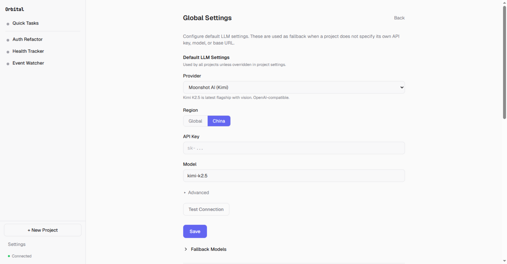

# Orbital

<p align="center">
  
</p>

[](#license)   


**Autonomous agents, under your control.**

> Your AI agents can work for hours — reading files, running shell commands, browsing the web, delegating to sub-agents. But who's watching them?

Orbital is a local-first agent management system. It ships with a built-in autonomous agent, coordinates sub-agents like Claude Code, Codex, and Gemini CLI (via [ACP](https://agentcommunicationprotocol.dev/)), and gates every dangerous action behind approval workflows you control from your phone. Sandbox isolation, budget limits, cron scheduling, persistent memory — all on your machine. Nothing uploaded. Nothing cloud-hosted.

## Demo

[](https://www.youtube.com/watch?v=Z_8CXPEl3dI)

<p align="center">
  
</p>
<p align="center"><em>Multiple agents running in parallel — each with its own project, triggers, and session history</em></p>

<p align="center">
  
</p>
<p align="center"><em>An agent needs permission to run a command — approve or deny from your phone</em></p>

## Orbital Is / Is Not

| Orbital **IS** | Orbital **IS NOT** |
| --- | --- |
| An autonomous agent with sandbox boundaries and approval gates | A cloud service — everything runs on your machine |
| A sub-agent coordinator: Claude Code, Codex, Gemini CLI via [ACP](https://agentcommunicationprotocol.dev/) + [claude-agent-sdk](https://github.com/anthropics/anthropic-sdk-python) | An OpenClaw fork — custom agent loop, built from scratch |
| Mobile management: approve actions, browse workspace files, upload from phone | A chat wrapper — agents run continuously via cron and file watchers |
| Budget controls, autonomy presets, credential management (OS keychain) | Fully autonomous God Mode (yet) — scheduler-driven today, full autonomy on the roadmap |

## How Orbital Compares

| | Orbital | OpenClaw | Copilot Cowork |
| --- | --- | --- | --- |
| Autonomous multi-hour sessions | ✅ | ✅ | ❌ (synchronous) |
| Sandbox isolation | ✅ (OS-level) | ❌ | Cloud-side |
| Approval workflows | ✅ (configurable autonomy presets) | IM notifications only | ❌ |
| Mobile dashboard | ✅ (approve, browse files, upload) | IM notifications | ❌ |
| Sub-agent coordination | ✅ (ACP + Claude SDK) | ✅ (multi-session) | ❌ |
| Budget controls | ✅ (per-project hard limits) | ❌ | ❌ |
| Credential management | ✅ (OS keychain, agent never sees raw secrets) | Plaintext config files | Cloud-managed |
| Cron + file-watch triggers | ✅ (natural language) | ❌ | ❌ |
| Local-first | ✅ | ✅ | ❌ |
| Open source | GPL 3.0 | MIT | ❌ |

---

## The Problem

AI agents are autonomous in capability but not in operation. The moment you look away, things break down.

&nbsp;

**1. You are the operating system**
<br>You use one agent for strategy, another for architecture, a third for implementation. You're the one threading them together — copy-pasting deliverables from one conversation into another, verifying outputs, sequencing who works on what. You do very little actual work, but you're trapped in the chores of being the process manager. Close the laptop and everything stops. Walk away and context is lost.

**2. Agents are destructive by default**
<br>`rm -rf`. Leaked credentials. Data exfiltration. Current tools rely on agents "behaving well" — no sandbox, no network isolation, no approval gate the agent can't bypass.

**3. Agents don't live where your work lives**
<br>Most platforms ask you to upload files, copy-paste context, re-explain your project every session. But your code is on your machine. Agents should work in your environment, not ask you to relocate into theirs.

**4. No centralized management**
<br>Three agents means three terminals, three permission models, three context windows. No unified dashboard. No single approval queue.

**5. Agent knowledge is ephemeral**
<br>Every session starts from zero. The agent doesn't remember yesterday's decisions or last week's files. You re-explain the same context over and over.

---

## The Insight

Orbital treats AI agents as processes that need an **operating system** — process management, permission enforcement, resource isolation, persistent state, and a supervision interface.

<table>
<tr>
<th width="40%">Problem</th>
<th width="60%">How Orbital solves it</th>
</tr>
<tr>
<td>Supervision = sitting at keyboard</td>
<td>Agents run on your machine. Need a decision? The agent pauses and pings your phone. <br>Approve, deny, or redirect — from anywhere.</td>
</tr>
<tr>
<td>No safety boundaries</td>
<td>Sandboxed shell. File access restricted to granted folders. Fail-closed approval. <br>Credentials resolved at the execution boundary — the LLM never sees raw passwords.</td>
</tr>
<tr>
<td>Work lives somewhere else</td>
<td>Runs on your machine, your filesystem, your browser. <br>No cloud uploads. No context migration. The workspace IS the project.</td>
</tr>
<tr>
<td>Fragmented management</td>
<td>One dashboard, all agents. One approval queue. Desktop or phone.</td>
</tr>
<tr>
<td>Cold starts every session</td>
<td>Agent memory lives in workspace files: <code>PROJECT_STATE.md</code>, <code>DECISIONS.md</code>, <code>LESSONS.md</code>. <br>Plain text you can read, edit, and version-control.</td>
</tr>
</table>

---

## Table of Contents

- [Orbital Is / Is Not](#orbital-is--is-not)
- [How Orbital Compares](#how-orbital-compares)
- [Installation](#installation)
- [Quick Start](#quick-start)
- [Architecture Overview](#architecture-overview)
- [Core Features](#core-features)
  - [Project & Workspace Model](#project--workspace-model)
  - [Quick Tasks](#quick-tasks)
  - [Autonomy & Approval System](#autonomy--approval-system)
  - [Sub-Agent Delegation](#sub-agent-delegation)
  - [Built-in Tool Suite](#built-in-tool-suite)
  - [Browser Automation](#browser-automation)
  - [Continuous Operation & Triggers](#continuous-operation--triggers)
  - [Context Management & Compaction](#context-management--compaction)
  - [Mobile Remote Control](#mobile-remote-control)
  - [Cost Controls & Budget Limits](#cost-controls--budget-limits)
  - [Credential Management](#credential-management)
  - [LLM Provider Routing & BYOK](#llm-provider-routing--byok)
  - [Loop Safety Guards](#loop-safety-guards)
  - [Desktop App & System Tray](#desktop-app--system-tray)
- [Development](#development)
- [Testing](#testing)
- [Roadmap](#roadmap)
- [License](#license)

---

## Installation

### Windows

1. Download [`Orbital-Setup-1.0.0.exe`](https://github.com/zqiren/Orbital/releases/download/v0.3.3/Orbital-Setup-1.0.0.exe) from [Releases](https://github.com/zqiren/Orbital/releases/tag/v0.3.3)
2. Run the installer and follow the prompts
3. Launch Orbital from the Start Menu or desktop shortcut

<details>
<summary>Windows SmartScreen Warning</summary>

Orbital is not yet code-signed, so Windows will show a security warning:

> **Windows protected your PC** — Microsoft Defender SmartScreen prevented an unrecognized app from starting.

Click **"More info"** then **"Run anyway"**. Code signing will be added in a future release.
</details>

### macOS

1. Download [`Orbital-1.0.0-macOS.dmg`](https://github.com/zqiren/Orbital/releases/download/v0.3.0/Orbital-1.0.0-macOS.dmg) from [Releases](https://github.com/zqiren/Orbital/releases/tag/v0.3.0)
2. Open the DMG and drag Orbital to your Applications folder
3. Launch Orbital from Applications or Spotlight

Requires macOS 13 (Ventura) or later. Apple Silicon and Intel supported.

<details>
<summary>macOS Gatekeeper Warning</summary>

Orbital is not yet code-signed, so macOS will block it on first launch:

> **"Orbital" can't be opened because Apple cannot check it for malicious software.**

To proceed:
1. Open **System Settings → Privacy & Security**
2. Scroll down — you'll see "Orbital was blocked"
3. Click **"Open Anyway"**

This is only needed once. Code signing will be added in a future release.
</details>

### From Source

```bash
# Clone the repository
git clone https://github.com/zqiren/Orbital.git && cd Orbital

# Install Python dependencies (Python 3.11+)
pip install -e ".[desktop]"

# Install frontend dependencies (Node.js 18+)
cd web && npm install && cd ..

# Start the daemon
python -m uvicorn agent_os.api.app:create_app --factory --port 8000

# Start the frontend dev server (separate terminal)
cd web && npx vite --host 127.0.0.1 --port 5173
```

Open `http://localhost:5173` in your browser. The setup wizard runs on first launch.

### Note on Sleep/Shutdown

Orbital prevents system sleep while agents are actively working (via OS-level sleep inhibition on Windows and macOS). When all agents are idle, sleep is re-allowed. The system tray icon shows current agent activity status.

---

## Quick Start

1. **Launch Orbital** — the setup wizard guides you through first-time configuration


2. **Enter your API key** — supports Anthropic, OpenAI, Moonshot, DeepSeek, and 15+ other providers

<p align="center">
  
</p>

3. **Create a project** — give it a name, pick a workspace directory, set an autonomy level

<p align="center">
  
</p>

4. **Chat** — type a task in the chat bar and the management agent handles it
5. **Approve or automate** — review tool calls in the approval card, or set autonomy to hands-off

---

## Architecture Overview

```
+------------------------------------------------------+
|                    Frontend (React SPA)               |
|  Chat UI . Approval Cards . Project Settings . Files  |
+-------------------------+----------------------------+
                          | REST + WebSocket
+-------------------------v----------------------------+
|                  Daemon (FastAPI + uvicorn)            |
|                                                       |
|  +--------------+  +--------------+  +--------------+ |
|  | AgentManager |  | SubAgentMgr  |  | TriggerMgr   | |
|  | (lifecycle)  |  | (delegation) |  | (cron/watch) | |
|  +------+-------+  +------+-------+  +--------------+ |
|         |                 |                            |
|  +------v-------+  +------v-------+                    |
|  | Agent Loop   |  | Transports   |                    |
|  | (streaming)  |  | Pipe/PTY/SDK |                    |
|  +------+-------+  +--------------+                    |
|         |                                              |
|  +------v-------+  +--------------+  +--------------+  |
|  | LLM Provider |  | Tool Registry|  | Autonomy     |  |
|  | (multi-SDK)  |  | (shell,file, |  | Interceptor  |  |
|  |              |  |  browser...) |  | (approve/deny|  |
|  +--------------+  +--------------+  +--------------+  |
|                                                        |
|  +--------------------------------------------------+  |
|  | Platform Layer (Windows sandbox / macOS / Linux)  |  |
|  +--------------------------------------------------+  |
+-------------------------+----------------------------+
                          | WebSocket tunnel
+-------------------------v----------------------------+
|              Cloud Relay (Node.js)                     |
|  REST proxy . Event forwarding . Push notifications   |
|  Device pairing . Phone WebSocket bridge              |
+------------------------------------------------------+
```

**Key design decisions:**
- **Isolation**: OS-level sandboxing (Windows sandbox user, macOS Seatbelt, Linux bubblewrap planned)
- **Fail-closed interceptor**: Any approval system error results in DENY, never ALLOW
- **Single daemon**: PID file enforcement prevents multiple instances

---

## Core Features

### Project & Workspace Model

Each project maps to a workspace directory and maintains its own sessions, triggers, and configuration.

<p align="center">
  
</p>
<p align="center"><em>Browse, preview, and upload files in each project's workspace</em></p>

```
~/.agent-os/
+-- daemon.pid                          # Singleton enforcement
+-- projects.json                       # All project configs
+-- settings.json                       # Global settings
+-- credential-meta.json                # Credential metadata
+-- browser-profile/                    # Shared browser profile
+-- AGENT.md                            # Shared agent directive
+-- {project-slug-a3f2}/               # Per-project namespace
    +-- sessions/
    |   +-- {session_id}.jsonl          # Append-only session log
    +-- instructions/
    |   +-- project_goals.md
    |   +-- user_directives.md
    +-- PROJECT_STATE.md                # Current task state
    +-- DECISIONS.md                    # Decision log
    +-- LESSONS.md                      # Learned patterns
    +-- SESSION_LOG.md                  # Last 3 session summaries
    +-- CONTEXT.md                      # External reference material
```

**Session format**: One JSON line per message (role, source, content, timestamp, tool_calls). Append-only with file locks. Never modified except during compaction.

### Quick Tasks

The sidebar includes a **Quick Task** section for fire-and-forget interactions. Scratch projects skip the full project creation flow — useful for one-off tasks that don't need a dedicated workspace.

<p align="center">
  
</p>

### Autonomy & Approval System

Three autonomy presets control how much supervision agents receive:

| Preset | Shell | File Write | Browser | Description |
|--------|-------|-----------|---------|-------------|
| **Hands-off** | Auto | Auto | Auto | Maximum autonomy. Only `request_access` requires approval. |
| **Check-in** | Approval | Approval | Write only | Balanced. Default for external agents. |
| **Supervised** | Approval | Approval | All except read | Maximum oversight. |

<p align="center">
  
</p>
<p align="center"><em>Pick an autonomy level and set budget limits per project</em></p>

**Approval flow:**
1. Interceptor catches tool call based on autonomy rules
2. Frontend shows an **Approval Card** with tool name, arguments, and context
3. User can **Approve**, **Deny**, or **Auto-approve for 10 minutes**
4. Per-action bypass: same tool+args auto-approved for 60 seconds

<p align="center">
  
</p>
<p align="center"><em>Approve agent actions from your phone — with full context and optional guidance</em></p>

### Sub-Agent Delegation

Orbital is not tied to a single AI tool. The management agent plans and delegates, while specialized sub-agents execute. Any CLI-based agent can be registered via a manifest file.

<p align="center">
  
</p>
<p align="center"><em>The management agent creates an implementation plan...</em></p>

<p align="center">
  
</p>
<p align="center"><em>...delegates Phase 1 to @claudecode, monitors progress, and reviews the result</em></p>

**Transport types:**

| Transport | Use Case |
|-----------|----------|
| **Pipe** | stdin/stdout subprocess, JSON streaming |
| **PTY** | Pseudo-terminal for interactive agents |
| **SDK** | Direct Claude SDK integration |
| **ACP** | [Agent Communication Protocol](https://agentcommunicationprotocol.dev/) — Codex, Gemini CLI, and other ACP-compatible agents |

### Built-in Tool Suite

The management agent has access to these tool categories:

| Category | Tools | Description |
|----------|-------|-------------|
| **Shell** | `shell` | Command execution with network-aware detection |
| **File** | `read`, `write`, `edit`, `glob`, `grep` | File operations within workspace |
| **Browser** | 23 actions via Patchright | Navigate, click, type, extract, screenshot, multi-tab |
| **Triggers** | `create_trigger`, `list_triggers`, `update_trigger`, `delete_trigger` | Schedule and file-watch triggers via natural language |
| **Credentials** | `request_credential` | Agent-initiated credential request — opens secure modal |
| **Delegation** | `delegate` | Route tasks to sub-agents |

### Browser Automation

Built on **Patchright** (a Playwright fork with anti-bot-detection):

- **Stealth mode**: Anti-automation detection scripts injected into every browser context
- **Shared profile**: One browser profile across all projects — log into services once, all agents share cookies
- **Accessibility-first**: `snapshot` returns an accessibility tree with `[ref=eN]` element references for reliable interaction
- **23 browser actions**: navigate, click, type, fill, press, hover, select, drag, upload, snapshot, screenshot, extract, search, evaluate, tab management, PDF export, web search, URL fetch

<p align="center">
  
</p>
<p align="center"><em>An agent browsing arxiv.org — scanning for AI reasoning papers on a daily schedule</em></p>

### Continuous Operation & Triggers

Agents run continuously via triggers — no manual intervention needed. Create triggers through **natural language** in the chat:

> *"Watch the uploads/ folder for new .jpg files and analyze them"*
> *"Run a research scan every morning at 6 AM"*

The management agent translates this into a `create_trigger` tool call with the appropriate type and parameters.

**Trigger types:**

| Type | Configuration | Example |
|------|--------------|---------|
| **Schedule** | Cron expression + timezone | `0 6 * * *` (daily at 6 AM) |
| **File Watch** | Path + glob patterns + debounce | `uploads/*.jpg`, 5s debounce |

<p align="center">
  
</p>
<p align="center"><em>File watch trigger: monitors auth/ for .py changes, runs tests on every save. 22 runs so far.</em></p>

<p align="center">
  
</p>
<p align="center"><em>Scheduled trigger: scans arxiv, Hacker News, and tech blogs every day at 6 AM. 12 runs.</em></p>

**Real-world example — Health Tracker with file watch:**

<p align="center">
  
  &nbsp;&nbsp;&nbsp;&nbsp;
  
</p>
<p align="center"><em>Left: "Watch uploads/ for meal photos and track calories." Right: Drop a photo, get instant nutritional analysis.</em></p>

### Context Management & Compaction

**Six workspace files** maintained by the LLM at session boundaries:

| File | Purpose |
|------|---------|
| `AGENT.md` | Shared agent directive (global) |
| `PROJECT_STATE.md` | Current task, in-progress work |
| `DECISIONS.md` | Decision log with rationale |
| `LESSONS.md` | Learned patterns and pitfalls |
| `SESSION_LOG.md` | Last 3 session summaries |
| `CONTEXT.md` | External references, API docs |

**Cold resume**: On session start, these files are assembled into the system prompt to reorient the agent — no context lost between sessions.

**Compaction** (when context usage exceeds 80%): memory flush, LLM-driven summarization of older messages, recent messages kept intact, post-compaction reorientation with project goals and current state.

### Mobile Remote Control

Control agents from your phone on the local network or via a cloud relay.

<p align="center">
  
  &nbsp;&nbsp;&nbsp;&nbsp;
  
</p>
<p align="center"><em>Left: Project dashboard on phone. Right: Agent completes its research after you approve from anywhere.</em></p>

**Local network**: Scan the QR code in Settings to open Orbital on your phone via LAN.

<p align="center">
  
</p>
<p align="center"><em>Scan to open Orbital on your phone — same Wi-Fi network required</em></p>

**Cloud relay** (optional): Deploy a relay server for access outside your home network. Push notifications for approval requests, budget alerts, and agent status changes.

### Cost Controls & Budget Limits

Per-project budget limits prevent runaway spending:

| Setting | Description |
|---------|-------------|
| `Budget Limit (USD)` | Maximum spend for the project |
| `Budget Action` | `ask` (prompt user), `pause` (stop agent), or `deny` (block LLM calls) |
| `Spent` | Running total with reset option |

The agent loop tracks cumulative token usage and computes cost using per-model pricing from the provider registry. When the budget threshold is reached, the configured action fires and a push notification is sent.

### Credential Management

<p align="center">
  
</p>
<p align="center"><em>Website credentials stored in your system keychain. Agents always ask permission before using them.</em></p>

- **API keys**: Stored in OS keychain (`keyring`), masked in API responses, per-project BYOK override
- **Website credentials**: Metadata in `credential-meta.json`, values in OS keychain. The `request_credential` tool lets agents request credentials mid-session via a secure modal — credentials never appear in chat history.

### LLM Provider Routing & BYOK

**15+ providers** supported out of the box:

Anthropic, OpenAI, DeepSeek, Moonshot (Kimi), Groq, Google Gemini, Azure OpenAI, Ollama, and more.

- **SDK routing**: Anthropic SDK for Anthropic, OpenAI SDK for OpenAI-compatible providers
- **Per-model metadata**: Display name, tier, context window, max output, capabilities (vision, tool use, streaming), pricing
- **Fallback rotation**: When the primary provider fails, the loop rotates to fallback providers with error classification (transient, rate limit, abort)

### Loop Safety Guards

The agent loop includes multiple safety mechanisms to prevent runaway execution:

| Guard | Threshold | Behavior |
|-------|-----------|----------|
| **Token budget** | 500K tokens (configurable) | Hard stop on cumulative usage |
| **Repetition detection** | 5 identical action hashes | Forces different approach |
| **Ping-pong detection** | 3 identical consecutive pairs | Breaks alternating cycles |
| **Circuit breaker** | 2 consecutive identical errors | Blocks tool until new user message |
| **Context overflow** | 3 consecutive overflows | Hard stop after progressive reduction |

### Desktop App & System Tray

Orbital ships as a desktop application bundled with PyInstaller:

- **System tray**: Agent activity status, quick access menu, running port in tooltip
- **Native window**: Embeds the React frontend via `pywebview` — no browser needed
- **Daemon lifecycle**: Desktop app spawns the daemon on launch, manages port allocation, cleans up on exit
- **Sleep prevention**: Blocks system sleep while agents are active (Windows `SetThreadExecutionState`), re-allows when idle

**Skills system**: Each project can configure operational skills — patterns the agent follows before each task.

<p align="center">
  
</p>
<p align="center"><em>Skills like Efficient Execution, Learning Capture, and Task Planning shape how the agent works</em></p>

---

## Development

### Backend

```bash
# Start daemon
python -m uvicorn agent_os.api.app:create_app --factory --port 8000

# Restart with fresh code
bash scripts/restart-daemon.sh
```

### Frontend

```bash
cd web
npm install
npx vite --host 127.0.0.1 --port 5173
```

### Key Paths

| Component | Path |
|-----------|------|
| FastAPI app factory | `agent_os/api/app.py` |
| Agent loop | `agent_os/agent/loop.py` |
| Tool implementations | `agent_os/agent/tools/` |
| Autonomy interceptor | `agent_os/agent/interceptor.py` |
| LLM providers | `agent_os/agent/providers/` |
| Trigger manager | `agent_os/daemon_v2/trigger_manager.py` |
| Browser manager | `agent_os/daemon_v2/browser_manager.py` |
| Desktop entry point | `agent_os/desktop/main.py` |
| System tray | `agent_os/desktop/tray.py` |
| Frontend components | `web/src/components/` |

---

## Testing

```bash
# Unit + platform tests
python -m pytest tests/unit/ tests/platform/ -q \
  --ignore=tests/platform/test_consumer3_wiring.py

# TypeScript check (zero errors expected)
cd web && npx tsc --noEmit

# Daemon integration test
bash scripts/restart-daemon.sh
curl http://localhost:8000/api/v2/projects
```

**Known pre-existing test notes:**
- `test_consumer3_wiring.py` — requires Windows sandbox user configuration
- `test_e2e.py`, `test_user_stories.py` — require a real LLM API key set via `AGENT_OS_TEST_API_KEY`

---

## Roadmap

### Shipped

- Multi-provider LLM routing with fallback rotation
- Three autonomy presets with cascade to sub-agents
- Streaming chat with real-time WebSocket events
- Browser automation with anti-detection (Patchright)
- Continuous operation via schedule and file-watch triggers
- Natural language trigger creation
- Cloud relay with push notifications and device pairing
- Context compaction with pre-compaction memory flush
- Per-project budget limits and cost tracking
- Credential management (API keys + website credentials)
- Desktop app with system tray and native window
- Agent loop safety guards (iteration cap, repetition, ping-pong, circuit breaker)
- OS-level sleep prevention during agent activity
- Sub-agent delegation with @mention routing

### Next

- **Webhook triggers** — HTTP endpoint that fires agent tasks on incoming webhooks
- **Pipeline triggers** — Chain project outputs as inputs to other projects
- **Network isolation** — Per-project domain allowlists enforced at OS level
- **Linux sandboxing** — bubblewrap enforcement
- **Code signing** — Eliminate SmartScreen warnings on Windows
- **Auto-resume on daemon restart** — Restore in-progress sessions

---

## License

Orbital is licensed under the [GNU General Public License v3.0](LICENSE).

```
Orbital - An operating system for AI agents
Copyright (C) 2026 Orbital Contributors

This program is free software: you can redistribute it and/or modify
it under the terms of the GNU General Public License as published by
the Free Software Foundation, either version 3 of the License, or
(at your option) any later version.
```
