<p align="center">
  <strong>English</strong> · <a href="README.zh-CN.md">简体中文</a>
</p>

<p align="center">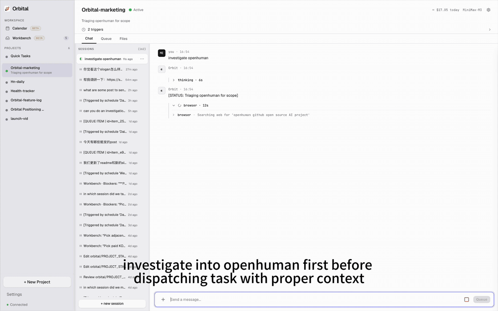</p>

<p align="center"><em>What you're seeing: a marketing project asks Orbital to size up a competitor. It researches the target itself so the task brief is accurate, hands the token-heavy deep-dive to Claude&nbsp;Code per a standing project directive, then reads the findings back against the project's own decisions and lessons — ending on the calls only you can make.</em></p>

<p align="center">
  
</p>

<h1 align="center">Orbital</h1>
<p align="center"><strong>The project agent</strong></p>
<h3 align="center">Every agent owns a session. Orbital owns the project.</h3>

Orbital works like Claude Code or Codex: ask it to research, plan, write, run commands, browse the web, or operate your tools.

The difference is that Orbital treats a local folder as a long-running project.

As it works, Orbital maintains and records the project's current state, decisions, lessons, task queue, and artifacts inside that folder. Every new task starts from the context accumulated by previous work, so the agent's work compounds over time.

Orbital can also dispatch Claude Code, Codex, Gemini CLI, Cursor, and other CLI agents. Every dispatch briefs the worker on the project and the task, and points it at the relevant project files — so you don't have to explain the project again each time. Orbital watches the run, reads what comes back against the project's context, and writes the outcome into the project.

<p align="center"><strong>One accountable manager · Interchangeable workers · Local-first</strong></p>

<p align="center">
  <a href="https://github.com/zqiren/Orbital/releases/latest"><strong>Windows Installer (.exe)</strong></a> &nbsp;&middot;&nbsp;
  <a href="https://github.com/zqiren/Orbital/releases/latest"><strong>macOS Installer (.dmg)</strong></a> &nbsp;&middot;&nbsp;
  <a href="https://www.youtube.com/watch?v=U2I0DUUUIzo"><strong>Watch the demo</strong></a>
</p>
<p align="center">Set up in under 5 minutes. No Python or Node required. Bring your own API key.</p>

[](#license)  

---

## Why a project agent?

People already use several capable agents at work — for the newest model, the leftover quota, or because a particular tool is better at the job.

But each agent works inside its own session, with its own context and history. When you move between sessions or tools, you become responsible for carrying the project between them: restating goals, explaining previous decisions, locating artifacts, and checking what was left unfinished. You end up working as their intern, ferrying context between them to keep your own project moving.

Orbital changes the unit of work from the session to the project.

A project agent stays responsible for the project across tasks, sessions, and worker agents. It maintains the shared context, decides what needs to happen next, delegates when useful, and records every outcome back into the project.

Individual agents complete tasks. Orbital keeps the project moving.

---

## What it means to own the project

Orbital maintains five things that normally disappear or fragment between agent sessions — all of them as plain files in your project folder:

- **State** — what is true about the project now (`PROJECT_STATE.md`)
- **Decisions** — what was decided and why (`DECISIONS.md`)
- **Lessons** — what the project has learned (`LESSONS.md`)
- **Work** — what is running, completed, or blocked (`queue.json`). Every queued task ends **Completed** or **Blocked** — an agent that stops without a verdict gets re-prompted, then force-blocked with a reason. Nothing drifts away silently.
- **Artifacts** — what the agents researched, wrote, or built (the workspace itself, plus `orbital/output/`)

These stay in the local project and become context for future work. On a cold start, Orbital assembles them into its own system prompt before it acts.

When Orbital delegates, the worker is pointed at those same files and told they are authoritative — that briefing is rendered fresh on every dispatch, not something you paste in. Each worker also keeps its own memory file inside the project, so it accumulates its own experience across dispatches. When the task finishes, Orbital reads the result and records what matters back into the project.

The worker can change. The project continues.

---

## How it works

1. **Set up once** — pick an LLM provider and paste your API key; optionally connect accounts your agents will need.

2. **Create a project** — name it, choose the local folder that holds your work, set an autonomy level.

3. **Give Orbital a task** — ask it to research, plan, write, code, browse, or work with files.

4. **Orbital maintains the context** — it keeps the project's state, decisions, lessons, queue, and artifacts current as the work progresses.

5. **Orbital delegates when useful** — it dispatches work to Claude Code, Codex, Gemini CLI, Cursor, or another CLI agent against the same accumulated context.

6. **Every result becomes part of the project** — future tasks begin on top of the work that came before them.

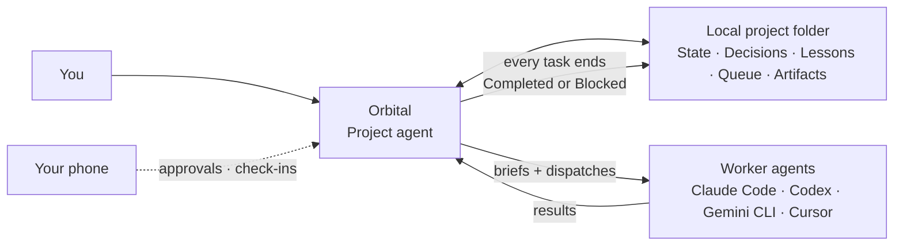
```mermaid
flowchart LR
    You["You"] --> Orbital["Orbital<br/>Project agent"]
    Orbital <--> Project["Local project folder<br/>State · Decisions · Lessons · Queue · Artifacts"]
    Orbital -->|briefs + dispatches| Workers["Worker agents<br/>Claude Code · Codex · Gemini CLI · Cursor"]
    Workers -->|results| Orbital
    Orbital -->|every task ends<br/>Completed or Blocked| Project
    Phone["Your phone"] -.->|approvals · check-ins| Orbital
```

---

## A concrete example

Suppose you ask Orbital to research a competitor.

Orbital gathers the initial information and records the findings inside the project. It then dispatches the token-heavy technical investigation to Claude Code, which starts by reading the project's goals, constraints, and previous decisions from the project folder.

When Claude Code finishes, Orbital reads its findings and records the useful results back into the project.

A week later, you ask Orbital to draft a launch plan. It begins with that earlier research, the decisions made since, and the artifacts already produced.

You do not begin again with an empty chat. You continue the project.

---

## Quick Start

1. **Launch Orbital** — the setup wizard guides you through two steps:

   **Step 1 — LLM Provider:** Pick a provider from the preset cards, follow the key-console link to grab an API key, and paste it in. Supports DeepSeek, Anthropic, OpenAI, Moonshot, and a dozen other providers.

   <p align="center">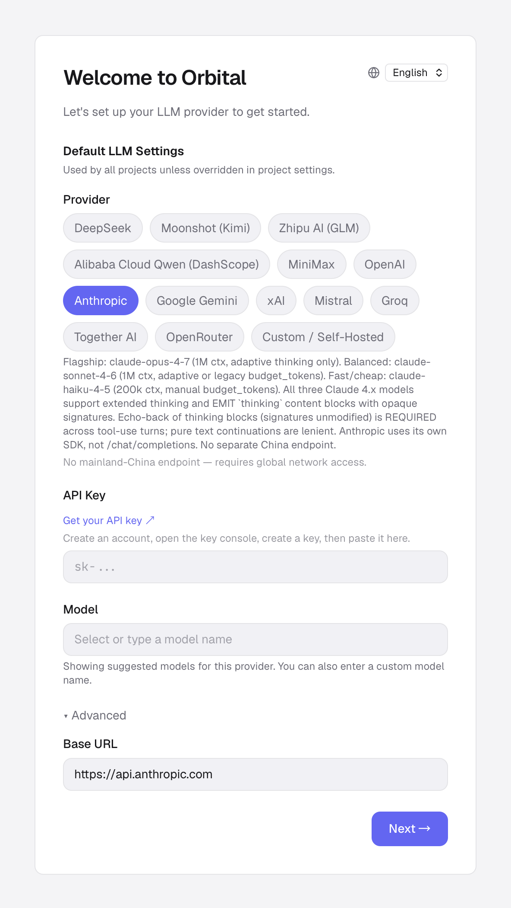</p>


   **Step 2 — Connect Your Accounts:** Link API connectors (Google Calendar, Drive) and sign in to sites your agents will need (Google, GitHub, etc.) so they can browse without getting blocked by CAPTCHAs. Everything here is optional and can be done later in Settings.

   <p align="center">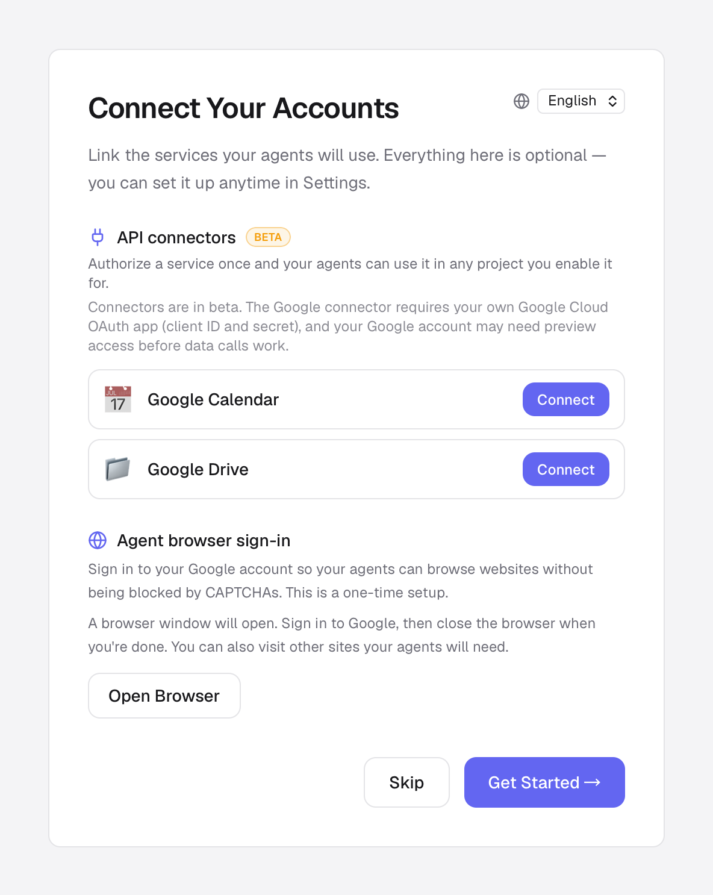</p>


2. **Create a project** — give it a name, pick a workspace directory, set an autonomy level

<p align="center">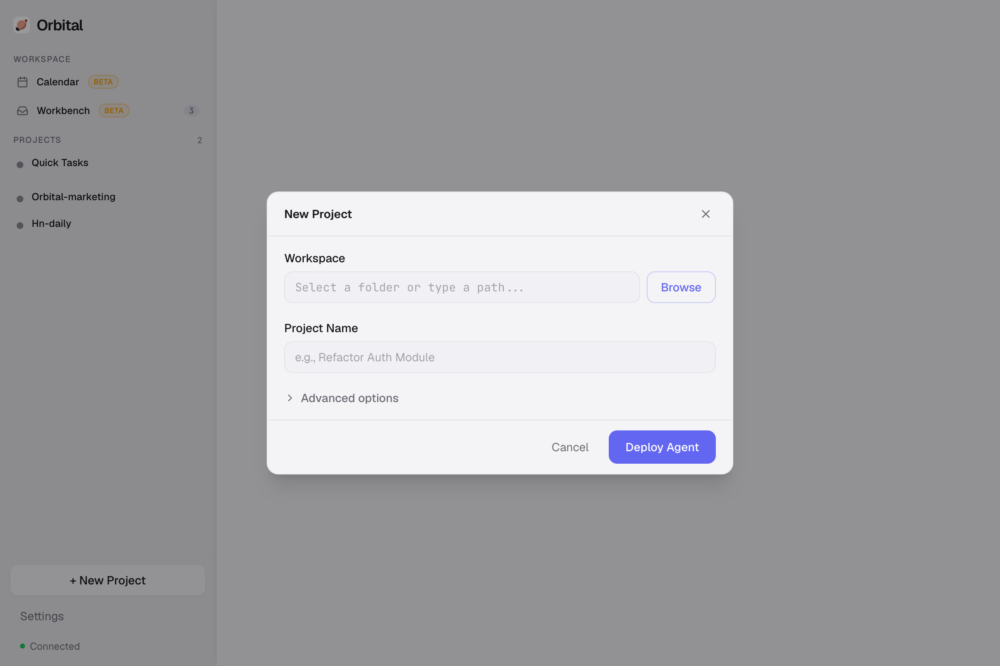</p>

3. **Chat** — type a task in the chat bar and the project agent handles it
4. **Walk away** — queue the next tasks; each finished one becomes context the next builds on

---

## See the project stay under one manager

<p align="center">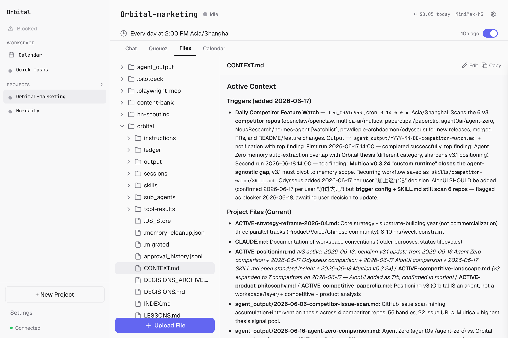</p>
<p align="center"><em>The project agent keeps the project's state, decisions, and lessons current across sessions.</em></p>

<p align="center">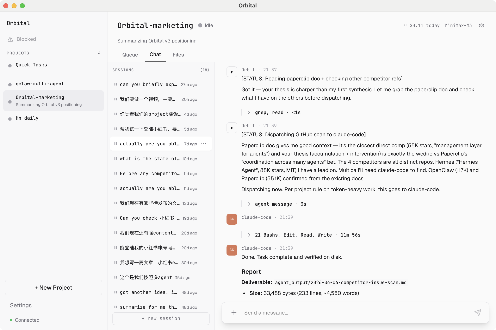</p>
<p align="center"><em>It delegates to Claude Code, Codex, or Gemini CLI against the same project context, then records the result.</em></p>

---

## At a Glance

**Why the project never loses its memory**

- **Accountable management loop** — one agent plans, delegates, supervises, and records outcomes for the project
- **Persistent project context** — PROJECT_STATE.md, DECISIONS.md, LESSONS.md, and artifacts remain available across sessions
- **Self-improving skills** — the agent creates reusable skills from multi-step workflows and consults them before repeating similar tasks

**Why you can swap agents mid-project**

- **Interchangeable workers** — dispatch Claude Code, Codex, Gemini CLI, Cursor, or any CLI agent against the same project context
- **Task queue** — queue work per project and walk away; the agent drains items one at a time, marking each completed (with a summary) or blocked (with a reason); pause mid-queue to chat and steer, then resume

**Why you can delegate without watching**

- **Workbench** (beta) — the decisions and actions only you can take, flagged by the agent as it works and collected across every project into one list, each with the evidence behind it
- **Project-based governance** — each project is a folder with its own workspace, instructions, queue, budget, approval policy, and audit trail
- **Sandboxed execution** — agents only access folders you specify (Windows sandbox user, macOS Seatbelt)
- **Approval workflows** — agents pause before risky actions; approve from desktop or phone
- **Budget controls** — per-project spending limits with configurable actions
- **Credential store** — API keys and website passwords in OS keychain, never exposed to chat

**Why the project moves while you're away**

- **Triggers** — set up a cron job or file watcher so the project agent checks in regularly and kicks off workers without you
- **Calendar** (beta) — every enabled automation projected onto a week view, so scheduled work stays visible instead of firing invisibly
- **Mobile supervision** — manage agents from your phone via QR code pairing

**Under the hood**

- **13 built-in LLM providers** — Anthropic, OpenAI, DeepSeek, Moonshot (Kimi), Groq, Google Gemini, xAI, Mistral, Together, OpenRouter, Zhipu, Qwen, plus custom endpoints
- **Browser automation** — 26 browser actions via Patchright with anti-detection

---

## How Orbital compares

Memory, scheduling, and sub-agents are table stakes now — every tool below has them. These are the three questions where the answers still differ.

| July 2026 | Orbital | [Claude Code](https://code.claude.com/docs/en/desktop) | [Codex](https://developers.openai.com/codex/) | [Hermes](https://github.com/NousResearch/hermes-agent) | [OpenClaw](https://docs.openclaw.ai/) |
| --- | --- | --- | --- | --- | --- |
| Can a different agent pick up the next task? | ✅ Claude Code, Codex, Gemini CLI, Cursor, any CLI | ❌ Claude workers | ❌ Codex workers | ❌ Hermes workers | Partial (external harnesses via ACP) |
| What stops a queued task from drifting? | ✅ Enforced Completed/Blocked closure | ❌ | ❌ | ❌ | ❌ |
| Who owns the budget, approvals, and audit trail? | ✅ The project | Partial (permissions + run history) | Partial (approvals + enterprise audit) | Partial (command approvals) | Partial (approvals + logs) |

**The short version:** the difference isn't any one capability — it's that the project, not the session, is the unit that owns state, workers, and governance.

---

## Feature Deep Dives

<details>
<summary><strong>Orbital Is / Is Not</strong></summary>

| Orbital **IS** | Orbital **IS NOT** |
| --- | --- |
| A project workspace where you and your agents share the same files, history, and context | A cloud service — everything runs on your machine |
| A sub-agent coordinator: Claude Code via SDK, Codex via app-server, and Gemini CLI, Cursor, or other workers via PTY/[ACP](https://agentcommunicationprotocol.dev/) | An OpenClaw fork — custom agent loop, built from scratch |
| Remote supervision: approve actions, browse workspace files, upload from phone | A chat wrapper — agents run continuously via cron and file watchers |
| Budget controls, autonomy presets, credential management (OS keychain) | Fully autonomous God Mode (yet) — scheduler-driven today, full autonomy on the roadmap |

</details>

### How the project stays under one manager

<details>
<summary><strong>Project & Workspace Model</strong></summary>

Each project maps to a workspace directory and maintains its own sessions, queue, triggers, and configuration.

<p align="center">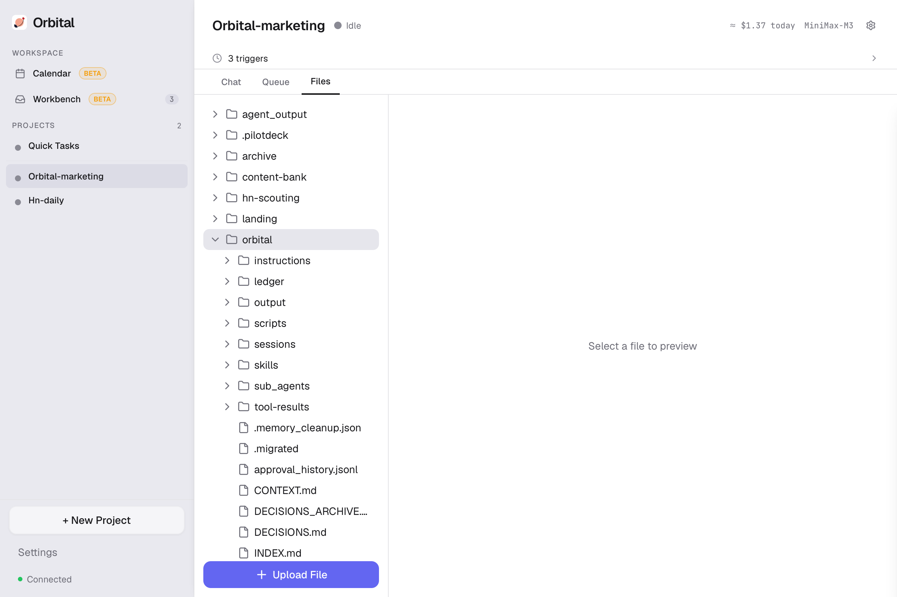</p>
<p align="center"><em>Browse, preview, and upload files in each project's workspace — and watch the agent's output accumulate</em></p>

```
{workspace}/
+-- AGENTS.md                           # Onboarding signpost for external agents (seeded at creation, user-owned)
+-- orbital/                            # Operational metadata
    +-- sessions/
    |   +-- {session_id}.jsonl          # Append-only session log
    +-- instructions/
    |   +-- project_goals.md
    |   +-- user_directives.md
    +-- skills/                         # Project skills
    +-- sub_agents/                     # Sub-agent transcripts + per-worker MEMORY.md
    +-- tool-results/                   # Tool output artifacts
    +-- output/                         # Agent work artifacts
    |   +-- screenshots/                # Browser screenshots
    |   +-- pdfs/                       # Saved PDFs
    |   +-- shell-output/               # Shell command output
    +-- queue.json                      # Task queue (queued / running / completed / blocked)
    +-- PROJECT_STATE.md                # Current-state scratchpad (overwrite)
    +-- DECISIONS.md                    # Durable decisions + reasoning
    +-- LESSONS.md                      # Durable heuristics / playbooks
    +-- INDEX.md                        # Navigation map: file tree + one line per file
    +-- DECISIONS_ARCHIVE.md            # Demoted decisions (read-on-demand)
    +-- LESSONS_ARCHIVE.md              # Demoted lessons (read-on-demand)

~/orbital/                              # Home global (daemon infrastructure)
+-- daemon.pid                          # Singleton enforcement
+-- device.json                         # Device identity
+-- browser-profile/                    # Shared browser profile
+-- credential-meta.json                # Credential metadata
```

**Session format**: One JSON line per message (role, source, content, timestamp, tool_calls). Append-only with file locks. Never modified except during compaction.

</details>

<details>
<summary><strong>Context Management & Compaction</strong></summary>

This is how the project agent keeps context available across sessions. The agent-maintained Layer-1 files are injected every turn (bounded per file) and consolidated at session boundaries:

| File | Purpose | Bound |
|------|---------|-------|
| `PROJECT_STATE.md` | Current-state scratchpad — what's true now (overwrite, not a changelog) | token cap → trim oldest |
| `DECISIONS.md` | Durable decisions + reasoning (merge-and-supersede, never contradict) | token cap → demote oldest-cold to archive |
| `LESSONS.md` | Durable heuristics / technical playbooks (kept intact, never word-trimmed) | token cap → demote oldest-cold to archive |
| `INDEX.md` | Navigation map only: file tree + one sentence per file | one-sentence format + token cap |
| `DECISIONS_ARCHIVE.md`, `LESSONS_ARCHIVE.md` | Demoted durable entries, read-on-demand (pointed to by INDEX) | unbounded |

Each entry carries system-managed metadata (`id` / `created` / `touched` / `tag`) so dedup runs on recency. Per-turn injection bounds each file to a budget derived from the active model's context window. Session-end runs a deterministic size backstop (demote/trim, never an LLM call) plus a best-effort LLM dedup/merge that fixes contradictions. (`SESSION_LOG.md` was retired; the Layer-1 files are injected every turn, so a separate session history is redundant.)

**Cold resume**: On session start, these files are assembled into the system prompt so the agent can reorient before it acts.

<p align="center">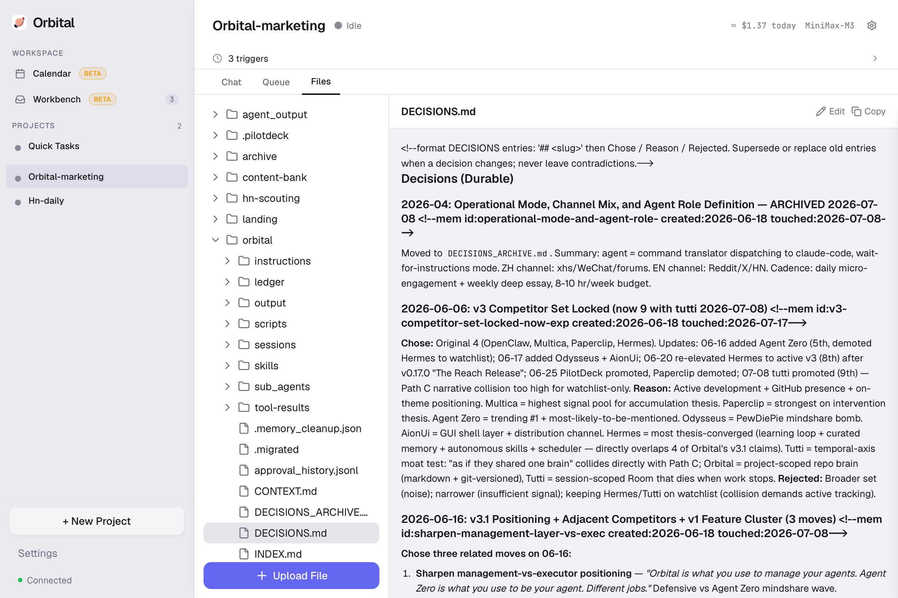</p>
<p align="center">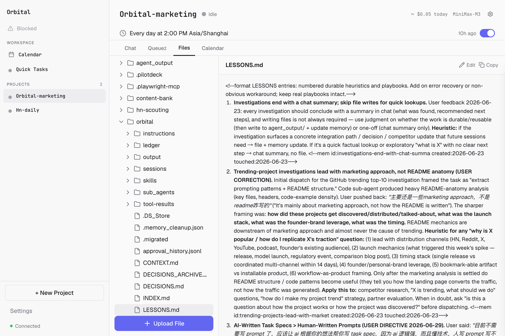</p>
<p align="center"><em>DECISIONS.md and LESSONS.md — written by the agent as it works, and carried into every future session</em></p>

**Compaction** (when context usage exceeds 80%): memory flush, LLM-driven summarization of older messages, recent messages kept intact, post-compaction reorientation with project goals and current state.

**Prefix caching** (v0.4.2): the system prompt is split into static, semi-stable, and truly-dynamic sections so up to ~95% of input tokens hit the provider's prefix cache on follow-up turns. See the [v0.4.2 release notes](https://github.com/zqiren/Orbital/releases/tag/v0.4.2) for benchmark numbers.

</details>

<details>
<summary><strong>Sub-Agent Delegation</strong></summary>

Orbital is not tied to a single AI tool. The project agent plans and delegates, while specialized workers execute — each reading the same accumulated project context. Any CLI-based agent can be registered via a manifest file; Claude Code, Codex, Cursor, Gemini CLI, Aider, Cline, Goose, Copilot CLI, and Continue ship with one.

Each dispatch renders a fresh inheritance prompt that points the worker at `PROJECT_STATE.md`, `DECISIONS.md`, `LESSONS.md`, `INDEX.md`, the project's instructions, and its skills — declaring them authoritative and off-limits for writes. Workers read them on demand rather than receiving a pasted copy, so the brief never goes stale.

<p align="center">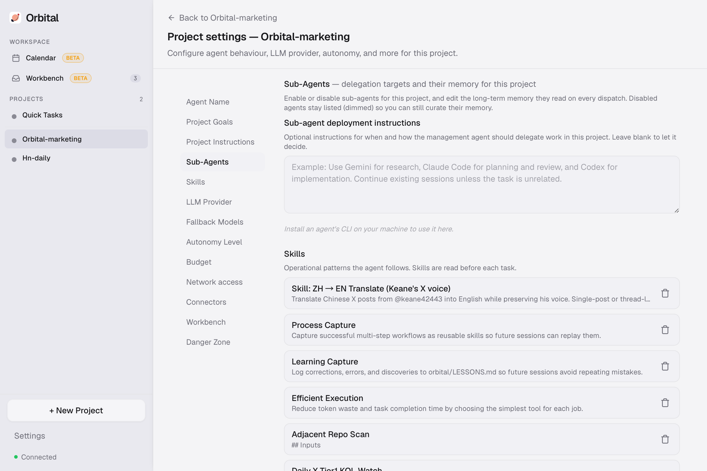</p>
<p align="center"><em>Each sub-agent keeps its own long-term memory across dispatches — curate what it remembers...</em></p>

<p align="center"></p>
<p align="center"><em>...then delegates a task to @claudecode, reviews the result, and writes it back into the project</em></p>

**Transport types:**

| Transport | Use Case |
|-----------|----------|
| **Codex app-server** | Native Codex JSON-RPC over stdio, with structured lifecycle and approvals |
| **Pipe** | stdin/stdout subprocess, JSON streaming |
| **PTY** | Pseudo-terminal for interactive agents — Gemini CLI, Aider, Cline, Goose, Copilot CLI, Continue |
| **SDK** | Direct Claude SDK integration |
| **ACP** | [Agent Communication Protocol](https://agentcommunicationprotocol.dev/) — Cursor, via its official ACP server |

> **Note:** Codex uses its native app-server path, not PTY or ACP. Orbital launches `codex app-server` and speaks JSON-RPC directly. ACP is available for any ACP-compliant worker; PTY is the default for other interactive CLI agents.

</details>

<details>
<summary><strong>Task Queue</strong></summary>

Each project has a queue, stored with the project at `orbital/queue.json`. Add tasks — pin urgent ones to the front — and your agent works through them one at a time, in order, without you watching.

The agent must declare an outcome on every item; it can't silently drift to the next one:

| Outcome | What happens |
|---------|--------------|
| **Completed** | The agent reports a short summary; the item moves to **Completed** and the queue advances. |
| **Blocked** | The agent states the reason (missing credentials, ambiguous requirements, …); the item moves to **Needs Attention** and the queue moves on. You unblock it when ready. |

**Pause to steer.** Pause the queue mid-item to chat freely — your clarifications land in the same session, so the agent sees them when you resume.

**Continuity by design.** Each completed item's artifacts are already in the project when the next item starts, so the agent can use them when supervising later tasks. The project's triggers (schedules and file watchers) are listed in the queue's **Automations** section alongside your tasks.

<p align="center">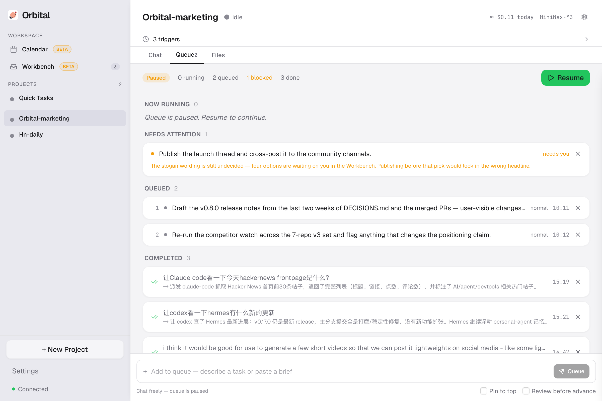</p>
<p align="center"><em>Queue tasks and walk away — each finished one becomes context the next builds on</em></p>

</details>

<details>
<summary><strong>Workbench — what only you can decide</strong> (beta)</summary>

Some things an agent genuinely cannot finish for you: a spend decision, a message that has to come from your account, a judgment call between three options it already researched. As the agent works, it flags those in the project's state file — and the **Workbench** collects them from every project into one list.

Each card carries its provenance, so you are never asked to act on a bare instruction. Expand **Why I believe this** and you see the evidence the agent recorded and the session it came from. Cards sort overdue-first, then oldest, and each one exits in a single tap — **Done** once you've handled it, **Delete** when it stopped mattering. Tapping the card itself opens that project's chat with the decision pre-filled, so answering is one message instead of a hunt for context.

The **Today** strip along the top lists the day's automation slots, including the ones that already fired — so a single glance covers both what needs you and what ran without you.

<p align="center">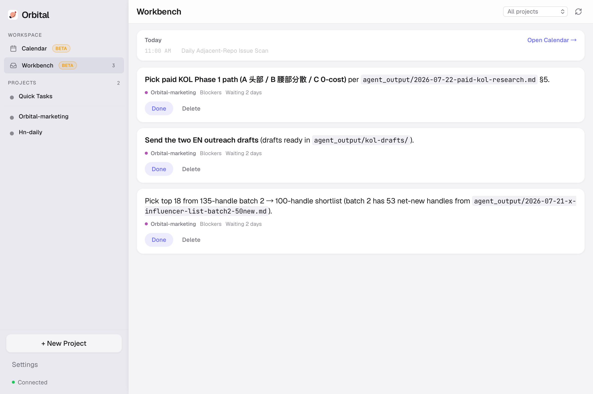</p>
<p align="center"><em>Every project's open decisions in one list — with the evidence behind each one a click away</em></p>

</details>

<details>
<summary><strong>Calendar</strong> (beta)</summary>

Automations you set up months ago shouldn't fire invisibly. Every enabled schedule trigger projects its upcoming runs onto a week grid, so the rhythm of the project is something you can see rather than remember. Dated commitments the agent recorded in the project state land on the same grid and drop off once they're resolved, and connecting Google Calendar brings those events into the same view.

The project agent can read this calendar too, so "what's already on the schedule" is context it plans around instead of something you have to restate.

<p align="center">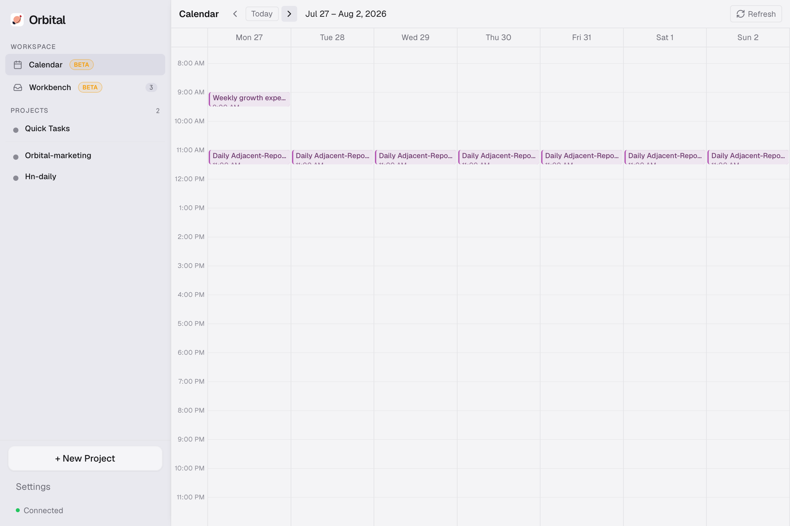</p>
<p align="center"><em>The week ahead, as your automations will actually run it</em></p>

</details>

<details>
<summary><strong>Quick Tasks</strong></summary>

The sidebar includes a **Quick Task** section for fire-and-forget interactions. Scratch projects skip the full project creation flow — useful for one-off tasks that don't need a dedicated workspace.

<p align="center">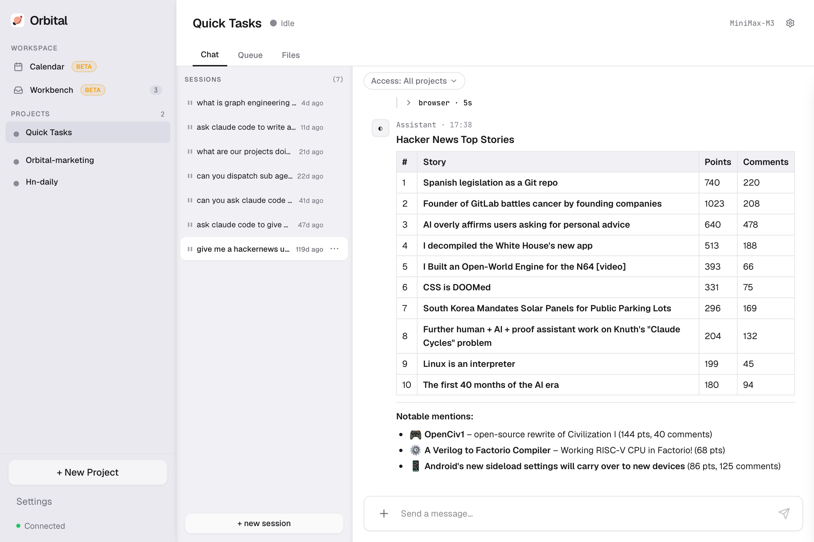</p>

</details>

<details>
<summary><strong>Self-Improving Skills</strong></summary>

Agents create reusable skills from multi-step workflows and consult matching skills before starting similar tasks. Skills are stored as SKILL.md files in the workspace and managed through the Settings UI — another way the project gets more capable the longer it runs.

<p align="center">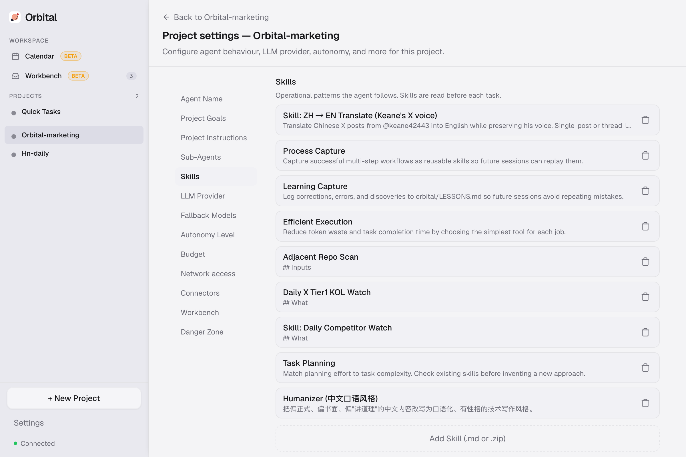</p>
<p align="center"><em>Skills like Efficient Execution, Learning Capture, and Task Planning shape how your agent works — and the agent adds its own</em></p>

</details>

### Tools & execution

<details>
<summary><strong>Built-in Tool Suite</strong></summary>

The project agent has access to these tool categories:

| Category | Tools | Description |
|----------|-------|-------------|
| **Shell** | `shell` | Command execution with network-aware detection |
| **File** | `read`, `write`, `edit`, `glob`, `grep` | File operations and search within workspace |
| **Browser** | 26 actions via Patchright | Navigate, click, type, extract, screenshot, multi-tab, PDF, web search, URL fetch |
| **Triggers** | `create_trigger`, `list_triggers`, `update_trigger`, `delete_trigger` | Schedule and file-watch triggers via natural language |
| **Credentials** | `request_credential` | Agent-initiated credential request — opens secure modal |
| **Delegation** | `agent_message` | Route tasks to sub-agents |
| **Access** | `request_access` | Request sandbox portal to a path outside the workspace |

</details>

<details>
<summary><strong>Browser Automation</strong></summary>

Built on **Patchright** (a Playwright fork with anti-bot-detection):

- **Stealth mode**: Anti-automation detection scripts injected into every browser context
- **Shared profile**: One browser profile across all projects — log into services once, all agents share cookies
- **Accessibility-first**: `snapshot` returns an accessibility tree with `[ref=eN]` element references for reliable interaction
- **26 browser actions**: navigate, click, type, fill, press, hover, select, drag, upload, snapshot, screenshot, extract, search (page), evaluate, tab management, go back/forward, reload, wait, PDF export, web search, URL fetch, batch

<p align="center">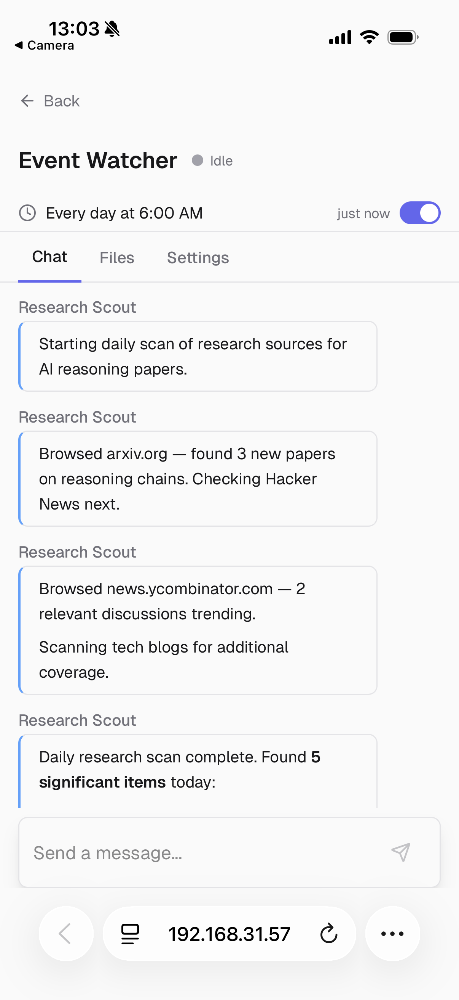</p>
<p align="center"><em>Your agent browsing arxiv.org — scanning for AI reasoning papers on a daily schedule</em></p>

</details>

<details>
<summary><strong>Continuous Operation & Triggers</strong></summary>

Agents run continuously via triggers — no manual intervention needed. Create triggers through **natural language** in the chat:

> *"Watch the uploads/ folder for new .jpg files and analyze them"*
> *"Run a research scan every morning at 6 AM"*

The project agent translates this into a `create_trigger` tool call with the appropriate type and parameters.

**Trigger types:**

| Type | Configuration | Example |
|------|--------------|---------|
| **Schedule** | Cron expression + timezone | `0 6 * * *` (daily at 6 AM) |
| **File Watch** | Path + glob patterns + debounce | `uploads/*.jpg`, 5s debounce |

<p align="center">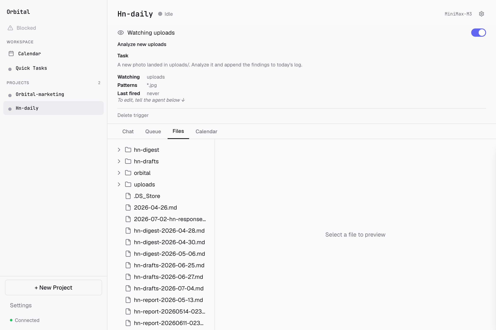</p>
<p align="center"><em>File watch trigger: watches uploads/ for new photos and analyzes each one on arrival</em></p>

<p align="center">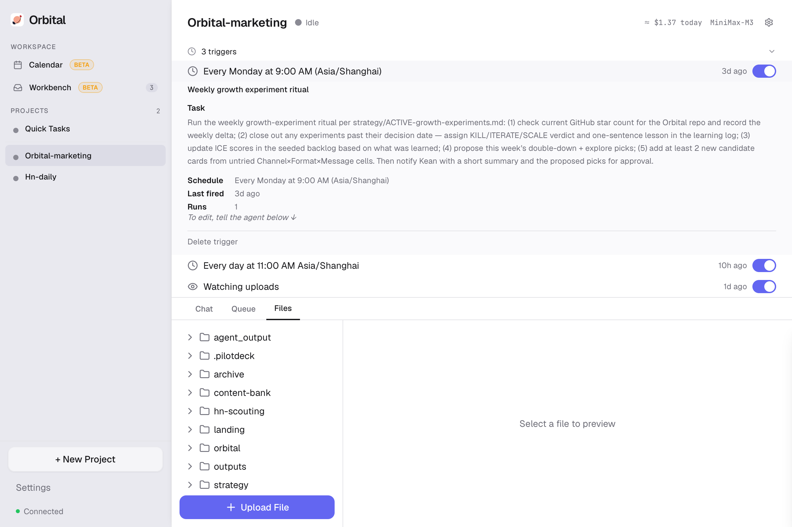</p>
<p align="center"><em>Schedule trigger: a daily competitor watch dispatched every day at 2 PM — 19 runs so far</em></p>

**Real-world example — Health Tracker with file watch:**

<p align="center">
  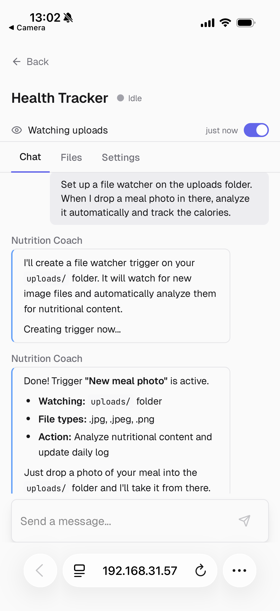
  &nbsp;
  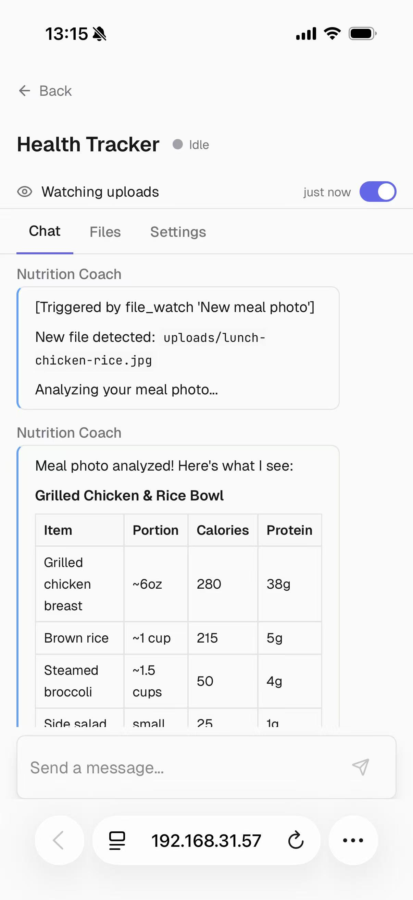
</p>
<p align="center"><em>Left: "Watch uploads/ for meal photos and track calories." Right: Drop a photo, get instant nutritional analysis.</em></p>

</details>

<details>
<summary><strong>LLM Provider Routing & BYOK</strong></summary>

**13 providers** supported out of the box:

Anthropic, OpenAI, DeepSeek, Moonshot (Kimi), Groq, Google Gemini, xAI, Mistral, Together, OpenRouter, Zhipu, Qwen, plus a `custom` entry for any OpenAI-compatible endpoint (e.g., Ollama, Azure OpenAI, self-hosted models).

- **SDK routing**: Anthropic SDK for Anthropic, OpenAI SDK for OpenAI-compatible providers
- **Per-model metadata**: Display name, tier, context window, max output, capabilities (vision, tool use, streaming), pricing
- **Fallback rotation**: When the primary provider fails, the loop rotates to fallback providers with error classification (transient, rate limit, abort)

</details>

### Control & safety

<details>
<summary><strong>Autonomy & Approval System</strong></summary>

Three autonomy presets control how much supervision agents receive:

| Preset | Shell | File Write | Browser | Description |
|--------|-------|-----------|---------|-------------|
| **Hands-off** | Auto | Auto | Auto | Maximum autonomy. Only `request_access` requires approval. |
| **Check-in** | Approval | Approval | Write only | Balanced. Default for external agents. |
| **Supervised** | Approval | Approval | All except read | Maximum oversight. |

<p align="center">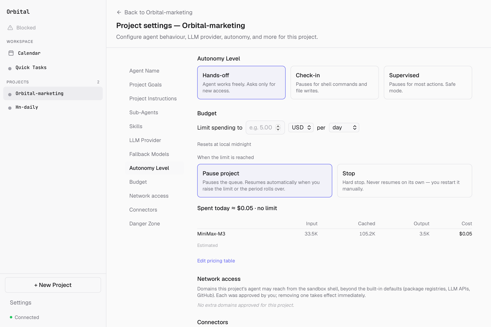</p>
<p align="center"><em>Pick an autonomy level and set budget limits per project</em></p>

**Approval flow:**
1. Interceptor catches tool call based on autonomy rules
2. Frontend shows an **Approval Card** with tool name, arguments, and context
3. User can **Approve**, **Deny**, or **Auto-approve for 10 minutes**
4. Per-action bypass: same tool+args auto-approved for 60 seconds

<p align="center">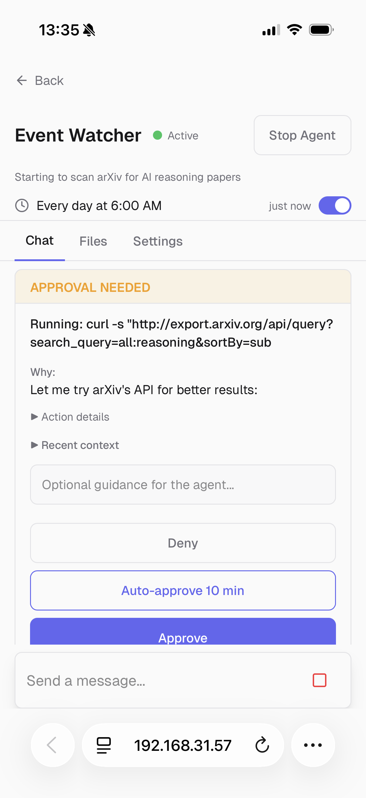</p>
<p align="center"><em>Approve agent actions from your phone — with full context and optional guidance</em></p>

</details>

<details>
<summary><strong>Cost Controls & Budget Limits</strong></summary>

Per-project budget limits prevent runaway spending:

| Setting | Description |
|---------|-------------|
| `Budget Limit (USD)` | Maximum spend for the project |
| `Budget Action` | `ask` (pause and prompt user) or `stop` (halt the agent) |
| `Spent` | Running total with reset option |

The agent loop tracks cumulative token usage and computes cost using per-model pricing from the provider registry. When the budget threshold is reached, the configured action fires (`ask` pauses the session; `stop` halts the agent). Budget events do not currently trigger push notifications.

<p align="center">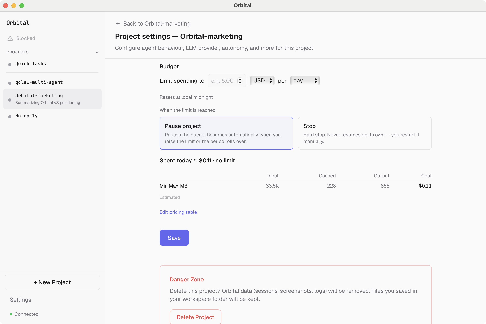</p>
<p align="center"><em>Set a limit and a reset period; watch the live per-model spend and cost breakdown</em></p>

</details>

<details>
<summary><strong>Mobile Remote Control</strong></summary>

Control agents from your phone on the local network or via a cloud relay.

<p align="center">
  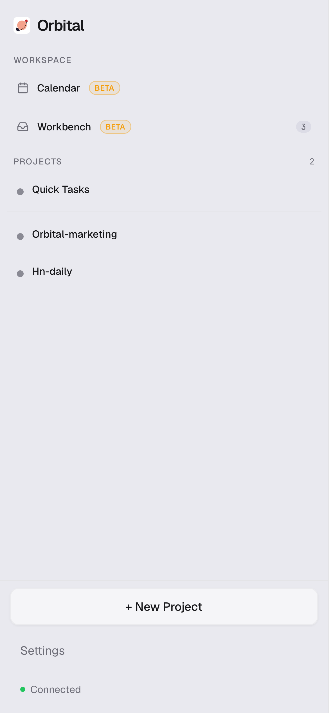
  &nbsp;
  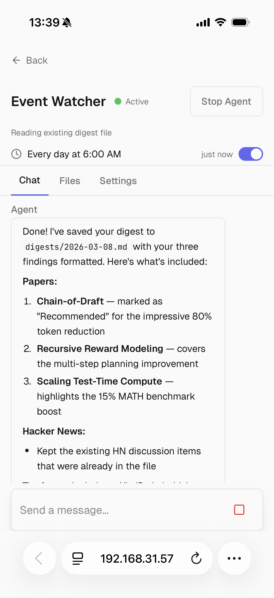
</p>
<p align="center"><em>Left: Project dashboard on phone. Right: Your agent completes its research after you approve from anywhere.</em></p>

**Local network**: Scan the QR code in Settings to open Orbital on your phone via LAN.

<p align="center">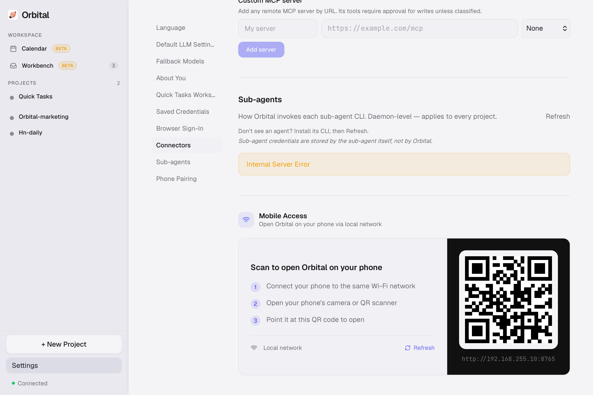</p>
<p align="center"><em>Scan to open Orbital on your phone — same Wi-Fi network required</em></p>

**Cloud relay** (optional): Deploy a relay server for access outside your home network. Push notifications for approval requests and agent status changes.

</details>

<details>
<summary><strong>Credential Management</strong></summary>

<p align="center">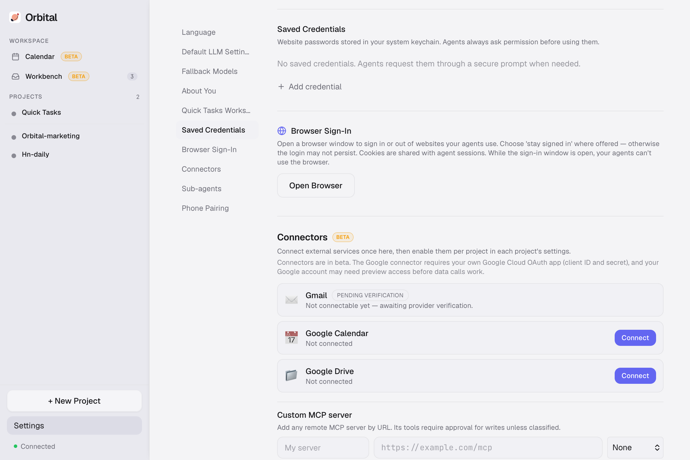</p>
<p align="center"><em>Website credentials stored in your system keychain. Your agent always asks permission before using them.</em></p>

- **API keys**: Stored in OS keychain (`keyring`), masked in API responses, per-project BYOK override
- **Website credentials**: Metadata in `credential-meta.json`, values in OS keychain. The `request_credential` tool lets agents request credentials mid-session via a secure modal — credentials never appear in chat history.

</details>

<details>
<summary><strong>Loop Safety Guards</strong></summary>

The agent loop includes multiple safety mechanisms to prevent runaway execution:

| Guard | Threshold | Behavior |
|-------|-----------|----------|
| **Token budget** | 100M tokens (configurable) | Hard stop on cumulative usage |
| **Repetition detection** | 5 identical action hashes | Forces different approach |
| **Ping-pong detection** | 3 identical consecutive pairs | Breaks alternating cycles |
| **Circuit breaker** | 2 consecutive identical errors | Blocks tool until new user message |
| **Context overflow** | 3 consecutive overflows | Hard stop after progressive reduction |

</details>

<details>
<summary><strong>Desktop App & System Tray</strong></summary>

Orbital ships as a desktop application bundled with PyInstaller:

- **System tray**: Agent activity status, quick access menu, running port in tooltip
- **Native window**: Embeds the React frontend via `pywebview` — no browser needed
- **Daemon lifecycle**: Desktop app spawns the daemon on launch, manages port allocation, cleans up on exit
- **Sleep prevention**: Blocks system sleep while agents are active (Windows `SetThreadExecutionState`), re-allows when idle

</details>

---

## Architecture

Orbital is one persistent agent bound to a **project** — not a chat session. It acts as a local control plane for the project's workspace, instructions, state, queue, budget, and approval rules. It plans, delegates, supervises, and records outcomes; worker agents execute against the same project context. You supervise from anywhere.

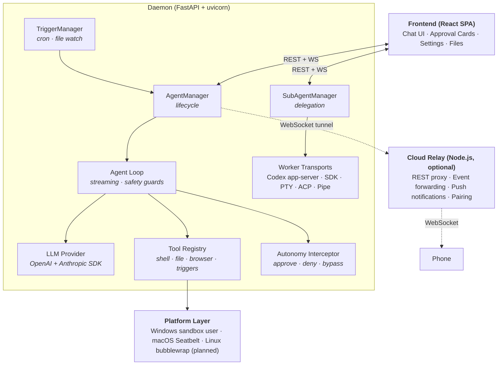
```mermaid
flowchart TB
    UI["<b>Frontend (React SPA)</b><br/>Chat UI · Approval Cards · Settings · Files"]

    subgraph daemon["Daemon (FastAPI + uvicorn)"]
        direction TB
        AM["AgentManager<br/><i>lifecycle</i>"]
        SAM["SubAgentManager<br/><i>delegation</i>"]
        TM["TriggerManager<br/><i>cron · file watch</i>"]
        Loop["Agent Loop<br/><i>streaming · safety guards</i>"]
        TR["Worker Transports<br/>Codex app-server · SDK · PTY · ACP · Pipe"]
        LLM["LLM Provider<br/><i>OpenAI + Anthropic SDK</i>"]
        Tools["Tool Registry<br/><i>shell · file · browser · triggers</i>"]
        Auto["Autonomy Interceptor<br/><i>approve · deny · bypass</i>"]

        AM --> Loop
        SAM --> TR
        TM --> AM
        Loop --> LLM
        Loop --> Tools
        Loop --> Auto
    end

    Platform["<b>Platform Layer</b><br/>Windows sandbox user · macOS Seatbelt · Linux bubblewrap (planned)"]
    Relay["<b>Cloud Relay (Node.js, optional)</b><br/>REST proxy · Event forwarding · Push notifications · Pairing"]
    Phone["Phone"]

    UI <-->|REST + WS| AM
    UI <-->|REST + WS| SAM
    Tools --> Platform
    AM -.WebSocket tunnel.-> Relay
    Relay -.WebSocket.-> Phone
```

**Key design decisions:**
- **The agent owns the project**: it maintains structured state, decisions, lessons, and session history so planning and accountability remain in one place
- **Isolation**: OS-level sandboxing (Windows sandbox user, macOS Seatbelt, Linux bubblewrap planned)
- **Fail-closed interceptor**: Any approval system error results in DENY, never ALLOW
- **Single daemon**: PID file enforcement prevents multiple instances
- **Local-first**: Your files and project state live on your disk. The cloud relay, when enabled, proxies approvals and events — not your files.

---

## Installation

### Windows

1. Download the `Orbital-Setup-*.exe` from [Releases](https://github.com/zqiren/Orbital/releases/latest) (latest Windows build)
2. Run the installer and follow the prompts
3. Launch Orbital from the Start Menu or desktop shortcut

<details>
<summary>Windows SmartScreen Warning</summary>

Orbital is not yet code-signed, so Windows will show a security warning:

> **Windows protected your PC** — Microsoft Defender SmartScreen prevented an unrecognized app from starting.

Click **"More info"** then **"Run anyway"**. Code signing will be added in a future release.
</details>

### macOS

1. Download the `Orbital-*-macOS.dmg` from [Releases](https://github.com/zqiren/Orbital/releases/latest)
2. Open the DMG and drag Orbital to your Applications folder
3. Launch Orbital from Applications or Spotlight

Requires macOS 13 (Ventura) or later, **Apple Silicon (M1 or newer)**. Intel Macs are **not** supported by this build (the bundle is arm64-only).

Release builds are Developer-ID signed and notarized by Apple, so the app opens normally on first launch — no Gatekeeper warning or "Open Anyway" workaround needed. (If you built Orbital from source or grabbed a CI branch artifact, that build is ad-hoc signed and macOS will still ask you to approve it once via right-click → Open.)

### From Source

```bash
# Clone the repository
git clone https://github.com/zqiren/Orbital.git && cd Orbital

# Install Python dependencies (Python 3.11+)
pip install -e ".[desktop]"

# Install frontend dependencies (Node.js 18+)
cd web && npm install && cd ..

# Start the daemon
python -m uvicorn agent_os.api.app:create_app --factory --port 8000

# Start the frontend dev server (separate terminal)
cd web && npx vite --host 127.0.0.1 --port 5173
```

Open `http://localhost:5173` in your browser. The setup wizard runs on first launch.

### Note on Sleep/Shutdown

Orbital prevents system sleep while agents are actively working (via OS-level sleep inhibition on Windows and macOS). When all agents are idle, sleep is re-allowed. The system tray icon shows current agent activity status.

---

## Development

### Backend

```bash
# Start daemon
python -m uvicorn agent_os.api.app:create_app --factory --port 8000

# Restart with fresh code
bash scripts/restart-daemon.sh
```

### Frontend

```bash
cd web
npm install
npx vite --host 127.0.0.1 --port 5173
```

### Key Paths

| Component | Path |
|-----------|------|
| FastAPI app factory | `agent_os/api/app.py` |
| Agent loop | `agent_os/agent/loop.py` |
| Tool implementations | `agent_os/agent/tools/` |
| Autonomy interceptor | `agent_os/daemon_v2/autonomy.py` |
| LLM providers | `agent_os/agent/providers/` |
| Trigger manager | `agent_os/daemon_v2/trigger_manager.py` |
| Browser manager | `agent_os/daemon_v2/browser_manager.py` |
| Sub-agent manifests | `agent_os/agents/manifests/` |
| Desktop entry point | `agent_os/desktop/main.py` |
| System tray | `agent_os/desktop/tray.py` |
| Frontend components | `web/src/components/` |

---

## Testing

```bash
# Unit + platform tests
python -m pytest tests/unit/ tests/platform/ -q

# TypeScript check (zero errors expected)
cd web && npx tsc -b

# Daemon integration test
bash scripts/restart-daemon.sh
curl http://localhost:8000/api/v2/projects
```

**Known pre-existing test notes:**
- `test_e2e.py`, `test_user_stories.py` — require a real LLM API key set via `AGENT_OS_TEST_API_KEY`

---

## Roadmap

### Shipped

- Multi-provider LLM routing with fallback rotation
- Three autonomy presets with cascade to sub-agents
- Streaming chat with real-time WebSocket events
- Browser automation with anti-detection (Patchright)
- Continuous operation via schedule and file-watch triggers
- Natural language trigger creation
- Cloud relay with push notifications and device pairing
- Context compaction with pre-compaction memory flush
- Prefix-cache-optimized prompt assembly (v0.4.2)
- Per-project budget limits and cost tracking
- Credential management (API keys + website credentials)
- Desktop app with system tray and native window
- Agent loop safety guards (iteration cap, repetition, ping-pong, circuit breaker)
- OS-level sleep prevention during agent activity
- Sub-agent delegation with @mention routing

### Next

- **Webhook triggers** — HTTP endpoint that fires agent tasks on incoming webhooks
- **Pipeline triggers** — Chain project outputs as inputs to other projects
- **Network isolation** — Per-project domain allowlists enforced at OS level
- **Linux sandboxing** — bubblewrap enforcement
- **Code signing** — Eliminate SmartScreen warnings on Windows
- **Auto-resume on daemon restart** — Restore in-progress sessions

---

## Why I built this

I loved Claude Projects. I hated that I couldn't let an agent update the project, and that it didn't live on my machine.

I loved OpenClaw. I hated the lack of control — no budget, no sandbox, no way to supervise from my phone when I stepped away.

Orbital is the thing I wanted. One agent accountable for the whole project: the plan, the decisions, the queue, the budget, and the approvals. The phone to check in when I'm not at my desk. Claude Code, Codex, and Gemini CLI as workers it can choose for the job without handing away the project's context.

Built nights and weekends while working full-time. Still very early. Feedback and issues welcome.

---

## Telemetry

Orbital sends **one anonymous aggregate per day** — counters, enums, and
booleans only. Never prompts, files, paths, model output, or any
project/session identifier. The exact outbound JSON is inspectable verbatim in
**Settings → Data & privacy**, where a single toggle turns it off. The full
published schema is in [docs/TELEMETRY.md](docs/TELEMETRY.md).

---

## License

Orbital is licensed under the [GNU General Public License v3.0](LICENSE).

```
Orbital — Every agent owns a session. Orbital owns the project.
Copyright (C) 2026 Orbital Contributors

This program is free software: you can redistribute it and/or modify
it under the terms of the GNU General Public License as published by
the Free Software Foundation, either version 3 of the License, or
(at your option) any later version.
```
