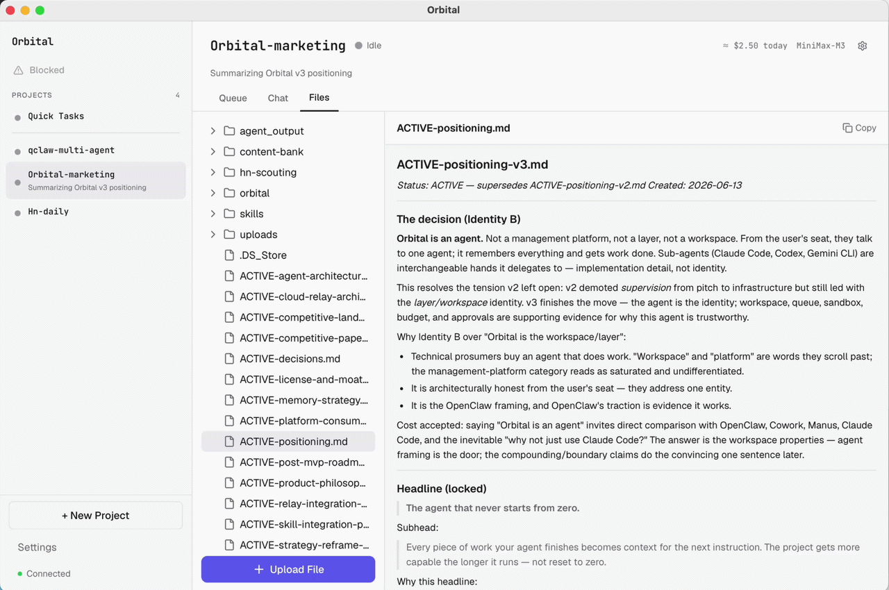
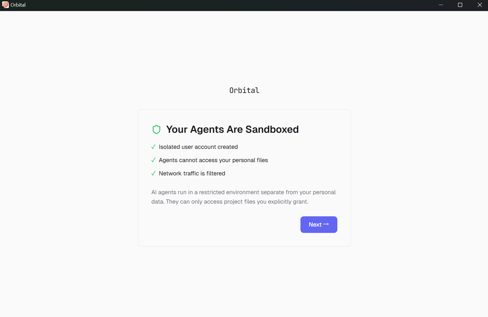
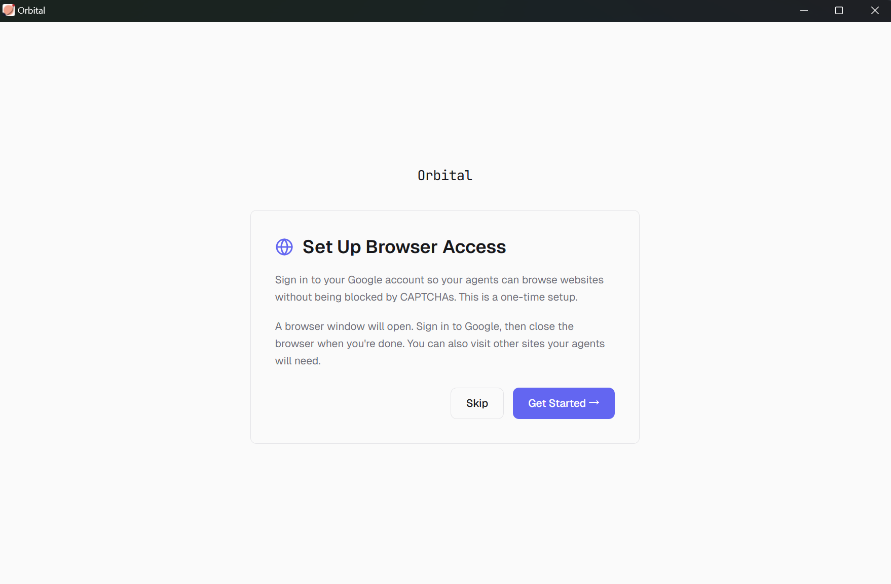
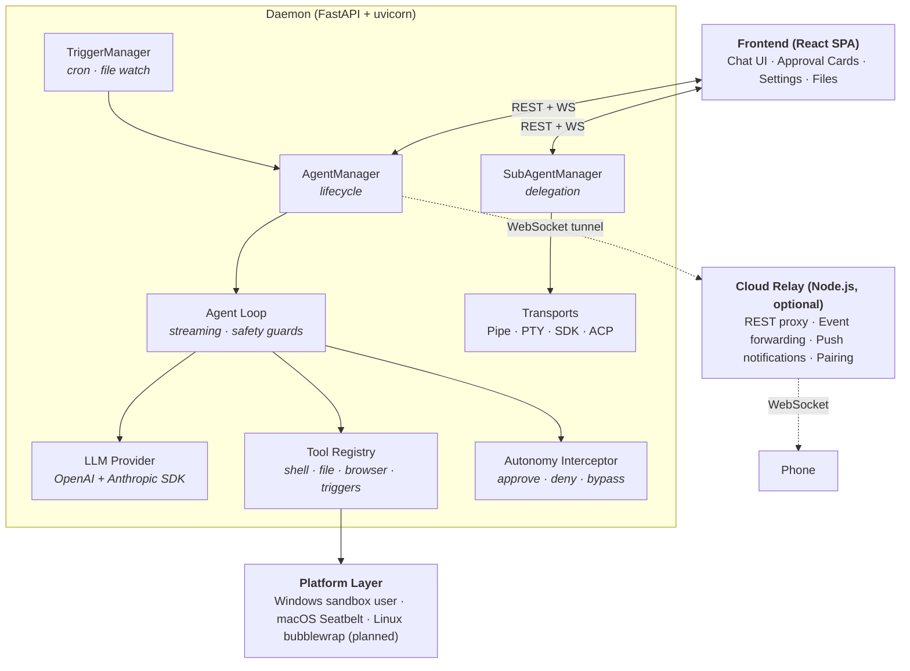
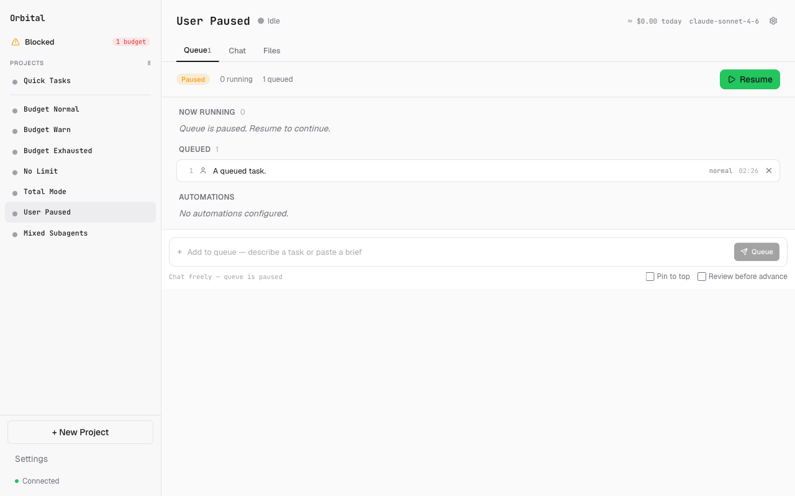

<p align="center">
  <strong>English</strong> · <a href="README.zh-CN.md">简体中文</a>
</p>

<p align="center"></p>
<p align="center"><em>You give your agent the work. It reads everything the project already knows, does it, and writes back what it learned.</em></p>

<h2 align="center">The agent that never starts from zero.</h2>
<p align="center">Every piece of work your agent finishes becomes context for the next instruction.<br>The project gets more capable the longer it runs — not reset to zero.</p>

<p align="center">
  <a href="https://github.com/zqiren/Orbital/releases/download/v0.6.0/Orbital-Setup-0.6.0.exe"><strong>Windows Installer (.exe)</strong></a> &nbsp;&middot;&nbsp;
  <a href="https://github.com/zqiren/Orbital/releases/download/v0.6.0/Orbital-0.6.0-macOS.dmg"><strong>macOS Installer (.dmg)</strong></a> &nbsp;&middot;&nbsp;
  <a href="https://www.youtube.com/watch?v=ranTQFmW6vU"><strong>Watch the demo</strong></a>
</p>
<p align="center">Set up in under 5 minutes. No Python or Node required.</p>

<p align="center">
  
</p>

# Orbital

[](#license)   

---

## Why this exists

Every agent today forgets. You paste the same context into every session. You re-explain the project every morning. The decisions you settled last week vanish when the session ends, so you settle them again.

Your agent dies. Your session ends. Your work doesn't.

Orbital is an agent built around that fact. Everything it finishes — the artifacts it produced, the decisions, the lessons — is written into the project and read back at the start of the next session. Instead of starting from zero, your agent starts from everything it has already made. The work compounds.

---

## What makes Orbital different

**Artifacts that compound.** Most of the work in a project is your agent producing artifacts — code, documents, research, reports. Every artifact it finishes becomes reference material for the next session and the next artifact, alongside the state, decisions, and lessons it keeps current. A project you opened yesterday knows what happened yesterday — and builds on it.

**Grounded in your real work.** The project is a folder on your disk, local-first. Your files aren't just storage — they're what your agent reads before it produces anything, so its artifacts target your actual codebase, your actual documents, your actual data, instead of plausible-sounding output grounded in nothing.

**Swap the hands, keep the memory.** Your agent delegates execution to sub-agents — Claude Code, Codex, Gemini CLI, or any CLI agent. They're interchangeable: each one works from the same accumulated context — the same files, decisions, instructions, and history — and what they finish flows back into the project. Change the sub-agent; lose nothing.

**Safe to leave running.** Queue up tasks and walk away: your agent works through them one at a time, declaring an outcome on every item — completed with a summary, or blocked with a reason for you to resolve. It works inside sandbox boundaries you set, under a per-project budget, with approval rules you control.

---

## At a Glance

- **Persistent context** — PROJECT_STATE.md, DECISIONS.md, LESSONS.md maintained across sessions, so each session starts from everything the last one finished
- **Project-based agent management** — each project is a folder with its own workspace, instructions, budget, and autonomy level
- **Sub-agent delegation** — the management agent monitors your workspace, evaluates progress against goals, and dispatches work to Claude Code, Codex, Gemini CLI, or any CLI agent — all reading the same accumulated context
- **Self-improving skills** — agent creates reusable skills from multi-step workflows and consults them before repeating similar tasks
- **Task queue** — queue work per project and walk away; the agent drains items one at a time, marking each completed (with a summary) or blocked (with a reason); pause mid-queue to chat and steer, then resume
- **Triggers** — set up a cron job or file watcher so the management agent checks in regularly and kicks off sub-agents without you
- **13 built-in LLM providers** — Anthropic, OpenAI, DeepSeek, Moonshot (Kimi), Groq, Google Gemini, xAI, Mistral, Together, OpenRouter, Zhipu, Qwen, plus custom endpoints
- **Browser automation** — 26 browser actions via Patchright with anti-detection
- **Credential store** — API keys and website passwords in OS keychain, never exposed to chat
- **Sandboxed execution** — agents only access folders you specify (Windows sandbox user, macOS Seatbelt)
- **Approval workflows** — agents pause before risky actions; approve from desktop or phone
- **Budget controls** — per-project spending limits with configurable actions
- **Mobile supervision** — manage agents from your phone via QR code pairing

---

## Quick Start

1. **Launch Orbital** — the setup wizard guides you through three steps:

   **Step 1 — LLM Provider:** Connect your API key. Supports Anthropic, OpenAI, Moonshot, DeepSeek, and a dozen other providers.

   <p align="center"></p>


   **Step 2 — Sandbox:** Orbital creates an isolated user account so agents can't access your personal files or network without permission.

   <p align="center"></p>


   **Step 3 — Browser Warm-up:** Sign into sites your agents will need (Google, GitHub, etc.) so they can browse without getting blocked by CAPTCHAs.

   <p align="center"></p>


2. **Create a project** — give it a name, pick a workspace directory, set an autonomy level

<p align="center"></p>

3. **Chat** — type a task in the chat bar and the management agent handles it
4. **Walk away** — queue the next tasks; each finished one becomes context the next builds on

---

## See it compound

<p align="center"></p>
<p align="center"><em>The project keeps its own state, decisions, and lessons current — written by the agent, read back every session.</em></p>

<p align="center"></p>
<p align="center"><em>Delegate to Claude Code, Codex, or Gemini — each works from the same accumulated context, and what they finish flows back in.</em></p>

---

## How It Works

Orbital is one agent bound to a **project** — not a chat session. The project binds a workspace directory, evolving instructions, an autonomy preset, a budget, approval rules, and persistent state into one supervised unit. Your agent plans and delegates inside it, sub-agents execute, and everything they finish is written back as context for the next instruction. You supervise from anywhere.


```mermaid
flowchart TB
    UI["<b>Frontend (React SPA)</b><br/>Chat UI · Approval Cards · Settings · Files"]

    subgraph daemon["Daemon (FastAPI + uvicorn)"]
        direction TB
        AM["AgentManager<br/><i>lifecycle</i>"]
        SAM["SubAgentManager<br/><i>delegation</i>"]
        TM["TriggerManager<br/><i>cron · file watch</i>"]
        Loop["Agent Loop<br/><i>streaming · safety guards</i>"]
        TR["Transports<br/>Pipe · PTY · SDK · ACP"]
        LLM["LLM Provider<br/><i>OpenAI + Anthropic SDK</i>"]
        Tools["Tool Registry<br/><i>shell · file · browser · triggers</i>"]
        Auto["Autonomy Interceptor<br/><i>approve · deny · bypass</i>"]

        AM --> Loop
        SAM --> TR
        TM --> AM
        Loop --> LLM
        Loop --> Tools
        Loop --> Auto
    end

    Platform["<b>Platform Layer</b><br/>Windows sandbox user · macOS Seatbelt · Linux bubblewrap (planned)"]
    Relay["<b>Cloud Relay (Node.js, optional)</b><br/>REST proxy · Event forwarding · Push notifications · Pairing"]
    Phone["Phone"]

    UI <-->|REST + WS| AM
    UI <-->|REST + WS| SAM
    Tools --> Platform
    AM -.WebSocket tunnel.-> Relay
    Relay -.WebSocket.-> Phone
```

**Key design decisions:**
- **Memory is the product**: the agent maintains structured project state (state, decisions, lessons, session log) and re-reads it every session — the work compounds instead of resetting
- **Isolation**: OS-level sandboxing (Windows sandbox user, macOS Seatbelt, Linux bubblewrap planned)
- **Fail-closed interceptor**: Any approval system error results in DENY, never ALLOW
- **Single daemon**: PID file enforcement prevents multiple instances
- **Local-first**: Your files and project state live on your disk. The cloud relay, when enabled, proxies approvals and events — not your files.

---

## How Orbital compares

| | Orbital | Claude Projects | OpenClaw | Claude Cowork |
| --- | --- | --- | --- | --- |
| Project lives on your machine | ✅ (workspace is a folder you own) | ❌ (cloud-hosted) | ✅ (agent workspace) | Partial (folder access, VM-sandboxed) |
| Agent can update the project | ✅ (memory, decisions, lessons maintained by the agent) | ❌ (human-only edits) | Partial (MEMORY.md, no structured state) | ❌ (session-scoped) |
| Structured project state across sessions | ✅ (PROJECT_STATE.md, DECISIONS.md, LESSONS.md) | ❌ | Partial | ❌ |
| Delegate to external CLI agents | ✅ (Claude Code, Codex, Gemini CLI, any CLI agent) | ❌ | Partial (child sessions, not external CLI) | ❌ (internal Claude sub-agents only) |
| Multiple agents share one workspace | ✅ | ❌ | ❌ | ❌ |
| Approval workflow with mobile oversight | ✅ (configurable autonomy, phone approval) | ❌ | Partial (exec-only, IM inline buttons) | ❌ |
| Per-project budget caps (real USD) | ✅ | ❌ | ❌ | ❌ (subscription-based) |
| Sandboxed execution by default | ✅ (Windows sandbox user, macOS Seatbelt) | N/A (cloud) | Opt-in (Docker, not default) | ✅ (VM, Computer Use runs outside it) |
| Triggers (cron + file watch) | ✅ | ❌ | ✅ (`openclaw cron`) | ✅ (`/schedule`) |
| Open source | GPL-3.0 | ❌ | MIT | ❌ |

**The short version:** Claude Projects proved the mental model. OpenClaw proved local agents work. Cowork proved people want agents to run autonomously. Orbital is one agent that does all three on your machine — it keeps its own project state current across sessions, and delegates execution to whichever sub-agents you choose. It never starts from zero.

---

## Feature Deep Dives

<details>
<summary><strong>Orbital Is / Is Not</strong></summary>

| Orbital **IS** | Orbital **IS NOT** |
| --- | --- |
| A project workspace where you and your agents share the same files, history, and context | A cloud service — everything runs on your machine |
| A sub-agent coordinator: Claude Code, Codex, Gemini CLI (supports [ACP](https://agentcommunicationprotocol.dev/) transport) + [claude-agent-sdk](https://github.com/anthropics/anthropic-sdk-python) | An OpenClaw fork — custom agent loop, built from scratch |
| Remote supervision: approve actions, browse workspace files, upload from phone | A chat wrapper — agents run continuously via cron and file watchers |
| Budget controls, autonomy presets, credential management (OS keychain) | Fully autonomous God Mode (yet) — scheduler-driven today, full autonomy on the roadmap |

</details>

### How the work compounds

<details>
<summary><strong>Project & Workspace Model</strong></summary>

Each project maps to a workspace directory and maintains its own sessions, triggers, and configuration.

<p align="center"></p>
<p align="center"><em>Browse, preview, and upload files in each project's workspace — and watch the agent's output accumulate</em></p>

```
{workspace}/
+-- orbital/                            # Operational metadata
    +-- sessions/
    |   +-- {session_id}.jsonl          # Append-only session log
    +-- instructions/
    |   +-- project_goals.md
    |   +-- user_directives.md
    +-- skills/                         # Project skills
    +-- sub_agents/                     # Sub-agent transcripts
    +-- tool-results/                   # Tool output artifacts
    +-- output/                         # Agent work artifacts
    |   +-- screenshots/                # Browser screenshots
    |   +-- pdfs/                       # Saved PDFs
    |   +-- shell-output/               # Shell command output
    +-- PROJECT_STATE.md                # Current task state
    +-- DECISIONS.md                    # Decision log
    +-- LESSONS.md                      # Learned patterns
    +-- SESSION_LOG.md                  # Last 3 session summaries
    +-- CONTEXT.md                      # External reference material

~/orbital/                              # Home global (daemon infrastructure)
+-- daemon.pid                          # Singleton enforcement
+-- device.json                         # Device identity
+-- browser-profile/                    # Shared browser profile
+-- credential-meta.json                # Credential metadata
```

**Session format**: One JSON line per message (role, source, content, timestamp, tool_calls). Append-only with file locks. Never modified except during compaction.

</details>

<details>
<summary><strong>Context Management & Compaction</strong></summary>

This is the engine behind *never starts from zero*. **Five workspace files** are maintained by the LLM at session boundaries:

| File | Purpose |
|------|---------|
| `PROJECT_STATE.md` | Current task, in-progress work |
| `DECISIONS.md` | Decision log with rationale |
| `LESSONS.md` | Learned patterns and pitfalls |
| `SESSION_LOG.md` | Last 3 session summaries |
| `CONTEXT.md` | External references, API docs |

**Cold resume**: On session start, these files are assembled into the system prompt to reorient the agent — no context lost between sessions.

<p align="center"></p>
<p align="center"></p>
<p align="center"><em>DECISIONS.md and LESSONS.md — written by the agent as it works, and carried into every future session</em></p>

**Compaction** (when context usage exceeds 80%): memory flush, LLM-driven summarization of older messages, recent messages kept intact, post-compaction reorientation with project goals and current state.

**Prefix caching** (v0.4.2): the system prompt is split into static, semi-stable, and truly-dynamic sections so up to ~95% of input tokens hit the provider's prefix cache on follow-up turns. See the [v0.4.2 release notes](https://github.com/zqiren/Orbital/releases/tag/v0.4.2) for benchmark numbers.

</details>

<details>
<summary><strong>Sub-Agent Delegation</strong></summary>

Orbital is not tied to a single AI tool. The management agent plans and delegates, while specialized sub-agents execute — each reading the same accumulated project context. Any CLI-based agent can be registered via a manifest file.

<p align="center"></p>
<p align="center"><em>Each sub-agent keeps its own long-term memory across dispatches — curate what it remembers...</em></p>

<p align="center"></p>
<p align="center"><em>...then delegates a task to @claudecode, reviews the result, and writes it back into the project</em></p>

**Transport types:**

| Transport | Use Case |
|-----------|----------|
| **Pipe** | stdin/stdout subprocess, JSON streaming |
| **PTY** | Pseudo-terminal for interactive agents — Gemini CLI, Codex, Copilot CLI, Cline, Goose |
| **SDK** | Direct Claude SDK integration |
| **ACP** | [Agent Communication Protocol](https://agentcommunicationprotocol.dev/) — supported but not the current default |

> **Note:** ACP transport is implemented in the daemon but agent manifests currently default to PTY for stability. Switching any ACP-compatible agent (Gemini CLI, Codex, Copilot CLI, Cline, Goose) to ACP is a one-line manifest change — see `docs/acp-migration.md` (coming soon).

</details>

<details>
<summary><strong>Task Queue</strong></summary>

Each project has a queue. Add tasks — pin urgent ones to the front — and your agent works through them one at a time, in order, without you watching.

The agent must declare an outcome on every item; it can't silently drift to the next one:

| Outcome | What happens |
|---------|--------------|
| **Completed** | The agent reports a short summary; the item moves to **Completed** and the queue advances. |
| **Blocked** | The agent states the reason (missing credentials, ambiguous requirements, …); the item moves to **Needs Attention** and the queue moves on. You unblock it when ready. |

**Pause to steer.** Pause the queue mid-item to chat freely — your clarifications land in the same session, so the agent sees them when you resume.

**Compounding by design.** Each completed item's artifacts are already in the project when the next item starts, so later tasks build on earlier ones instead of starting over. The project's triggers (schedules and file watchers) are listed in the queue's **Automations** section alongside your tasks.

<p align="center"></p>
<p align="center"><em>Queue tasks and walk away — each finished one becomes context the next builds on</em></p>

</details>

<details>
<summary><strong>Quick Tasks</strong></summary>

The sidebar includes a **Quick Task** section for fire-and-forget interactions. Scratch projects skip the full project creation flow — useful for one-off tasks that don't need a dedicated workspace.

<p align="center"></p>

</details>

<details>
<summary><strong>Self-Improving Skills</strong></summary>

Agents create reusable skills from multi-step workflows and consult matching skills before starting similar tasks. Skills are stored as SKILL.md files in the workspace and managed through the Settings UI — another way the project gets more capable the longer it runs.

<!-- Kept docs/screenshots/skills.png (real skills) over the new setting-skill.png, which shows an empty "No skills installed" list and undersells the feature. Re-grab from a project that has real skills if you want it current. -->
<p align="center"></p>
<p align="center"><em>Skills like Efficient Execution, Learning Capture, and Task Planning shape how your agent works — and the agent adds its own</em></p>

</details>

### Tools & execution

<details>
<summary><strong>Built-in Tool Suite</strong></summary>

The management agent has access to these tool categories:

| Category | Tools | Description |
|----------|-------|-------------|
| **Shell** | `shell` | Command execution with network-aware detection |
| **File** | `read`, `write`, `edit`, `glob`, `grep` | File operations and search within workspace |
| **Browser** | 26 actions via Patchright | Navigate, click, type, extract, screenshot, multi-tab, PDF, web search, URL fetch |
| **Triggers** | `create_trigger`, `list_triggers`, `update_trigger`, `delete_trigger` | Schedule and file-watch triggers via natural language |
| **Credentials** | `request_credential` | Agent-initiated credential request — opens secure modal |
| **Delegation** | `agent_message` | Route tasks to sub-agents |
| **Access** | `request_access` | Request sandbox portal to a path outside the workspace |

</details>

<details>
<summary><strong>Browser Automation</strong></summary>

Built on **Patchright** (a Playwright fork with anti-bot-detection):

- **Stealth mode**: Anti-automation detection scripts injected into every browser context
- **Shared profile**: One browser profile across all projects — log into services once, all agents share cookies
- **Accessibility-first**: `snapshot` returns an accessibility tree with `[ref=eN]` element references for reliable interaction
- **26 browser actions**: navigate, click, type, fill, press, hover, select, drag, upload, snapshot, screenshot, extract, search (page), evaluate, tab management, go back/forward, reload, wait, PDF export, web search, URL fetch, batch

<p align="center"></p>
<p align="center"><em>Your agent browsing arxiv.org — scanning for AI reasoning papers on a daily schedule</em></p>

</details>

<details>
<summary><strong>Continuous Operation & Triggers</strong></summary>

Agents run continuously via triggers — no manual intervention needed. Create triggers through **natural language** in the chat:

> *"Watch the uploads/ folder for new .jpg files and analyze them"*
> *"Run a research scan every morning at 6 AM"*

The management agent translates this into a `create_trigger` tool call with the appropriate type and parameters.

**Trigger types:**

| Type | Configuration | Example |
|------|--------------|---------|
| **Schedule** | Cron expression + timezone | `0 6 * * *` (daily at 6 AM) |
| **File Watch** | Path + glob patterns + debounce | `uploads/*.jpg`, 5s debounce |

<p align="center"></p>
<p align="center"><em>File watch trigger: monitors auth/ for .py changes, runs tests on every save. 22 runs so far.</em></p>

<p align="center"></p>
<p align="center"><em>Scheduled trigger: scans arxiv, Hacker News, and tech blogs every day at 6 AM. 12 runs.</em></p>

**Real-world example — Health Tracker with file watch:**

<p align="center">
  
  &nbsp;
  
</p>
<p align="center"><em>Left: "Watch uploads/ for meal photos and track calories." Right: Drop a photo, get instant nutritional analysis.</em></p>

</details>

<details>
<summary><strong>LLM Provider Routing & BYOK</strong></summary>

**13 providers** supported out of the box:

Anthropic, OpenAI, DeepSeek, Moonshot (Kimi), Groq, Google Gemini, xAI, Mistral, Together, OpenRouter, Zhipu, Qwen, plus a `custom` entry for any OpenAI-compatible endpoint (e.g., Ollama, Azure OpenAI, self-hosted models).

- **SDK routing**: Anthropic SDK for Anthropic, OpenAI SDK for OpenAI-compatible providers
- **Per-model metadata**: Display name, tier, context window, max output, capabilities (vision, tool use, streaming), pricing
- **Fallback rotation**: When the primary provider fails, the loop rotates to fallback providers with error classification (transient, rate limit, abort)

</details>

### Control & safety

<details>
<summary><strong>Autonomy & Approval System</strong></summary>

Three autonomy presets control how much supervision agents receive:

| Preset | Shell | File Write | Browser | Description |
|--------|-------|-----------|---------|-------------|
| **Hands-off** | Auto | Auto | Auto | Maximum autonomy. Only `request_access` requires approval. |
| **Check-in** | Approval | Approval | Write only | Balanced. Default for external agents. |
| **Supervised** | Approval | Approval | All except read | Maximum oversight. |

<p align="center"></p>
<p align="center"><em>Pick an autonomy level and set budget limits per project</em></p>

**Approval flow:**
1. Interceptor catches tool call based on autonomy rules
2. Frontend shows an **Approval Card** with tool name, arguments, and context
3. User can **Approve**, **Deny**, or **Auto-approve for 10 minutes**
4. Per-action bypass: same tool+args auto-approved for 60 seconds

<p align="center"></p>
<p align="center"><em>Approve agent actions from your phone — with full context and optional guidance</em></p>

</details>

<details>
<summary><strong>Cost Controls & Budget Limits</strong></summary>

Per-project budget limits prevent runaway spending:

| Setting | Description |
|---------|-------------|
| `Budget Limit (USD)` | Maximum spend for the project |
| `Budget Action` | `ask` (pause and prompt user) or `stop` (halt the agent) |
| `Spent` | Running total with reset option |

The agent loop tracks cumulative token usage and computes cost using per-model pricing from the provider registry. When the budget threshold is reached, the configured action fires (`ask` pauses the session; `stop` halts the agent). Budget events do not currently trigger push notifications.

<p align="center"></p>
<p align="center"><em>Set a limit and a reset period; watch the live per-model spend and cost breakdown</em></p>

</details>

<details>
<summary><strong>Mobile Remote Control</strong></summary>

Control agents from your phone on the local network or via a cloud relay.

<p align="center">
  
  &nbsp;
  
</p>
<p align="center"><em>Left: Project dashboard on phone. Right: Your agent completes its research after you approve from anywhere.</em></p>

**Local network**: Scan the QR code in Settings to open Orbital on your phone via LAN.

<p align="center"></p>
<p align="center"><em>Scan to open Orbital on your phone — same Wi-Fi network required</em></p>

**Cloud relay** (optional): Deploy a relay server for access outside your home network. Push notifications for approval requests and agent status changes.

</details>

<details>
<summary><strong>Credential Management</strong></summary>

<p align="center"></p>
<p align="center"><em>Website credentials stored in your system keychain. Your agent always asks permission before using them.</em></p>

- **API keys**: Stored in OS keychain (`keyring`), masked in API responses, per-project BYOK override
- **Website credentials**: Metadata in `credential-meta.json`, values in OS keychain. The `request_credential` tool lets agents request credentials mid-session via a secure modal — credentials never appear in chat history.

</details>

<details>
<summary><strong>Loop Safety Guards</strong></summary>

The agent loop includes multiple safety mechanisms to prevent runaway execution:

| Guard | Threshold | Behavior |
|-------|-----------|----------|
| **Token budget** | 100M tokens (configurable) | Hard stop on cumulative usage |
| **Repetition detection** | 5 identical action hashes | Forces different approach |
| **Ping-pong detection** | 3 identical consecutive pairs | Breaks alternating cycles |
| **Circuit breaker** | 2 consecutive identical errors | Blocks tool until new user message |
| **Context overflow** | 3 consecutive overflows | Hard stop after progressive reduction |

</details>

<details>
<summary><strong>Desktop App & System Tray</strong></summary>

Orbital ships as a desktop application bundled with PyInstaller:

- **System tray**: Agent activity status, quick access menu, running port in tooltip
- **Native window**: Embeds the React frontend via `pywebview` — no browser needed
- **Daemon lifecycle**: Desktop app spawns the daemon on launch, manages port allocation, cleans up on exit
- **Sleep prevention**: Blocks system sleep while agents are active (Windows `SetThreadExecutionState`), re-allows when idle

</details>

---

## Installation

### Windows

1. Download [`Orbital-Setup-0.6.0.exe`](https://github.com/zqiren/Orbital/releases/download/v0.6.0/Orbital-Setup-0.6.0.exe) from [Releases](https://github.com/zqiren/Orbital/releases/tag/v0.6.0) (latest Windows build)
2. Run the installer and follow the prompts
3. Launch Orbital from the Start Menu or desktop shortcut

<details>
<summary>Windows SmartScreen Warning</summary>

Orbital is not yet code-signed, so Windows will show a security warning:

> **Windows protected your PC** — Microsoft Defender SmartScreen prevented an unrecognized app from starting.

Click **"More info"** then **"Run anyway"**. Code signing will be added in a future release.
</details>

### macOS

1. Download [`Orbital-0.6.0-macOS.dmg`](https://github.com/zqiren/Orbital/releases/download/v0.6.0/Orbital-0.6.0-macOS.dmg) from [Releases](https://github.com/zqiren/Orbital/releases/tag/v0.6.0)
2. Open the DMG and drag Orbital to your Applications folder
3. Launch Orbital from Applications or Spotlight

Requires macOS 13 (Ventura) or later, **Apple Silicon (M1 or newer)**. Intel Macs are **not** supported by this build (the bundle is arm64-only).

<details>
<summary>macOS Gatekeeper Warning</summary>

Orbital is not yet code-signed, so macOS will block it on first launch:

> **"Orbital" can't be opened because Apple cannot check it for malicious software.**

To proceed:
1. Open **System Settings → Privacy & Security**
2. Scroll down — you'll see "Orbital was blocked"
3. Click **"Open Anyway"**

This is only needed once. Code signing will be added in a future release.
</details>

### From Source

```bash
# Clone the repository
git clone https://github.com/zqiren/Orbital.git && cd Orbital

# Install Python dependencies (Python 3.11+)
pip install -e ".[desktop]"

# Install frontend dependencies (Node.js 18+)
cd web && npm install && cd ..

# Start the daemon
python -m uvicorn agent_os.api.app:create_app --factory --port 8000

# Start the frontend dev server (separate terminal)
cd web && npx vite --host 127.0.0.1 --port 5173
```

Open `http://localhost:5173` in your browser. The setup wizard runs on first launch.

### Note on Sleep/Shutdown

Orbital prevents system sleep while agents are actively working (via OS-level sleep inhibition on Windows and macOS). When all agents are idle, sleep is re-allowed. The system tray icon shows current agent activity status.

---

## Development

### Backend

```bash
# Start daemon
python -m uvicorn agent_os.api.app:create_app --factory --port 8000

# Restart with fresh code
bash scripts/restart-daemon.sh
```

### Frontend

```bash
cd web
npm install
npx vite --host 127.0.0.1 --port 5173
```

### Key Paths

| Component | Path |
|-----------|------|
| FastAPI app factory | `agent_os/api/app.py` |
| Agent loop | `agent_os/agent/loop.py` |
| Tool implementations | `agent_os/agent/tools/` |
| Autonomy interceptor | `agent_os/daemon_v2/autonomy.py` |
| LLM providers | `agent_os/agent/providers/` |
| Trigger manager | `agent_os/daemon_v2/trigger_manager.py` |
| Browser manager | `agent_os/daemon_v2/browser_manager.py` |
| Desktop entry point | `agent_os/desktop/main.py` |
| System tray | `agent_os/desktop/tray.py` |
| Frontend components | `web/src/components/` |

---

## Testing

```bash
# Unit + platform tests
python -m pytest tests/unit/ tests/platform/ -q \
  --ignore=tests/platform/test_consumer3_wiring.py

# TypeScript check (zero errors expected)
cd web && npx tsc -b

# Daemon integration test
bash scripts/restart-daemon.sh
curl http://localhost:8000/api/v2/projects
```

**Known pre-existing test notes:**
- `test_consumer3_wiring.py` — requires Windows sandbox user configuration
- `test_e2e.py`, `test_user_stories.py` — require a real LLM API key set via `AGENT_OS_TEST_API_KEY`

---

## Roadmap

### Shipped

- Multi-provider LLM routing with fallback rotation
- Three autonomy presets with cascade to sub-agents
- Streaming chat with real-time WebSocket events
- Browser automation with anti-detection (Patchright)
- Continuous operation via schedule and file-watch triggers
- Natural language trigger creation
- Cloud relay with push notifications and device pairing
- Context compaction with pre-compaction memory flush
- Prefix-cache-optimized prompt assembly (v0.4.2)
- Per-project budget limits and cost tracking
- Credential management (API keys + website credentials)
- Desktop app with system tray and native window
- Agent loop safety guards (iteration cap, repetition, ping-pong, circuit breaker)
- OS-level sleep prevention during agent activity
- Sub-agent delegation with @mention routing

### Next

- **Webhook triggers** — HTTP endpoint that fires agent tasks on incoming webhooks
- **Pipeline triggers** — Chain project outputs as inputs to other projects
- **Network isolation** — Per-project domain allowlists enforced at OS level
- **Linux sandboxing** — bubblewrap enforcement
- **Code signing** — Eliminate SmartScreen warnings on Windows
- **Auto-resume on daemon restart** — Restore in-progress sessions

---

## Why I built this

I loved Claude Projects. I hated that I couldn't let an agent update the project, and that it didn't live on my machine.

I loved OpenClaw. I hated the lack of control — no budget, no sandbox, no way to supervise from my phone when I stepped away.

Orbital is the thing I wanted. One agent that remembers everything we've done. Sandbox, budget, approvals I control. The phone to check in when I'm not at my desk. Claude Code, Codex, Gemini CLI as the hands it delegates to — swap the hands, keep the memory. An agent that never starts from zero.

Built nights and weekends while working full-time. Still very early. Feedback and issues welcome.

---

## License

Orbital is licensed under the [GNU General Public License v3.0](LICENSE).

```
Orbital — The agent that never starts from zero.
Copyright (C) 2026 Orbital Contributors

This program is free software: you can redistribute it and/or modify
it under the terms of the GNU General Public License as published by
the Free Software Foundation, either version 3 of the License, or
(at your option) any later version.
```
