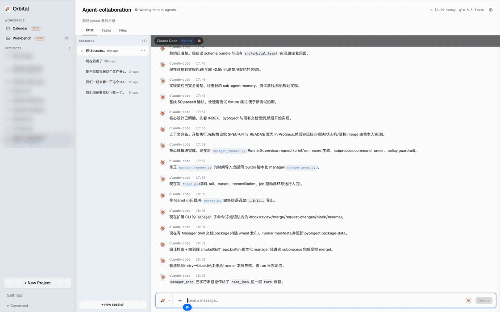
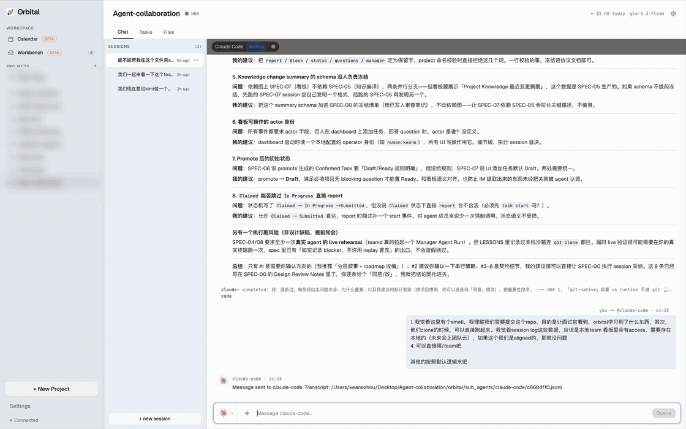
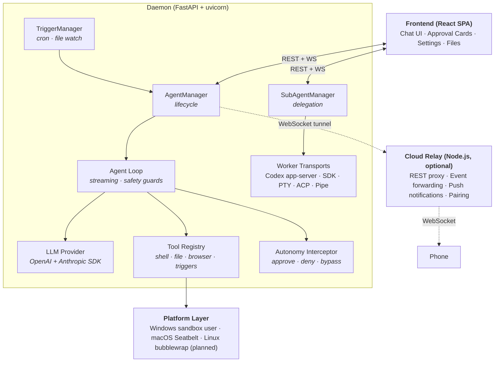

<p align="center">
  <a href="README.en.md">English</a> · <strong>简体中文</strong>
</p>


<p align="center"><strong>任务进行到一半，Claude Code余额用完了。Orbital直接转发Codex继续——完全无需重新解释。</strong></p>

<p align="center"></p>

<p align="center"><em>Orbital 之前把一个spec派给了 Claude Code。Claude Code跑到一半余额用完了，Orbital读到报错，判断这是账号问题、自己解不开，于是直接收集相关上下文，转交Codex接着做。会话，数据和上下文都是项目里的文件，不在绑定Claude的会话，所以任何agent都能接手。agent可以换，项目一直不断。</em></p>

<p align="center">
  
</p>

<h1 align="center">Orbital</h1>
<p align="center"><strong>project agent（项目 agent）</strong></p>
<h3 align="center">Agent只负责一次会话，Orbital负责整个项目。</h3>

**你的上下文，是你的吗？**

Claude Code 里聊了三轮才定下的方案、Codex 改到一半的文件、Cursor 里拍板的取舍——各自锁在各自的会话里。

会话一关、额度一到、换个工具，上下文就无法使用。下一个任务，你就得重新讲一遍。

**你才是 agent 的实习生：复制粘贴、搬运上下文、记住杂七杂八的文件放在哪，让agent来做脑力活。**

Orbital 把上下文从会话里拿出来，放回你的本地文件夹。任何 agent 随时接手，所有上下文全部保留。Claude Code、Codex、Cursor 都可以使用。

**上下文资产是你的，智能是可替换的。**

<p align="center"><strong>你的上下文资产，任何 agent 都能用</strong></p>

<p align="center">
  <a href="https://github.com/zqiren/Orbital/releases/latest/download/Orbital-Setup.exe"></a>
  &nbsp;&nbsp;
  <a href="https://github.com/zqiren/Orbital/releases/latest/download/Orbital-macOS.dmg"></a>
</p>
<p align="center"><a href="https://www.bilibili.com/video/BV1yN3B6CEKW/"><strong>30 秒演示视频</strong></a></p>
<p align="center">5 分钟就能装好。需要自备 API key。</p>

[](#license)  

---

## 为什么你需要一个“project” agent

你正在和 Claude Code 讨论一个方案，聊到第三轮，它弹出「You're out of usage credits」。Codex 的额度还在，但 Codex 对这个项目一无所知——目标、前两轮拍板的结论、改到一半的文件，都得你重讲一遍。

<p align="center"></p>
<p align="center"><em>同一个对话里：Claude Code用完了，你 @codex 说一句“你继续吧”，Codex 延续项目上下文继续任务。</em></p>

在工作中，大家都已经在同时用好几个 agent —— 可能是因为新出的模型、剩余的额度，也可能是因为某个工具更擅长这类活。

但每个 agent 都活在自己的会话里，各有各的上下文和历史。当你在会话和工具之间来回切换时，把项目「搬运」过去的活就落到了你身上：重述目标、解释此前的决策、翻找产出的文件、确认还有什么没做完。你需要做它们的实习生，帮它们串联上下文，来保证你自己的项目正常运转。

Orbital 把工作的单位从「会话」换成「项目」。

project agent 跨任务、跨会话、跨执行 agent 持续对项目负责：维护共享的上下文，判断下一步该做什么，需要时把活派出去，并把每一次的结果记录回项目。

单个 agent 完成任务。Orbital 让项目往前走。

---

## 什么叫“对你的项目负责”

Orbital将把重要的项目上下文组织起来，以普通文件的形式维护在你的本地文件夹里：

- **状态** —— 项目现在是什么情况（`PROJECT_STATE.md`）
- **决策** —— 决定了什么、为什么这么定（`DECISIONS.md`）
- **经验教训** —— 项目一路上学到了什么（`LESSONS.md`）
- **产出成果** —— agent 调研、撰写、构建出来的东西（工作空间本身，以及 `orbital/output/`）

这些都留会成为后续工作的上下文。每次任务开始前，Orbital 会先把它们组装进自己的系统提示词中，保证没有遗漏。

子agent也会读取同一批文件，不需要你记住项目的信息和文件架构。Agent会自己做笔记，保证下一次会话能无缝衔接。

Agent可以换。你的上下文资产一直在。

---

## 快速开始

1. **启动 Orbital** —— 设置向导引导你完成两步：

   **Step 1 — LLM Provider:** 中国大陆用户点「一键登录词元跳动」，授权后免费领取 Token，直接开始。也可以从预设卡片里选择服务商，点「获取 API 密钥」直达密钥控制台，粘贴即可——支持 DeepSeek、Moonshot (Kimi)、智谱、MiniMax、Anthropic、OpenAI 等十余家服务商。

   <!-- TODO: 重新截图——当前截图（7 月 27 日）早于一键登录按钮（9 月 3 日），画面里还没有这个按钮 -->

   <p align="center">
     
   </p>

   **Step 2 — 关联账户：** 连接 API 连接器（Google Calendar、Drive），并提前登录 agent 需要访问的站点（Google、GitHub 等），防止它在浏览时被验证码挡住。这一步可跳过，之后随时可在设置中完成。

   <p align="center">
     
   </p>

2. **创建项目** —— 起个名字，选择本地的一个文件夹，设定 autonomy 等级

   <p align="center">
     
   </p>
3. **开始对话** —— 在聊天框输入任务，管理 agent 自己处理
4. **走开** —— 把后续任务排进队列；每个完成项都会成为下一项的上下文

---

## 项目始终由同一个管理 agent 负责

<p align="center"></p>
<p align="center"><em>管理 agent 跨会话维护项目的状态、决策与经验</em></p>

<p align="center"></p>
<p align="center"><em>管理 agent 基于同一份项目上下文把任务派给 Claude Code、Codex 或 Gemini，再记录执行结果</em></p>

<p align="center"></p>
<p align="center"><em>在每个项目的工作空间里浏览、预览、上传文件——看着 agent 的产出不断积累</em></p>

<p align="center"></p>
<p align="center"><em>把任务排进队列然后走开——agent 逐项处理，每个完成项都会成为下一项的上下文；随时可暂停介入引导，再继续</em></p>

<p align="center"></p>
<p align="center"><em>工作台（beta）——只有你能拍板的事（花钱决策、必须用你账号发出的消息）由 agent 标记后跨项目汇总到一处，展开还能看到它这么判断的依据</em></p>

<p align="center"></p>
<p align="center"><em>日历（beta）——把已启用的定时 trigger 和带截止日期的承诺投影到周视图上，自动任务不再悄无声息地跑；管理 agent 自己也能读取它来安排工作</em></p>

<p align="center"></p>
<p align="center"><em>Skills——agent 从多步流程中沉淀出可复用的操作模式，下次遇到类似任务先查阅</em></p>

<p align="center"></p>
<p align="center"><em>定时与文件监听 trigger——让管理 agent 定期检查并自动派发 sub-agent，无需你动手</em></p>

<p align="center"></p>
<p align="center"><em>为每个项目设定预算上限和重置周期，实时查看按模型的花费与成本明细</em></p>

<p align="center"></p>
<p align="center"><em>网站凭据存放在系统钥匙串里，绝不暴露给聊天</em></p>

<p align="center">
  
  &nbsp;&nbsp;
  
</p>
<p align="center"><em>手机上监督：实时查看 agent 活动，带完整上下文批准关键动作（可附加指引）</em></p>

---

## 架构

Orbital 是绑定在一个**项目**上的持久管理 agent——而不是一个聊天会话。它是项目的本地 control plane，统一管理工作空间、instructions、状态、队列、预算和审批规则。管理 agent 负责规划、委派、监督并记录结果；worker agent 基于同一份项目上下文执行。你可以从任何地方监督。


```mermaid
flowchart TB
    UI["<b>Frontend (React SPA)</b><br/>Chat UI · Approval Cards · Settings · Files"]

    subgraph daemon["Daemon (FastAPI + uvicorn)"]
        direction TB
        AM["AgentManager<br/><i>lifecycle</i>"]
        SAM["SubAgentManager<br/><i>delegation</i>"]
        TM["TriggerManager<br/><i>cron · file watch</i>"]
        Loop["Agent Loop<br/><i>streaming · safety guards</i>"]
        TR["Worker Transports<br/>Codex app-server · SDK · PTY · ACP · Pipe"]
        LLM["LLM Provider<br/><i>OpenAI + Anthropic SDK</i>"]
        Tools["Tool Registry<br/><i>shell · file · browser · triggers</i>"]
        Auto["Autonomy Interceptor<br/><i>approve · deny · bypass</i>"]

        AM --> Loop
        SAM --> TR
        TM --> AM
        Loop --> LLM
        Loop --> Tools
        Loop --> Auto
    end

    Platform["<b>Platform Layer</b><br/>Windows sandbox user · macOS Seatbelt · Linux bubblewrap (planned)"]
    Relay["<b>Cloud Relay (Node.js, optional)</b><br/>REST proxy · Event forwarding · Push notifications · Pairing"]
    Phone["Phone"]

    UI <-->|REST + WS| AM
    UI <-->|REST + WS| SAM
    Tools --> Platform
    AM -.WebSocket tunnel.-> Relay
    Relay -.WebSocket.-> Phone
```

**设计决策：**
- **管理 agent 对项目负责**: agent 维护结构化的状态、决策、经验和会话历史，让规划与责任始终归于一处
- **Isolation**: OS 级别 sandbox（Windows sandbox user / macOS Seatbelt / Linux bubblewrap 在规划中）
- **Fail-closed interceptor**: 审批系统出错后默认 DENY，绝不 ALLOW
- **单 daemon**: PID 文件强制只能存在一个实例
- **Local-first**: 你的所有文件和项目状态都在你自己的硬盘上。Cloud relay 启用时只转发审批和事件，不转发你的文件。

---

## 与同类产品对比

持久记忆、定时任务和 sub-agent 现在已经是标配 —— 下面每个工具都有。真正还有分歧的是这三个问题。

| 2026 年 7 月 | Orbital | [Claude Code](https://code.claude.com/docs/en/desktop) | [Codex](https://developers.openai.com/codex/) | [Hermes](https://github.com/NousResearch/hermes-agent) | [OpenClaw](https://docs.openclaw.ai/) |
| --- | --- | --- | --- | --- | --- |
| 下一个任务能换一个 agent 接手吗？ | ✅ Claude Code、Codex、Gemini CLI、Cursor、任意 CLI | ❌ 只有 Claude worker | ❌ 只有 Codex worker | ❌ 只有 Hermes worker | 部分（通过 ACP 调用外部 agent） |
| 靠什么防止队列任务悄悄漂走？ | ✅ 强制以完成/受阻闭环 | ❌ | ❌ | ❌ | ❌ |
| 预算、审批和审计属于谁？ | ✅ 属于项目 | 部分（权限 + 运行历史） | 部分（审批 + 企业审计） | 部分（命令审批） | 部分（审批 + 日志） |

**一句话总结：** 差异不在某一项能力，而在于承载状态、worker 和治理的单位是「项目」，不是「会话」。

---

## 功能详解

完整的功能详解——项目与工作空间模型、管理 agent 的上下文维护与压缩、sub-agent 委派与传输层（Codex 原生 app-server JSON-RPC、Claude Code SDK、其他 worker PTY/ACP）、任务队列、Quick Tasks、自我改进的 skills、内置工具、浏览器自动化、triggers、LLM 路由与 BYOK、autonomy 与审批、预算控制、手机远程、凭据管理、agent loop 安全保护、桌面应用——以英文为准，见 [English README → Feature Deep Dives](README.en.md#feature-deep-dives)，避免中英两份各自维护导致内容不同步。

---

## 安装

### Windows

1. 从 [Releases](https://github.com/zqiren/Orbital/releases/latest) 下载最新的 `Orbital-Setup-*.exe`（Windows 版本）
2. 运行安装程序，按提示完成
3. 从开始菜单或桌面快捷方式启动 Orbital

<details>
<summary>Windows SmartScreen 警告</summary>

Orbital 的 Windows 安装包暂未做代码签名，Windows 会提示安全警告：

> **Windows 已保护你的电脑** —— Microsoft Defender SmartScreen 阻止了一个无法识别的应用启动。

点击 **「更多信息」**，然后点 **「仍要运行」**。代码签名会在后续版本加上。
</details>

### macOS

1. 从 [Releases](https://github.com/zqiren/Orbital/releases/latest) 下载最新的 `Orbital-*-macOS.dmg`
2. 打开 DMG，把 Orbital 拖到 Applications 文件夹
3. 从启动台或 Spotlight 启动 Orbital

需要 macOS 13 (Ventura) 及以上，**仅支持 Apple Silicon（M1 及更新机型）**。本版本为 arm64 构建，**不支持 Intel Mac**。

正式发布版已完成 Developer-ID 签名和 Apple 公证（notarization），首次启动直接打开——没有 Gatekeeper 拦截，不需要任何「仍要打开」操作。（从源码自行构建或下载 CI 分支产物的版本仍是 ad-hoc 签名，macOS 会要求你右键 → 打开确认一次。）

### 从源码运行

```bash
git clone https://github.com/zqiren/Orbital.git && cd Orbital

# 安装 Python 依赖(Python 3.11+)
pip install -e ".[desktop]"

# 安装前端依赖(Node.js 18+)
cd web && npm install && cd ..

# 启动 daemon
python -m uvicorn agent_os.api.app:create_app --factory --port 8000

# 另开终端启动前端
cd web && npx vite --host 127.0.0.1 --port 5173
```

浏览器打开 `http://localhost:5173`，首次启动会进入设置向导。

### 关于休眠

Agent 运行期间，Orbital 会通过系统级别的接口阻止机器进入休眠（Windows 和 macOS 都支持）。所有 agent 闲下来之后，会重新允许系统休眠。系统托盘图标会显示当前 agent 活动状态。

---

## 开发与测试

后端、前端、测试相关命令、关键文件路径请参见 [English README](README.en.md#development) 中 **Development** 与 **Testing** 章节。这部分文档以英文为准，避免中英两份各自维护导致内容不同步。

---

## Roadmap

**已完成：** 多 LLM 路由 + 失败轮换、三档 autonomy preset（并向 sub-agent 级联）、流式 chat + WebSocket 实时事件、带反检测的浏览器自动化（Patchright）、定时 / 文件监听 trigger、自然语言创建 trigger、cloud relay + 推送通知 + 设备配对、上下文压缩 + 压缩前记忆 flush、前缀缓存优化的 prompt 组装（v0.4.2）、按项目的预算上限和成本统计、凭据管理（API key + 网站登录）、桌面应用 + 系统托盘 + 原生窗口、agent loop 安全保护（迭代上限、重复检测、ping-pong、断路器）、agent 活动期间的系统休眠抑制、`@mention` 路由的 sub-agent 派发。

**接下来：** Webhook trigger、pipeline trigger（把一个项目的输出作为另一个的输入）、按项目的网络隔离（OS 级 domain allowlist）、Linux 上的 bubblewrap 沙箱、Windows 代码签名（消除 SmartScreen 警告）、daemon 重启后自动恢复进行中的会话。

---

## 我为什么做 Orbital

我喜欢 Claude Projects，但受不了 agent 不能自己更新项目，也受不了它不在我自己的机器上。

我喜欢 OpenClaw，但受不了那种失控感——没有预算，没有 sandbox，人离开电脑就没法从手机上监督。

Orbital 就是我自己想要的那个东西：一个对整个项目负责的 agent——计划、决策、队列、预算和审批都归它管理。不在电脑前时用手机看一眼。Claude Code、Codex、Gemini CLI 是它可以按任务选择的 worker，但项目的上下文始终留在管理 agent 手里。

全职工作之余的晚上和周末做出来的，还很早期。欢迎反馈和 issue。

---

## 赞助致谢

<p align="center">
  <a href="https://watcha.cn"></a>
</p>

Orbital 由 **[观猹 (Watcha)](https://watcha.cn)** 赞助支持。观猹是 Orbital 内置的中国大陆模型路由 **[词元跳动 (TokenDance)](https://tokendance.space)** 背后的团队。得益于这次赞助，中国大陆的新用户在引导页即可一键登录词元跳动、免费领取 Token、立即开始使用——无需手动配置 API Key。

---

## 遥测（Telemetry）

Orbital 每天发送**一份匿名汇总**——仅包含计数、枚举和布尔值。绝不包含提示词、文件、路径、模型输出或任何项目/会话标识。在 **设置 → 数据与隐私** 中可逐字查看即将发送的完整 JSON，并可一键关闭。完整的公开 schema 见 [docs/TELEMETRY.md](docs/TELEMETRY.md)。

---

## License

Orbital 采用 [GNU General Public License v3.0](LICENSE) 协议开源。

```
Orbital — Every agent owns a session. Orbital owns the project.
Copyright (C) 2026 Orbital Contributors

This program is free software: you can redistribute it and/or modify
it under the terms of the GNU General Public License as published by
the Free Software Foundation, either version 3 of the License, or
(at your option) any later version.
```
