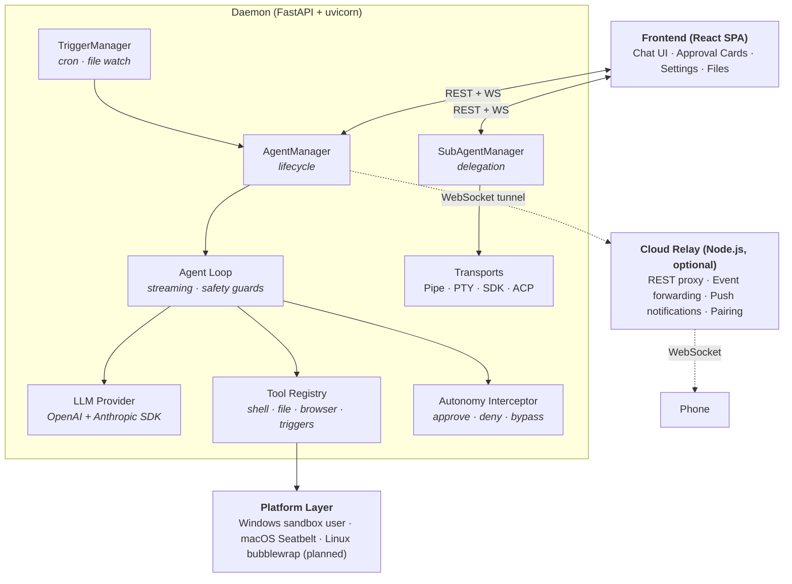

<p align="center">
  <a href="README.md">English</a> · <strong>简体中文</strong>
</p>

<p align="center"></p>
<p align="center"><em>你把工作交给 agent。它读取 project 里已经积累的一切,完成任务,再把学到的写回去。</em></p>

<h2 align="center">永不从零开始的 agent。</h2>
<p align="center">agent 每完成一件工作,都会成为下一条指令的上下文。<br>project 跑得越久,能力越强——而不是被清零重来。</p>

<p align="center">
  <a href="https://github.com/zqiren/Orbital/releases/download/v0.7.3/Orbital-Setup-0.7.3.exe"><strong>Windows 安装包 (.exe)</strong></a> &nbsp;&middot;&nbsp;
  <a href="https://github.com/zqiren/Orbital/releases/download/v0.7.3/Orbital-0.7.3-macOS.dmg"><strong>macOS 安装包 (.dmg)</strong></a> &nbsp;&middot;&nbsp;
  <a href="https://www.youtube.com/watch?v=ranTQFmW6vU"><strong>演示视频</strong></a>
</p>
<p align="center">5 分钟装好。不需要 Python 或 Node 环境。</p>

<p align="center">
  
</p>

# Orbital

[](#license)   

---

## 为什么要有 Orbital

现在的 agent 都会遗忘。每开一个会话,你都得把同样的背景重新粘贴一遍;每天早上,把项目重新解释一遍。上周已经敲定的决策,随着会话结束一起消失,于是这周只能再敲定一次。

Agent 会退场,会话会结束。但你的工作不该跟着消失。

Orbital 是围绕这个事实构建的 agent。它完成的一切——产出的成果、做过的决策、学到的经验——都会写进 project,并在下一个会话开始时读回来。你的 agent 不再从零开始,而是从它已经做完的一切出发。工作会不断积累、产生复利。

---

## Orbital 的不同之处

**成果会复利。** project 里的大部分工作,是 agent 在产出成果——代码、文档、调研、报告。每一份完成的成果,连同它持续维护的状态、决策和经验,都会成为下一个会话、下一份成果的参考材料。昨天打开过的 project 知道昨天发生了什么——并在这个基础上继续构建。

**扎根在你的真实工作里。** project 就是你硬盘上的一个文件夹,local-first。你的文件不只是存储——它们是 agent 在产出任何东西之前先读取的内容,所以它的成果针对的是你真实的代码库、真实的文档、真实的数据,而不是凭空生成、只是听起来合理的输出。

**换掉双手,保留记忆。** 你的 agent 把执行委派给 sub-agent——Claude Code、Codex、Gemini CLI 或任何 CLI agent。它们是可互换的:每一个都基于同一份积累的上下文工作——同样的文件、决策、instructions 和历史——完成的工作再流回 project。换掉 sub-agent,什么都不丢。

**放心挂机。** 把任务排进队列然后走开:agent 逐项处理,每一项都必须声明结果——完成并附总结,或者受阻并说明原因、等你来解决。它在你设定的 sandbox 边界内、在每个 project 的 budget 之下、按你控制的审批规则工作。

---

## 一览

- **持久上下文** —— PROJECT_STATE.md、DECISIONS.md、LESSONS.md 跨会话持续维护,每个会话都从上一个会话完成的一切出发
- **以 project 为单位管理 agent** —— 每个 project 是一个文件夹,带自己的工作空间、instructions、budget 和 autonomy 等级
- **Sub-agent 委派** —— 管理 agent 监控工作空间、对照目标评估进展,把工作派给 Claude Code、Codex、Gemini CLI 或任何 CLI agent——它们读取同一份积累的上下文
- **自我改进的 skills** —— agent 从多步流程中沉淀可复用的 skill,遇到类似任务先查阅
- **任务队列** —— 按 project 排队然后走开;agent 逐项处理,每项标记完成(附总结)或受阻(附原因);中途可暂停介入引导,再继续
- **Triggers** —— 设置 cron 定时或文件监听,让管理 agent 定期检查并自动派发 sub-agent
- **内置 13 家 LLM provider** —— Anthropic、OpenAI、DeepSeek、Moonshot (Kimi)、Groq、Google Gemini、xAI、Mistral、Together、OpenRouter、智谱、通义千问,以及任意自定义 endpoint
- **浏览器自动化** —— 基于 Patchright 的 26 种浏览器动作,带反检测
- **凭据管理** —— API key 和网站密码存放在操作系统钥匙串,绝不暴露给聊天
- **Sandbox 执行** —— agent 只能访问你指定的文件夹(Windows sandbox user、macOS Seatbelt)
- **审批流** —— 风险动作前暂停;在桌面或手机上批准
- **Budget 控制** —— 按 project 设定花费上限和到达上限后的动作
- **手机监督** —— 扫码配对,在手机上管理 agent

---

## 快速开始

1. **启动 Orbital** —— 设置向导引导你完成两步:

   **Step 1 — LLM Provider:** 从预设卡片里选择服务商,点「获取 API 密钥」直达密钥控制台,粘贴即可。支持 DeepSeek、Moonshot (Kimi)、智谱、MiniMax、Anthropic、OpenAI 等十余家服务商。

   <p align="center">
     
   </p>

   **Step 2 — 关联账户:** 连接 API 连接器(Google Calendar、Drive),并提前登录 agent 需要访问的站点(Google、GitHub 等),防止它在浏览时被验证码挡住。这一步可跳过,之后随时可在设置中完成。

   <p align="center">
     
   </p>

2. **创建 project** —— 起个名字,选择本地的一个文件夹,设定 autonomy 等级

   <p align="center">
     
   </p>
3. **开始对话** —— 在聊天框输入任务,管理 agent 自己处理
4. **走开** —— 把后续任务排进队列;每个完成项都会成为下一项构建的上下文

---

## 看工作如何积累

<p align="center"></p>
<p align="center"><em>project 自己维护状态、决策与经验——由 agent 书写,每个会话开始时读回,所以每次都从"上次结束的地方"继续</em></p>

<p align="center"></p>
<p align="center"><em>把任务派给 Claude Code、Codex 或 Gemini——它们读取同一份积累的上下文,完成后把成果写回工作空间</em></p>

<p align="center"></p>
<p align="center"><em>在每个 project 的工作空间里浏览、预览、上传文件——看着 agent 的产出不断积累</em></p>

<p align="center"></p>
<p align="center"><em>把任务排进队列然后走开——agent 逐项处理,每个完成项都会成为下一项的上下文;随时可暂停介入引导,再继续</em></p>

<p align="center"></p>
<p align="center"><em>Skills——agent 从多步流程中沉淀出可复用的操作模式,下次遇到类似任务先查阅</em></p>

<p align="center"></p>
<p align="center"><em>定时与文件监听 trigger——让管理 agent 定期检查并自动派发 sub-agent,无需你动手</em></p>

<p align="center"></p>
<p align="center"><em>为每个 project 设定 budget 上限和重置周期,实时查看按模型的花费与成本明细</em></p>

<p align="center"></p>
<p align="center"><em>网站凭据存放在系统钥匙串里,绝不暴露给聊天</em></p>

<p align="center">
  
  &nbsp;&nbsp;
  
</p>
<p align="center"><em>手机上监督:实时查看 agent 活动,带完整上下文批准关键动作(可附加指引)</em></p>

---

## 工作原理

Orbital 是绑定在一个 **project** 上的 agent——而不是一个聊天会话。project 把工作空间目录、持续演进的 instructions、autonomy preset、budget、审批规则和持久状态绑成一个受监督的整体。你的 agent 在其中规划与委派,sub-agent 负责执行,它们完成的一切都写回 project,成为下一条指令的上下文。你可以从任何地方监督。



**设计决策:**
- **记忆即产品**: agent 维护结构化的项目状态(当前状态、决策、经验),并在每个会话重新读取——工作不断积累,而不是被清零
- **Isolation**: OS 级别 sandbox(Windows sandbox user / macOS Seatbelt / Linux bubblewrap 在规划中)
- **Fail-closed interceptor**: 审批系统出错后默认 DENY,绝不 ALLOW
- **单 daemon**: PID 文件强制只能存在一个实例
- **Local-first**: 你的所有文件和 project 状态都在你自己的硬盘上。Cloud relay 启用时只转发审批和事件,不转发你的文件。

---

## 与同类产品对比

| | Orbital | Claude Projects | OpenClaw | Claude Cowork |
| --- | --- | --- | --- | --- |
| Project 在你自己机器上 | ✅(工作空间就是你的目录) | ❌(云端托管) | ✅(agent workspace) | 部分(目录访问,VM 沙箱) |
| Agent 能更新 project | ✅(记忆、决策、经验由 agent 自己维护) | ❌(只能人工编辑) | 部分(MEMORY.md,无结构化状态) | ❌(仅限会话) |
| 跨会话的结构化项目状态 | ✅(PROJECT_STATE.md、DECISIONS.md、LESSONS.md) | ❌ | 部分 | ❌ |
| 派给外部 CLI agent | ✅(Claude Code、Codex、Gemini CLI 及任意 CLI agent) | ❌ | 部分(子会话,非外部 CLI) | ❌(仅限内部 Claude sub-agent) |
| 多个 agent 共享一个工作空间 | ✅ | ❌ | ❌ | ❌ |
| 审批流 + 手机监督 | ✅(可配置 autonomy,手机审批) | ❌ | 部分(仅 exec,IM 内联按钮) | ❌ |
| 按 project 设 budget 上限(实际美元) | ✅ | ❌ | ❌ | ❌(订阅制) |
| 默认 sandbox 运行 | ✅(Windows sandbox user、macOS Seatbelt) | N/A(云端) | 可选(Docker,非默认) | ✅(VM,但 Computer Use 在 VM 外运行) |
| Triggers(定时 + 文件监听) | ✅ | ❌ | ✅(`openclaw cron`) | ✅(`/schedule`) |
| 开源 | GPL-3.0 | ❌ | MIT | ❌ |

**一句话总结:** Claude Projects 验证了心智模型,OpenClaw 验证了本地 agent 可行,Cowork 验证了用户希望 agent 自主运行。Orbital 用一个 agent 在你自己的机器上同时做到这三件事——它跨会话维护自己的项目状态,并把执行委派给你选择的任何 sub-agent。它永不从零开始。

---

## 功能详解

完整的功能详解——project 与工作空间模型、上下文管理与压缩(*永不从零开始*背后的引擎)、sub-agent 委派与传输层、任务队列、Quick Tasks、自我改进的 skills、内置工具、浏览器自动化、triggers、LLM 路由与 BYOK、autonomy 与审批、budget 控制、手机远程、凭据管理、agent loop 安全保护、桌面应用——以英文为准,见 [English README → Feature Deep Dives](README.md#feature-deep-dives),避免双边维护导致信息不准确。

---

## 安装

### Windows

1. 从 [Releases](https://github.com/zqiren/Orbital/releases/tag/v0.7.3) 下载 [`Orbital-Setup-0.7.3.exe`](https://github.com/zqiren/Orbital/releases/download/v0.7.3/Orbital-Setup-0.7.3.exe)（最新 Windows 版本）
2. 运行安装程序,按提示完成
3. 从开始菜单或桌面快捷方式启动 Orbital

<details>
<summary>Windows SmartScreen 警告</summary>

Orbital 的 Windows 安装包暂未做代码签名,Windows 会提示安全警告:

> **Windows 已保护你的电脑** —— Microsoft Defender SmartScreen 阻止了一个无法识别的应用启动。

点击 **「更多信息」**,然后点 **「仍要运行」**。代码签名会在后续版本加上。
</details>

### macOS

1. 从 [Releases](https://github.com/zqiren/Orbital/releases/tag/v0.7.3) 下载 [`Orbital-0.7.3-macOS.dmg`](https://github.com/zqiren/Orbital/releases/download/v0.7.3/Orbital-0.7.3-macOS.dmg)
2. 打开 DMG,把 Orbital 拖到 Applications 文件夹
3. 从启动台或 Spotlight 启动 Orbital

需要 macOS 13 (Ventura) 及以上,**仅支持 Apple Silicon(M1 及更新机型)**。本版本为 arm64 构建,**不支持 Intel Mac**。

正式发布版已完成 Developer-ID 签名和 Apple 公证(notarization),首次启动直接打开——没有 Gatekeeper 拦截,不需要任何「仍要打开」操作。(从源码自行构建或下载 CI 分支产物的版本仍是 ad-hoc 签名,macOS 会要求你右键 → 打开确认一次。)

### 从源码运行

```bash
git clone https://github.com/zqiren/Orbital.git && cd Orbital

# 安装 Python 依赖(Python 3.11+)
pip install -e ".[desktop]"

# 安装前端依赖(Node.js 18+)
cd web && npm install && cd ..

# 启动 daemon
python -m uvicorn agent_os.api.app:create_app --factory --port 8000

# 另开终端启动前端
cd web && npx vite --host 127.0.0.1 --port 5173
```

浏览器打开 `http://localhost:5173`,首次启动会进入设置向导。

### 关于休眠

Agent 在跑时,Orbital 会通过系统级别的接口阻止机器进入休眠(Windows 和 macOS 都支持)。所有 agent 闲下来之后,休眠会自动恢复。系统托盘图标会显示当前 agent 活动状态。

---

## 开发与测试

后端、前端、测试相关命令、关键文件路径请参见 [English README](README.md#development) 中 **Development** 与 **Testing** 章节。这部分文档以英文为准,避免双边维护导致信息不准确。

---

## Roadmap

**已完成:** 多 LLM 路由 + 失败轮换、三档 autonomy preset(并向 sub-agent 级联)、流式 chat + WebSocket 实时事件、带反检测的浏览器自动化(Patchright)、定时 / 文件监听 trigger、自然语言创建 trigger、cloud relay + 推送通知 + 设备配对、上下文压缩 + 压缩前记忆 flush、前缀缓存优化的 prompt 组装(v0.4.2)、按 project 的 budget 上限和成本统计、凭据管理(API key + 网站登录)、桌面应用 + 系统托盘 + 原生窗口、agent loop 安全保护(迭代上限、重复检测、ping-pong、断路器)、agent 活动期间的系统休眠抑制、`@mention` 路由的 sub-agent 派发。

**接下来:** Webhook trigger、pipeline trigger(把一个 project 的输出作为另一个的输入)、按 project 的网络隔离(OS 级 domain allowlist)、Linux 上的 bubblewrap 沙箱、Windows 代码签名(消除 SmartScreen 警告)、daemon 重启后自动恢复进行中的会话。

---

## 我为什么做 Orbital

我喜欢 Claude Projects,但受不了 agent 不能自己更新 project,也受不了它不在我自己的机器上。

我喜欢 OpenClaw,但受不了那种失控感——没有 budget,没有 sandbox,人离开电脑就没法从手机上监督。

Orbital 就是我自己想要的那个东西:一个记得我们做过的一切的 agent。sandbox、budget、审批都由我控制。不在电脑前时用手机看一眼。Claude Code、Codex、Gemini CLI 是它委派的双手——换掉双手,保留记忆。一个永不从零开始的 agent。

全职工作之余的晚上和周末做出来的,还很早期。欢迎反馈和 issue。

---

## License

Orbital 采用 [GNU General Public License v3.0](LICENSE) 协议开源。

```
Orbital — The agent that never starts from zero.
Copyright (C) 2026 Orbital Contributors

This program is free software: you can redistribute it and/or modify
it under the terms of the GNU General Public License as published by
the Free Software Foundation, either version 3 of the License, or
(at your option) any later version.
```
