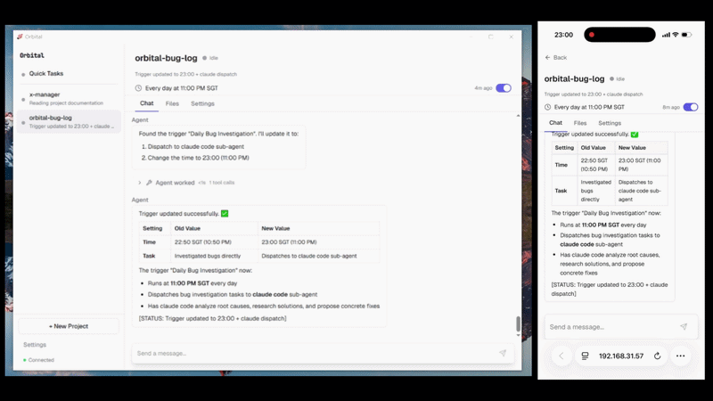
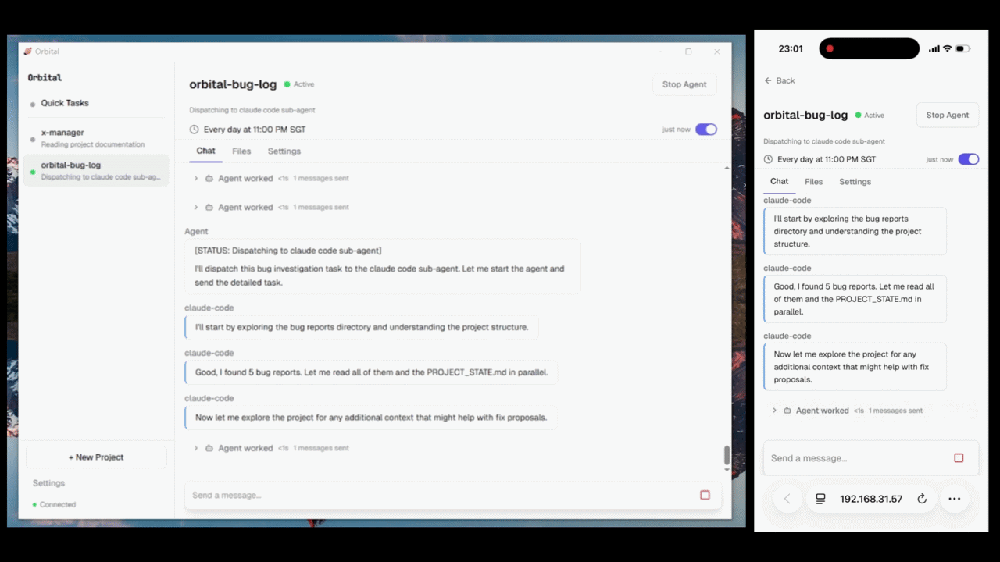
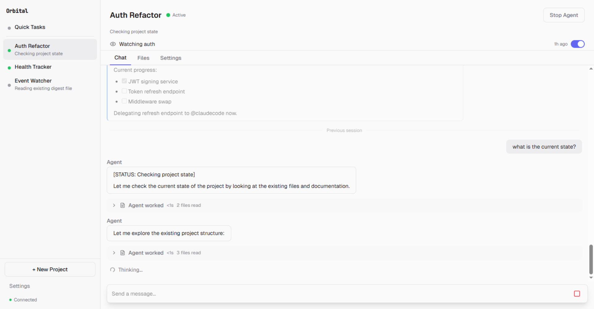

<p align="center">
  <a href="README.md">English</a> · <strong>简体中文</strong>
</p>

<p align="center">
  
</p>
<p align="center"><em>你把任务交给 project——agent 自己规划、派发给 Claude Code、把结果汇报给你。</em></p>

<p align="center">
  
</p>
<p align="center"><em>关键动作——审批流推到你手机上——同意后继续工作。</em></p>

<h2 align="center">给 agent 一个 project,而不是一个 prompt。</h2>
<p align="center">你和 agent 共享的项目工作空间——记忆长期保留,<br>边界由你设定,审批由你掌控。</p>

<p align="center">
  <a href="https://github.com/zqiren/Orbital/releases/download/v0.6.1/Orbital-Setup-0.6.1.exe"><strong>Windows 安装包 (.exe)</strong></a> &nbsp;&middot;&nbsp;
  <a href="https://github.com/zqiren/Orbital/releases/download/v0.6.2/Orbital-0.6.2-macOS.dmg"><strong>macOS 安装包 (.dmg)</strong></a> &nbsp;&middot;&nbsp;
  <a href="https://youtu.be/D9l0r4gP_RQ"><strong>演示视频</strong></a>
</p>
<p align="center">5 分钟装好。不需要 Python 或 Node 环境。</p>

<p align="center">
  
</p>

# Orbital

[](#license)   

---

## 为什么要有 Orbital

现在跟 AI agent 打交道,基本就是在带一个你不太放心的实习生：

每开一个对话都得重新把项目背景输出一遍。每一步都得盯着。每一次 agent 之间的协调都靠你手工复制粘贴来衔接。每一次任务都需要重新声明之前的事项。每一次都只能跑一件事。

真正的 delegation 不是一段聊天 — 它更像是你出差前,把手头工作交接给一个信得过的同事:工作背景讲清楚,文件和权限给到位,什么事要找你拍板说明白。剩下的他自己处理,关键节点会找你确认。

这就是 Orbital 在为 agent 做的事。

---

## Orbital 的不同之处

**一个 project,而不是一个 prompt。** 每个 project 都是你电脑上的一个文件夹,带着自己的工作空间、instructions、记忆、budget、sandbox 和审批规则。上下文和决策会跨会话沉淀和积累。今天打开的 project 知道昨天发生了什么。

**委派给你的 agent,不是手把手 micromanage。** 选一个 autonomy preset——hands-off / check-in / supervised。Agent 在你设的边界内运行。需要确认的关键工具调用会带着完整上下文推到你这里,剩下的交给它自己处理。你在桌前或手机上监督,不必时刻盯着。

**一个工作空间,多个 agent。** 你的 project 可以把任务派给 Claude Code、Codex、Gemini CLI 或任何 CLI agent——它们在同一份文件上工作,共享同样的决策、instructions 和历史。不用再在聊天窗口和终端之间来回复制粘贴。Agent 之间能看见彼此的工作,在同一个工作空间里合作。

---

## 快速开始

1. **启动 Orbital** —— 设置向导引导你完成三步:

   **Step 1 — LLM Provider:** 配置 API key。支持 Moonshot (Kimi)、DeepSeek、Anthropic、OpenAI 等 15+ 家服务商。

   <p align="center">
     
   </p>

   **Step 2 — Sandbox:** Orbital 创建一个隔离的系统账号,agent 在没有授权时无法访问你的个人文件或网络。

   **Step 3 — Browser Warm-up:** 提前登录 agent 需要访问的站点(Google、GitHub 等),存下 cookie,防止它在浏览时被验证码挡住。

2. **创建 project** —— 起个名字,选择本地的一个文件夹,设定 autonomy 等级
3. **开始对话** —— 在聊天框输入任务,agent 自己处理
4. **审批或自动化** —— 在审批卡片里查看工具调用,同意后 agent 才会继续,或把 autonomy 设成 hands-off

---

## 截图

<p align="center">
  
</p>
<p align="center"><em>多个 project 并行运行——每个都有自己的工作空间、trigger 和会话历史</em></p>

<p align="center">
  
</p>
<p align="center"><em>在手机上批准 agent 的动作——带完整上下文,可附加指引</em></p>

---

## 工作原理

Orbital 把每个 agent 工作单元当成一个 **project**——而不是一个聊天会话。一个 project 把工作空间、持续积累沉淀的 instructions、autonomy preset、budget、审批规则和记忆绑成一个受监督的整体。Agent 在 project 内工作,你可以从任何地方监督。

```
+------------------------------------------------------+
|                    Frontend (React SPA)               |
|  Chat UI . Approval Cards . Project Settings . Files  |
+-------------------------+----------------------------+
                          | REST + WebSocket
+-------------------------v----------------------------+
|                  Daemon (FastAPI + uvicorn)            |
|                                                       |
|  +--------------+  +--------------+  +--------------+ |
|  | AgentManager |  | SubAgentMgr  |  | TriggerMgr   | |
|  | (lifecycle)  |  | (delegation) |  | (cron/watch) | |
|  +------+-------+  +------+-------+  +--------------+ |
|         |                 |                            |
|  +------v-------+  +------v-------+                    |
|  | Agent Loop   |  | Transports   |                    |
|  | (streaming)  |  | Pipe/PTY/SDK |                    |
|  +------+-------+  +--------------+                    |
|         |                                              |
|  +------v-------+  +--------------+  +--------------+  |
|  | LLM Provider |  | Tool Registry|  | Autonomy     |  |
|  | (multi-SDK)  |  | (shell,file, |  | Interceptor  |  |
|  |              |  |  browser...) |  | (approve/deny|  |
|  +--------------+  +--------------+  +--------------+  |
|                                                        |
|  +--------------------------------------------------+  |
|  | Platform Layer (Windows sandbox / macOS / Linux)  |  |
|  +--------------------------------------------------+  |
+-------------------------+----------------------------+
                          | WebSocket tunnel
+-------------------------v----------------------------+
|              Cloud Relay (Node.js)                     |
|  REST proxy . Event forwarding . Push notifications   |
|  Device pairing . Phone WebSocket bridge              |
+------------------------------------------------------+
```

**设计决策:**
- **Isolation**: OS 级别 sandbox(Windows sandbox user / macOS Seatbelt / Linux bubblewrap 在规划中)
- **Fail-closed interceptor**: 审批系统出错后默认 DENY,绝不 ALLOW
- **单 daemon**: PID 文件强制只能存在一个实例
- **Local-first**: 你的所有文件和 project 状态都在你自己的硬盘上。Cloud relay 启用时只转发审批和事件,不转发你的文件。

---

## 与同类产品对比

| | Orbital | Claude Projects | OpenClaw | Claude Cowork |
| --- | --- | --- | --- | --- |
| Project 在你自己机器上 | ✅(工作空间就是你的目录) | ❌(云端托管) | ✅(agent workspace) | 部分(目录访问,VM 沙箱) |
| Agent 能更新 project | ✅(记忆、决策、经验由 agent 自己维护) | ❌(只能人工编辑) | 部分(MEMORY.md,无结构化状态) | ❌(仅限会话) |
| 跨会话的结构化项目状态 | ✅(PROJECT_STATE.md、DECISIONS.md、LESSONS.md) | ❌ | 部分 | ❌ |
| 派给外部 CLI agent | ✅(Claude Code、Codex、Gemini CLI 及任意 CLI agent) | ❌ | 部分(子会话,非外部 CLI) | ❌(仅限内部 Claude sub-agent) |
| 多个 agent 共享一个工作空间 | ✅ | ❌ | ❌ | ❌ |
| 审批流 + 手机监督 | ✅(可配置 autonomy,手机审批) | ❌ | 部分(仅 exec,IM 内联按钮) | ❌ |
| 按 project 设 budget 上限(实际美元) | ✅ | ❌ | ❌ | ❌(订阅制) |
| 默认 sandbox 运行 | ✅(Windows sandbox user、macOS Seatbelt) | N/A(云端) | 可选(Docker,非默认) | ✅(VM,但 Computer Use 在 VM 外运行) |
| Triggers(定时 + 文件监听) | ✅ | ❌ | ✅(`openclaw cron`) | ✅(`/schedule`) |
| 开源 | GPL-3.0 | ❌ | MIT | ❌ |

**一句话总结:** Claude Projects 验证了心智模型,OpenClaw 验证了本地 agent 可行,Cowork 验证了用户希望 agent 自己跑起来。Orbital 把这三件事合到一起——在你自己机器上,agent 能真正更新 project,多个 agent 在同一个工作空间里协作。

---

## 安装

### Windows

1. 从 [Releases](https://github.com/zqiren/Orbital/releases/tag/v0.6.1) 下载 [`Orbital-Setup-0.6.1.exe`](https://github.com/zqiren/Orbital/releases/download/v0.6.1/Orbital-Setup-0.6.1.exe)（最新 Windows 版本）
2. 运行安装程序,按提示完成
3. 从开始菜单或桌面快捷方式启动 Orbital

<details>
<summary>Windows SmartScreen 警告</summary>

Orbital 暂未做代码签名,Windows 会提示安全警告:

> **Windows 已保护你的电脑** —— Microsoft Defender SmartScreen 阻止了一个无法识别的应用启动。

点击 **「更多信息」**,然后点 **「仍要运行」**。代码签名会在后续版本加上。
</details>

### macOS

1. 从 [Releases](https://github.com/zqiren/Orbital/releases/tag/v0.6.2) 下载 [`Orbital-0.6.2-macOS.dmg`](https://github.com/zqiren/Orbital/releases/download/v0.6.2/Orbital-0.6.2-macOS.dmg)
2. 打开 DMG,把 Orbital 拖到 Applications 文件夹
3. 从启动台或 Spotlight 启动 Orbital

需要 macOS 13 (Ventura) 及以上,**仅支持 Apple Silicon(M1 及更新机型)**。本版本为 arm64 构建,**不支持 Intel Mac**。

<details>
<summary>macOS Gatekeeper 警告</summary>

Orbital 暂未做代码签名,macOS 第一次启动时会拦截:

> **「Orbital」无法打开,因为 Apple 无法检查其是否包含恶意软件。**

解决方式:
1. 打开 **系统设置 → 隐私与安全性**
2. 往下滑,会看到 "Orbital was blocked"
3. 点 **「仍要打开」**

只需做一次。代码签名会在后续版本加上。
</details>

### 从源码运行

```bash
git clone https://github.com/zqiren/Orbital.git && cd Orbital

# 安装 Python 依赖(Python 3.11+)
pip install -e ".[desktop]"

# 安装前端依赖(Node.js 18+)
cd web && npm install && cd ..

# 启动 daemon
python -m uvicorn agent_os.api.app:create_app --factory --port 8000

# 另开终端启动前端
cd web && npx vite --host 127.0.0.1 --port 5173
```

浏览器打开 `http://localhost:5173`,首次启动会进入设置向导。

### 关于休眠

Agent 在跑时,Orbital 会通过系统级别的接口阻止机器进入休眠(Windows 和 macOS 都支持)。所有 agent 闲下来之后,休眠会自动恢复。系统托盘图标会显示当前 agent 活动状态。

---

## 开发与测试

后端、前端、测试相关命令、关键文件路径请参见 [English README](README.md#development) 中 **Development** 与 **Testing** 章节。这部分文档以英文为准,避免双边维护导致信息不准确。

---

## Roadmap

**已完成:** 多 LLM 路由 + 失败轮换、三档 autonomy preset(并向 sub-agent 级联)、流式 chat + WebSocket 实时事件、带反检测的浏览器自动化(Patchright)、定时 / 文件监听 trigger、自然语言创建 trigger、cloud relay + 推送通知 + 设备配对、上下文压缩 + 压缩前记忆 flush、按 project 的 budget 上限和成本统计、凭据管理(API key + 网站登录)、桌面应用 + 系统托盘 + 原生窗口、agent loop 安全保护(迭代上限、重复检测、ping-pong、断路器)、agent 活动期间的系统休眠抑制、`@mention` 路由的 sub-agent 派发。

**接下来:** Webhook trigger、pipeline trigger(把一个 project 的输出作为另一个的输入)、按 project 的网络隔离(OS 级 domain allowlist)、Linux 上的 bubblewrap 沙箱、代码签名(消除 Windows SmartScreen 警告)、daemon 重启后自动恢复进行中的会话。

---

## License

Orbital 采用 [GNU General Public License v3.0](LICENSE) 协议开源。

```
Orbital — The project workspace you and your agent share.
Copyright (C) 2026 Orbital Contributors

This program is free software: you can redistribute it and/or modify
it under the terms of the GNU General Public License as published by
the Free Software Foundation, either version 3 of the License, or
(at your option) any later version.
```
