<p align="center">
  <a href="README.md">English</a> · <strong>简体中文</strong>
</p>

<p align="center">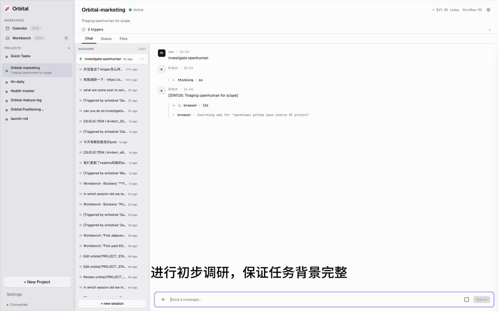</p>

<p align="center"><em>画面里发生的事：在一个市场项目中，Orbital 接到「评估竞品」的任务。它先自行调研，确保任务简报准确；再按项目中既定的指示，把耗 token 的深度调研交给 Claude&nbsp;Code；最后结合项目自身的决策与经验解读返回的结果——并把需要你拍板的选择留给你。</em></p>

<p align="center">
  
</p>

<h1 align="center">Orbital</h1>
<p align="center"><strong>project agent（项目 agent）</strong></p>
<h3 align="center">agent 只负责一次会话，Orbital 负责整个项目。</h3>

Orbital 和 Claude Code、Codex 一样干活：调研、规划、写作、执行命令、浏览网页，调用各种工具。

不同的是，Orbital 会把本地的一个文件夹当作长期项目来维护。它会自行维护项目的上下文——做到了哪、接下来做什么、该怎么做——以文件的形式存放在这个文件夹里。每一次新任务都从此前学到的一切开始，工作因此不断复利，而不是每次归零。

Orbital 也可以把任务派给 Claude Code、Codex、Gemini CLI、Cursor 等 CLI agent。每次任务派发都会向子 agent 交代项目背景和任务背景，并告诉它相关的文件——你永远不需要把项目重讲一遍。Orbital 会盯着任务运行，结合项目上下文解读返回的结果，并把产出写回项目。你派出去的活越多，它对项目就越了解。

<p align="center"><strong>一个持续负责的管理 agent · 可替换的执行 agent · 本地优先</strong></p>

<p align="center">
  <a href="https://github.com/zqiren/Orbital/releases/latest"><strong>Windows 安装包 (.exe)</strong></a> &nbsp;&middot;&nbsp;
  <a href="https://github.com/zqiren/Orbital/releases/latest"><strong>macOS 安装包 (.dmg)</strong></a> &nbsp;&middot;&nbsp;
  <a href="https://www.bilibili.com/video/BV1yN3B6CEKW/"><strong>30 秒演示视频</strong></a>
</p>
<p align="center">5 分钟装好。不需要 Python 或 Node 环境。自备 API key。</p>

[](#license)  

---

## 为什么需要一个 project agent

在工作中，大家都已经在同时用好几个 agent —— 可能是因为新出的模型、剩余的额度，也可能是因为某个工具更擅长这类活。

但每个 agent 都活在自己的会话里，各有各的上下文和历史。当你在会话和工具之间来回切换时，把项目「搬运」过去的活就落到了你身上：重述目标、解释此前的决策、翻找产出的文件、确认还有什么没做完。你需要做它们的实习生，帮它们串联上下文，来保证你自己的项目正常运转。

Orbital 把工作的单位从「会话」换成「项目」。

project agent 跨任务、跨会话、跨执行 agent 持续对项目负责：维护共享的上下文，判断下一步该做什么，需要时把活派出去，并把每一次的结果记录回项目。

单个 agent 完成任务。Orbital 让项目往前走。

---

## 「负责整个项目」意味着什么

有五样东西通常会在 agent 会话之间丢失或散落各处，Orbital 把它们全部以普通文件的形式维护在你的项目文件夹里：

- **状态** —— 项目现在是什么情况（`PROJECT_STATE.md`）
- **决策** —— 定了什么、为什么这么定（`DECISIONS.md`）
- **经验教训** —— 项目一路上学到了什么（`LESSONS.md`）
- **进展** —— 什么在跑、什么完成了、什么受阻了（`queue.json`）。每个队列任务都必须以**完成**或**受阻**收尾 —— agent 如果没给结论就停下，会被重新追问，再不给就强制标记为受阻并附上原因。没有任务会悄悄漂走。
- **产出成果** —— agent 调研、撰写、构建出来的东西（工作空间本身，以及 `orbital/output/`）

这些都留在本地项目里，成为后续工作的上下文。冷启动时，Orbital 会先把它们组装进自己的 system prompt，再开始动手。

派活时，子 agent 会被指向同一批文件，并被告知这些内容具有权威性 —— 这份交接在每次派发时现场生成，不需要你手动粘贴。每个子 agent 在项目里还有自己的记忆文件，跨多次派发积累自己的经验。任务结束后，Orbital 读取结果，把值得留下的部分记录回项目。

执行的 agent 可以换。项目一直在。

---

## 它是怎么工作的

1. **一次性设置** —— 选一家 LLM 服务商并填入 API key；需要的话再关联 agent 要用到的账户。

2. **创建项目** —— 起个名字，选择存放你工作内容的本地文件夹，设定 autonomy 等级。

3. **交给 Orbital 一个任务** —— 调研、规划、写作、写代码、浏览网页或处理文件。

4. **Orbital 维护上下文** —— 工作推进的同时，它让项目的状态、决策、经验教训、队列和成果保持最新。

5. **需要时派活** —— 把任务派给 Claude Code、Codex、Gemini CLI、Cursor 或其他 CLI agent，它们用的是同一份积累下来的上下文。

6. **每个结果都进入项目** —— 之后的任务都建立在此前的工作之上。

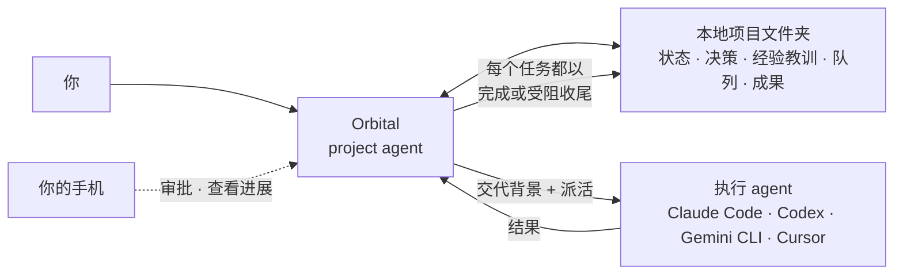

---

## 一个具体的例子

假设你让 Orbital 调研一个竞品。

Orbital 先自己收集基础信息，把发现记录进项目。然后把耗 token 的深度技术调研派给 Claude Code —— 后者开工前会先从项目文件夹里读取项目目标、约束和此前的决策。

Claude Code 跑完后，Orbital 读取它的结论，把其中有用的部分记录回项目。

一周后，你让 Orbital 写一份上线计划。它从那次调研、之后做的决策、以及已经产出的文件开始。

你不用从一个空白对话重新开始。你是在延续这个项目。

---

## 一览

**为什么项目不会失忆**

- **有明确责任人的管理 loop** —— 一个 agent 为整个项目规划、委派、监督并记录结果
- **持久的项目上下文** —— PROJECT_STATE.md、DECISIONS.md、LESSONS.md 和成果跨会话保留，供管理 agent 使用
- **自我改进的 skills** —— agent 从多步流程中沉淀可复用的 skill，遇到类似任务先查阅

**为什么可以中途换 agent**

- **可互换的 worker** —— 管理 agent 把工作派给 Claude Code、Codex、Gemini CLI、Cursor 或任何 CLI agent，它们使用同一份项目上下文
- **任务队列** —— 把任务按项目排进队列，然后走开；agent 逐项处理，每项标记完成（附总结）或受阻（附原因）；中途可暂停介入引导，再继续

**为什么可以放心委派、不用盯着**

- **以项目为单位治理** —— 每个项目是一个文件夹，带自己的工作空间、instructions、队列、预算、审批策略和审计记录
- **Sandbox 执行** —— agent 只能访问你指定的文件夹（Windows sandbox user、macOS Seatbelt）
- **审批流** —— 风险动作前暂停；在桌面或手机上批准
- **预算控制** —— 按项目设定花费上限和到达上限后的动作
- **凭据管理** —— API key 和网站密码存放在操作系统钥匙串，绝不暴露给聊天

**为什么人离开了项目还在推进**

- **Triggers** —— 设置 cron 定时或文件监听，让管理 agent 定期检查并自动派发 sub-agent
- **手机监督** —— 扫码配对，在手机上管理 agent

**技术细节**

- **内置 13 家 LLM provider** —— Anthropic、OpenAI、DeepSeek、Moonshot (Kimi)、Groq、Google Gemini、xAI、Mistral、Together、OpenRouter、智谱、通义千问，以及任意自定义 endpoint
- **浏览器自动化** —— 基于 Patchright 的 26 种浏览器动作，带反检测

---

## 快速开始

1. **启动 Orbital** —— 设置向导引导你完成两步：

   **Step 1 — LLM Provider:** 从预设卡片里选择服务商，点「获取 API 密钥」直达密钥控制台，粘贴即可。支持 DeepSeek、Moonshot (Kimi)、智谱、MiniMax、Anthropic、OpenAI 等十余家服务商。

   <p align="center">
     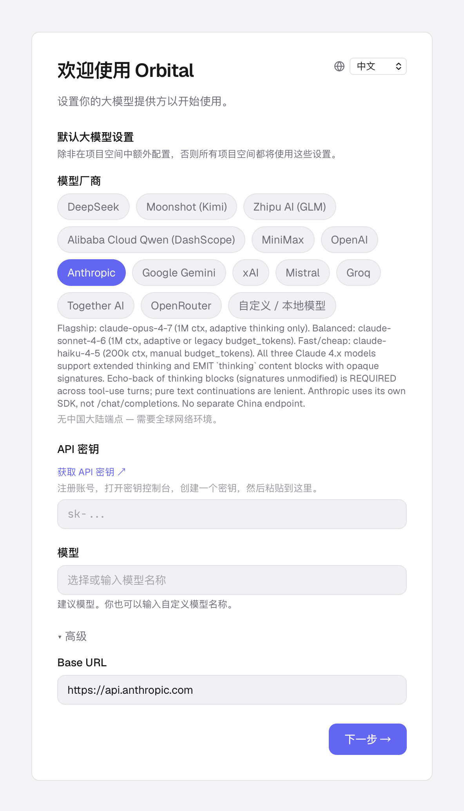
   </p>

   **Step 2 — 关联账户：** 连接 API 连接器（Google Calendar、Drive），并提前登录 agent 需要访问的站点（Google、GitHub 等），防止它在浏览时被验证码挡住。这一步可跳过，之后随时可在设置中完成。

   <p align="center">
     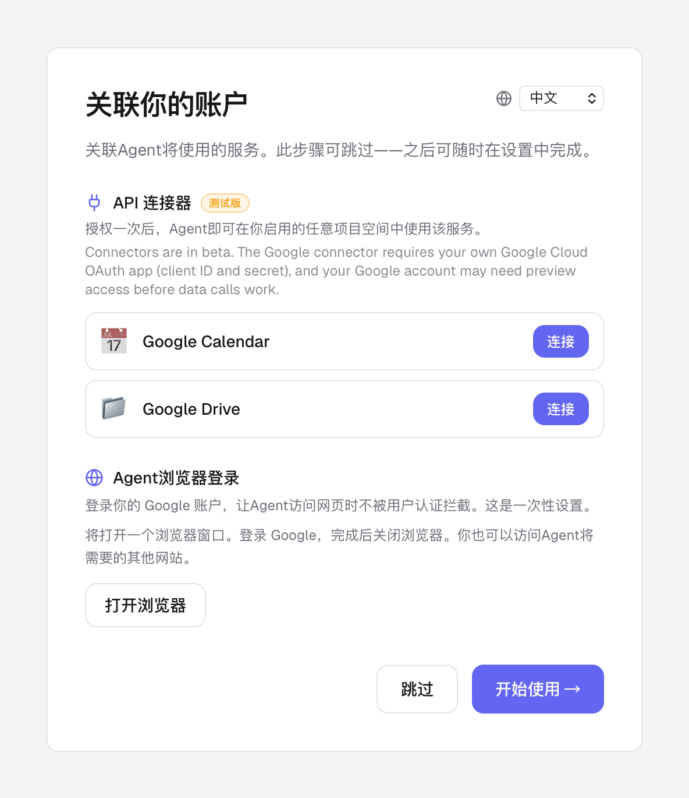
   </p>

2. **创建项目** —— 起个名字，选择本地的一个文件夹，设定 autonomy 等级

   <p align="center">
     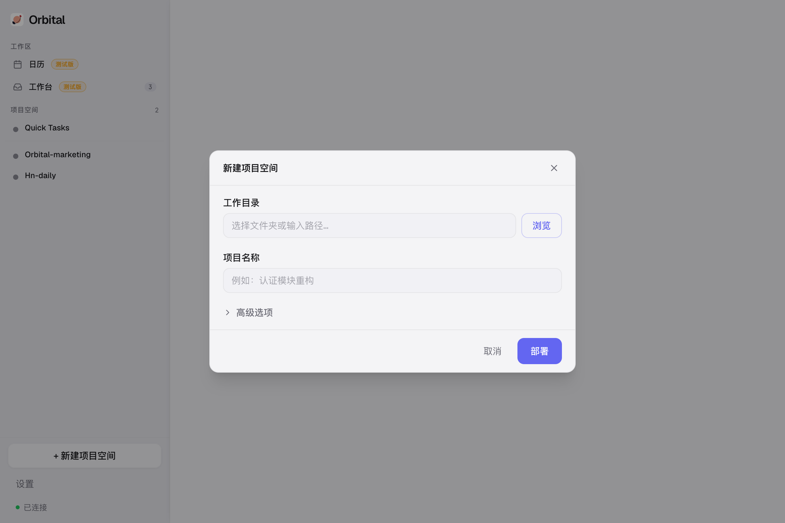
   </p>
3. **开始对话** —— 在聊天框输入任务，管理 agent 自己处理
4. **走开** —— 把后续任务排进队列；每个完成项都会成为下一项的上下文

---

## 项目始终由同一个管理 agent 负责

<p align="center">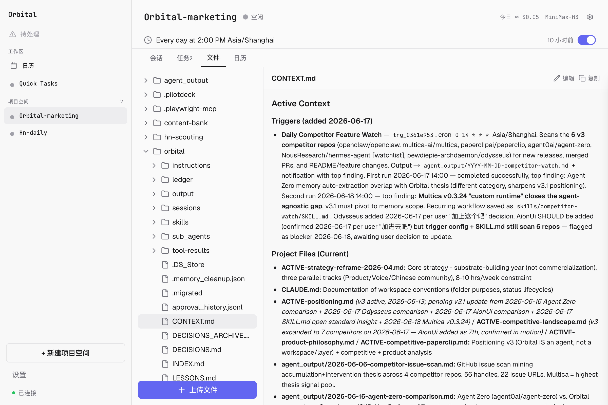</p>
<p align="center"><em>管理 agent 跨会话维护项目的状态、决策与经验</em></p>

<p align="center"></p>
<p align="center"><em>管理 agent 基于同一份项目上下文把任务派给 Claude Code、Codex 或 Gemini，再记录执行结果</em></p>

<p align="center">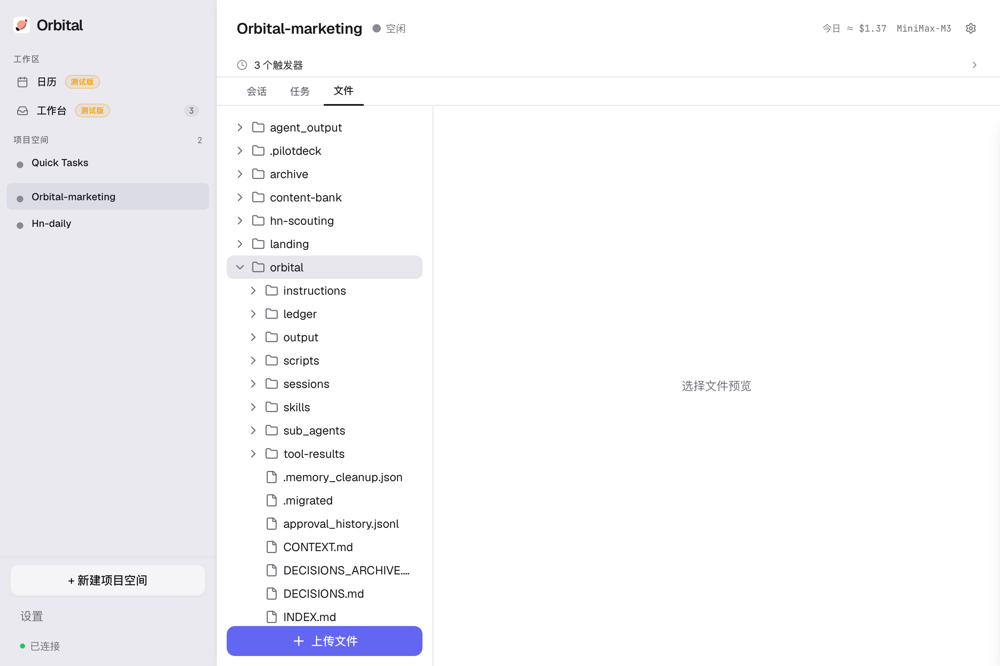</p>
<p align="center"><em>在每个项目的工作空间里浏览、预览、上传文件——看着 agent 的产出不断积累</em></p>

<p align="center">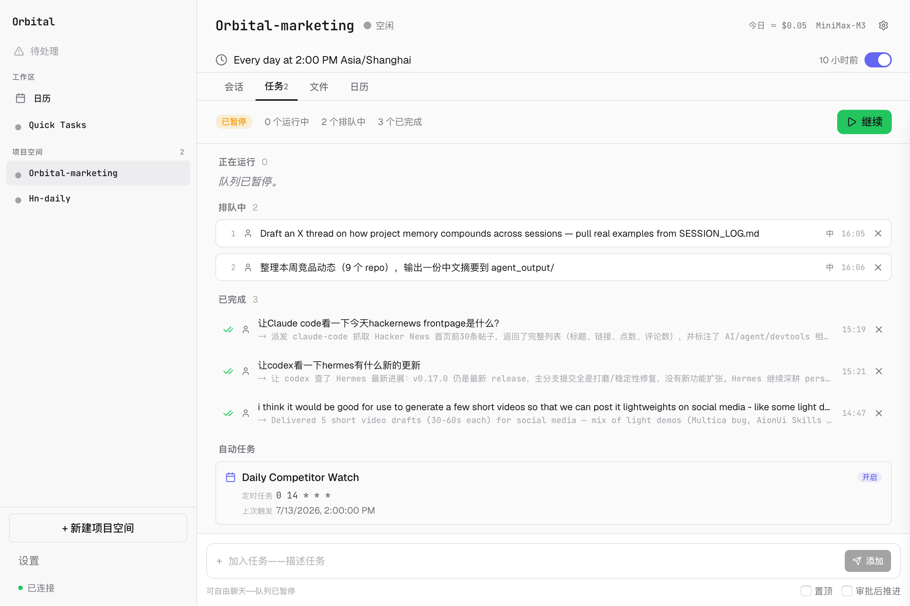</p>
<p align="center"><em>把任务排进队列然后走开——agent 逐项处理，每个完成项都会成为下一项的上下文；随时可暂停介入引导，再继续</em></p>

<p align="center">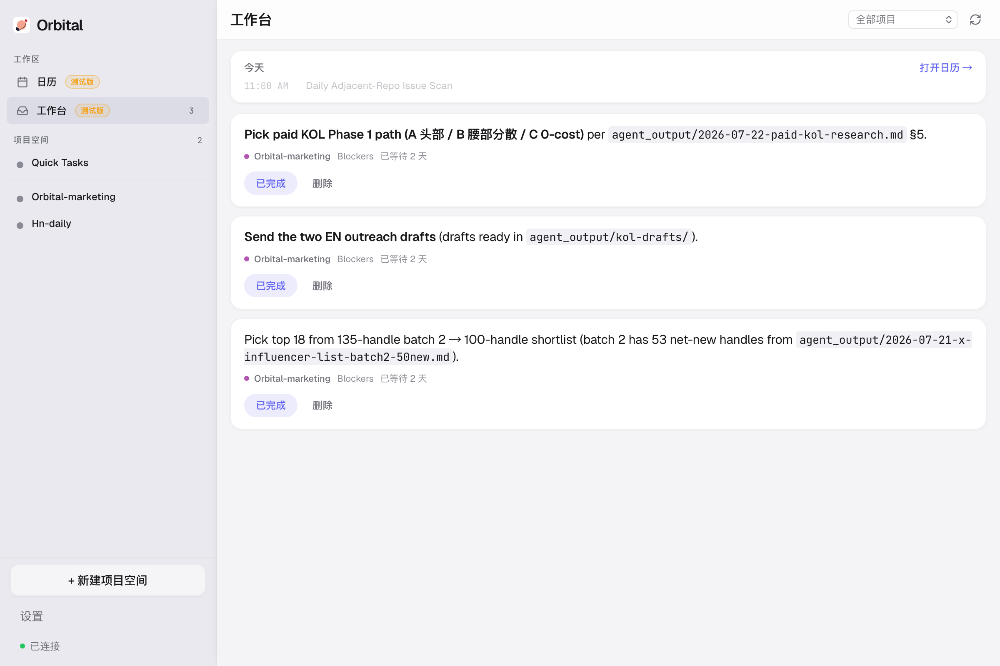</p>
<p align="center"><em>工作台（beta）——只有你能拍板的事（花钱决策、必须用你账号发出的消息）由 agent 标记后跨项目汇总到一处，展开还能看到它这么判断的依据</em></p>

<p align="center">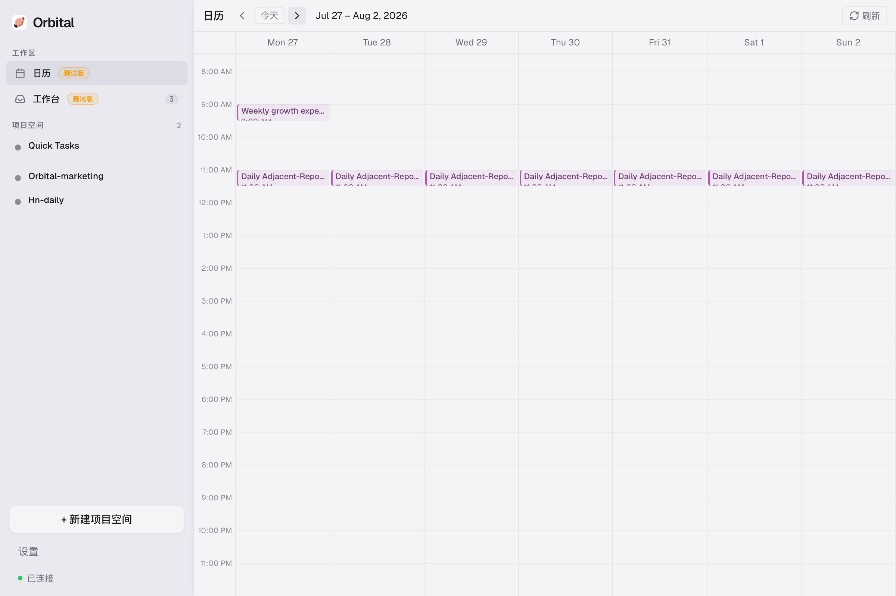</p>
<p align="center"><em>日历（beta）——把已启用的定时 trigger 和带截止日期的承诺投影到周视图上，自动任务不再悄无声息地跑；管理 agent 自己也能读取它来安排工作</em></p>

<p align="center">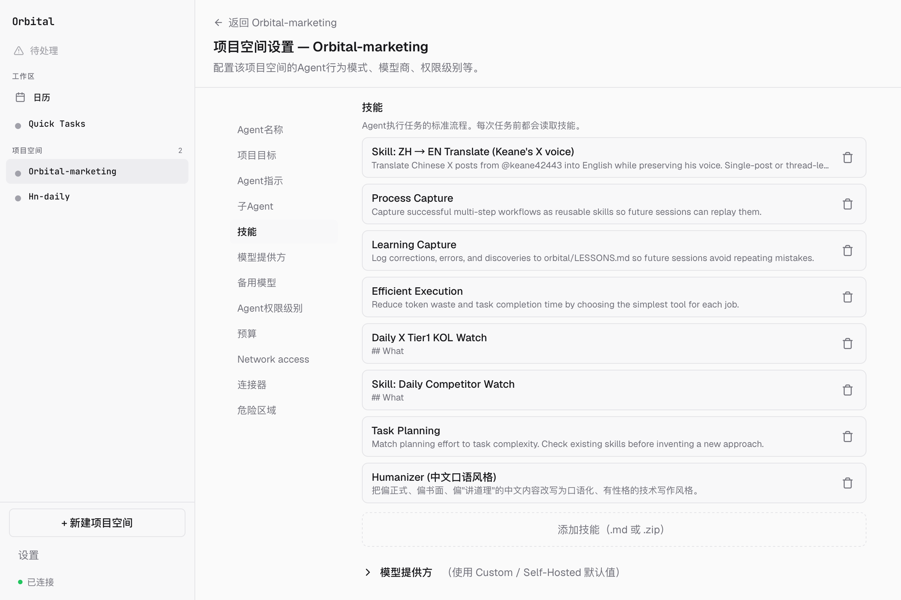</p>
<p align="center"><em>Skills——agent 从多步流程中沉淀出可复用的操作模式，下次遇到类似任务先查阅</em></p>

<p align="center">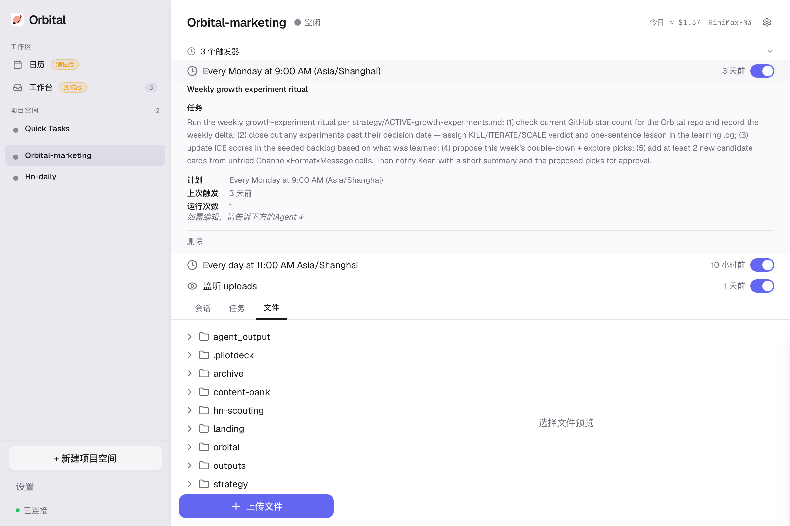</p>
<p align="center"><em>定时与文件监听 trigger——让管理 agent 定期检查并自动派发 sub-agent，无需你动手</em></p>

<p align="center">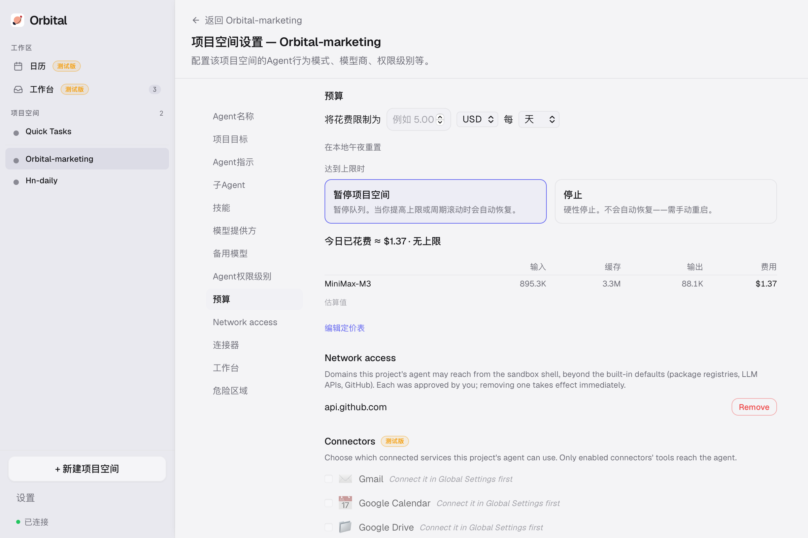</p>
<p align="center"><em>为每个项目设定预算上限和重置周期，实时查看按模型的花费与成本明细</em></p>

<p align="center">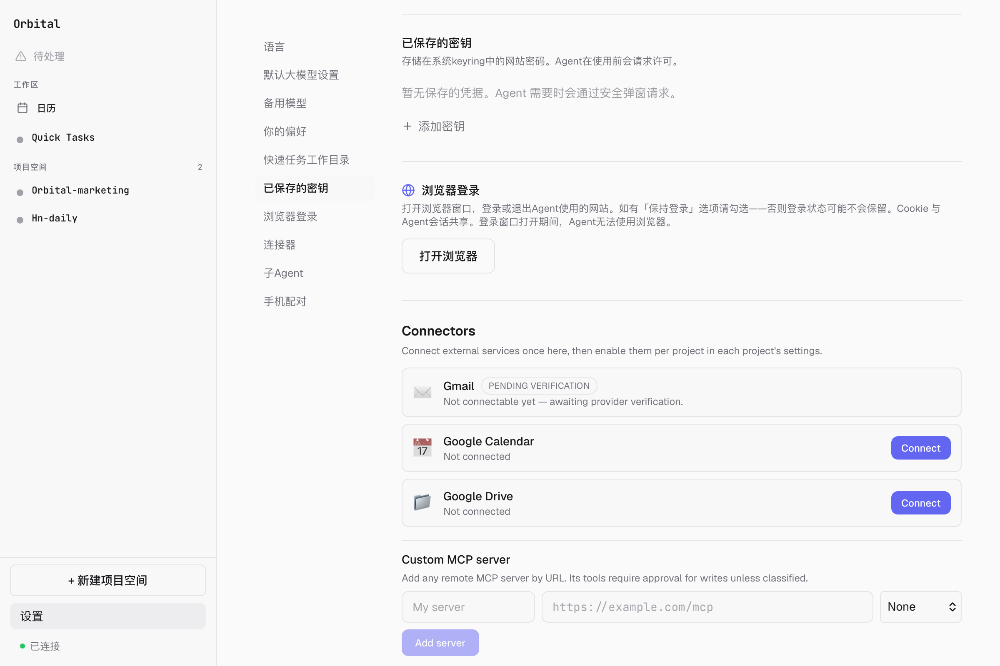</p>
<p align="center"><em>网站凭据存放在系统钥匙串里，绝不暴露给聊天</em></p>

<p align="center">
  
  &nbsp;&nbsp;
  
</p>
<p align="center"><em>手机上监督：实时查看 agent 活动，带完整上下文批准关键动作（可附加指引）</em></p>

---

## 架构

Orbital 是绑定在一个**项目**上的持久管理 agent——而不是一个聊天会话。它是项目的本地 control plane，统一管理工作空间、instructions、状态、队列、预算和审批规则。管理 agent 负责规划、委派、监督并记录结果；worker agent 基于同一份项目上下文执行。你可以从任何地方监督。

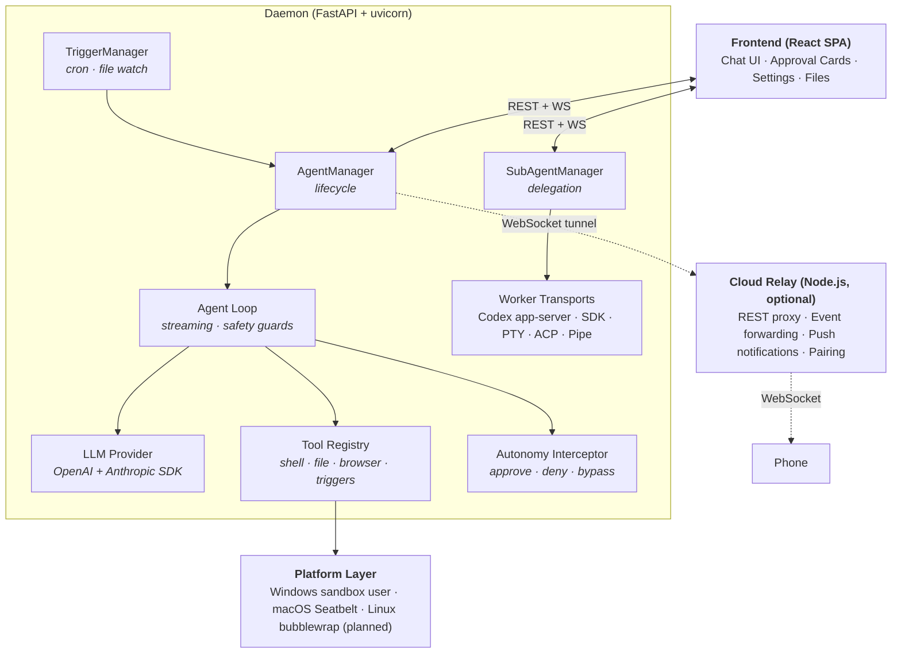

**设计决策：**
- **管理 agent 对项目负责**: agent 维护结构化的状态、决策、经验和会话历史，让规划与责任始终归于一处
- **Isolation**: OS 级别 sandbox（Windows sandbox user / macOS Seatbelt / Linux bubblewrap 在规划中）
- **Fail-closed interceptor**: 审批系统出错后默认 DENY，绝不 ALLOW
- **单 daemon**: PID 文件强制只能存在一个实例
- **Local-first**: 你的所有文件和项目状态都在你自己的硬盘上。Cloud relay 启用时只转发审批和事件，不转发你的文件。

---

## 与同类产品对比

持久记忆、定时任务和 sub-agent 现在已经是标配 —— 下面每个工具都有。真正还有分歧的是这三个问题。

| 2026 年 7 月 | Orbital | [Claude Code](https://code.claude.com/docs/en/desktop) | [Codex](https://developers.openai.com/codex/) | [Hermes](https://github.com/NousResearch/hermes-agent) | [OpenClaw](https://docs.openclaw.ai/) |
| --- | --- | --- | --- | --- | --- |
| 下一个任务能换一个 agent 接手吗？ | ✅ Claude Code、Codex、Gemini CLI、Cursor、任意 CLI | ❌ 只有 Claude worker | ❌ 只有 Codex worker | ❌ 只有 Hermes worker | 部分（通过 ACP 调用外部 agent） |
| 靠什么防止队列任务悄悄漂走？ | ✅ 强制以完成/受阻闭环 | ❌ | ❌ | ❌ | ❌ |
| 预算、审批和审计属于谁？ | ✅ 属于项目 | 部分（权限 + 运行历史） | 部分（审批 + 企业审计） | 部分（命令审批） | 部分（审批 + 日志） |

**一句话总结：** 差异不在某一项能力，而在于承载状态、worker 和治理的单位是「项目」，不是「会话」。

---

## 功能详解

完整的功能详解——项目与工作空间模型、管理 agent 的上下文维护与压缩、sub-agent 委派与传输层（Codex 原生 app-server JSON-RPC、Claude Code SDK、其他 worker PTY/ACP）、任务队列、Quick Tasks、自我改进的 skills、内置工具、浏览器自动化、triggers、LLM 路由与 BYOK、autonomy 与审批、预算控制、手机远程、凭据管理、agent loop 安全保护、桌面应用——以英文为准，见 [English README → Feature Deep Dives](README.md#feature-deep-dives)，避免中英两份各自维护导致内容不同步。

---

## 安装

### Windows

1. 从 [Releases](https://github.com/zqiren/Orbital/releases/latest) 下载最新的 `Orbital-Setup-*.exe`（Windows 版本）
2. 运行安装程序，按提示完成
3. 从开始菜单或桌面快捷方式启动 Orbital

<details>
<summary>Windows SmartScreen 警告</summary>

Orbital 的 Windows 安装包暂未做代码签名，Windows 会提示安全警告：

> **Windows 已保护你的电脑** —— Microsoft Defender SmartScreen 阻止了一个无法识别的应用启动。

点击 **「更多信息」**，然后点 **「仍要运行」**。代码签名会在后续版本加上。
</details>

### macOS

1. 从 [Releases](https://github.com/zqiren/Orbital/releases/latest) 下载最新的 `Orbital-*-macOS.dmg`
2. 打开 DMG，把 Orbital 拖到 Applications 文件夹
3. 从启动台或 Spotlight 启动 Orbital

需要 macOS 13 (Ventura) 及以上，**仅支持 Apple Silicon（M1 及更新机型）**。本版本为 arm64 构建，**不支持 Intel Mac**。

正式发布版已完成 Developer-ID 签名和 Apple 公证（notarization），首次启动直接打开——没有 Gatekeeper 拦截，不需要任何「仍要打开」操作。（从源码自行构建或下载 CI 分支产物的版本仍是 ad-hoc 签名，macOS 会要求你右键 → 打开确认一次。）

### 从源码运行

```bash
git clone https://github.com/zqiren/Orbital.git && cd Orbital

# 安装 Python 依赖(Python 3.11+)
pip install -e ".[desktop]"

# 安装前端依赖(Node.js 18+)
cd web && npm install && cd ..

# 启动 daemon
python -m uvicorn agent_os.api.app:create_app --factory --port 8000

# 另开终端启动前端
cd web && npx vite --host 127.0.0.1 --port 5173
```

浏览器打开 `http://localhost:5173`，首次启动会进入设置向导。

### 关于休眠

Agent 运行期间，Orbital 会通过系统级别的接口阻止机器进入休眠（Windows 和 macOS 都支持）。所有 agent 闲下来之后，会重新允许系统休眠。系统托盘图标会显示当前 agent 活动状态。

---

## 开发与测试

后端、前端、测试相关命令、关键文件路径请参见 [English README](README.md#development) 中 **Development** 与 **Testing** 章节。这部分文档以英文为准，避免中英两份各自维护导致内容不同步。

---

## Roadmap

**已完成：** 多 LLM 路由 + 失败轮换、三档 autonomy preset（并向 sub-agent 级联）、流式 chat + WebSocket 实时事件、带反检测的浏览器自动化（Patchright）、定时 / 文件监听 trigger、自然语言创建 trigger、cloud relay + 推送通知 + 设备配对、上下文压缩 + 压缩前记忆 flush、前缀缓存优化的 prompt 组装（v0.4.2）、按项目的预算上限和成本统计、凭据管理（API key + 网站登录）、桌面应用 + 系统托盘 + 原生窗口、agent loop 安全保护（迭代上限、重复检测、ping-pong、断路器）、agent 活动期间的系统休眠抑制、`@mention` 路由的 sub-agent 派发。

**接下来：** Webhook trigger、pipeline trigger（把一个项目的输出作为另一个的输入）、按项目的网络隔离（OS 级 domain allowlist）、Linux 上的 bubblewrap 沙箱、Windows 代码签名（消除 SmartScreen 警告）、daemon 重启后自动恢复进行中的会话。

---

## 我为什么做 Orbital

我喜欢 Claude Projects，但受不了 agent 不能自己更新项目，也受不了它不在我自己的机器上。

我喜欢 OpenClaw，但受不了那种失控感——没有预算，没有 sandbox，人离开电脑就没法从手机上监督。

Orbital 就是我自己想要的那个东西：一个对整个项目负责的 agent——计划、决策、队列、预算和审批都归它管理。不在电脑前时用手机看一眼。Claude Code、Codex、Gemini CLI 是它可以按任务选择的 worker，但项目的上下文始终留在管理 agent 手里。

全职工作之余的晚上和周末做出来的，还很早期。欢迎反馈和 issue。

---

## 遥测（Telemetry）

Orbital 每天发送**一份匿名汇总**——仅包含计数、枚举和布尔值。绝不包含提示词、文件、路径、模型输出或任何项目/会话标识。在 **设置 → 数据与隐私** 中可逐字查看即将发送的完整 JSON，并可一键关闭。完整的公开 schema 见 [docs/TELEMETRY.md](docs/TELEMETRY.md)。

---

## License

Orbital 采用 [GNU General Public License v3.0](LICENSE) 协议开源。

```
Orbital — Every agent owns a session. Orbital owns the project.
Copyright (C) 2026 Orbital Contributors

This program is free software: you can redistribute it and/or modify
it under the terms of the GNU General Public License as published by
the Free Software Foundation, either version 3 of the License, or
(at your option) any later version.
```
